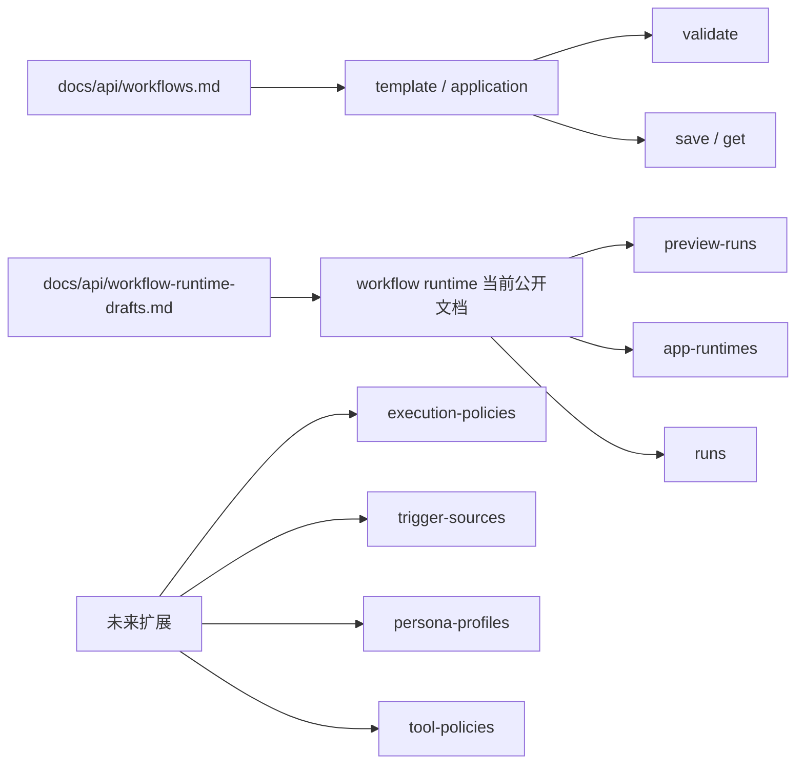

# Workflow Runtime 接口导航

## 文档目的

本文档用于整理当前 workflow runtime 相关的公开接口文档和后续扩展草案，减少在多份文档之间来回跳转。

本文档只做导航，不重复展开字段和接口细节。

## 当前边界

- workflow runtime 第一阶段已经公开 preview-runs、app-runtimes 和 runs 的最小接口。
- phase2 第一块已经增量公开 app-runtimes 的 restart 和 instances。
- workflow template/application 的 validate、save、get 仍集中在 [docs/api/workflows.md](workflows.md)。
- AI 控制面相关资源仍保持草案状态，不进入 current-api 总览。
- 当前 workflow runtime 文档主要描述 HTTP 控制面下的正式执行接口；后续 PLC、MQTT、ZeroMQ、gRPC、IO 变化等触发方式仍统一映射到 WorkflowRun，触发入口草案见 [docs/api/workflow-trigger-sources.md](workflow-trigger-sources.md)。

## 边界说明图

## 当前公开文档

- [docs/api/workflow-preview-runs.md](workflow-preview-runs.md)：WorkflowPreviewRun 的正式接口文档，覆盖编辑态快速试跑和结果回查。
- [docs/api/workflow-app-runtimes.md](workflow-app-runtimes.md)：WorkflowAppRuntime 的正式接口文档，覆盖长期运行单元的 create、list、get、start、stop、restart、health 和 instances。
- [docs/api/workflow-runs.md](workflow-runs.md)：WorkflowRun 的正式接口文档，覆盖 sync invoke、async run create、结果回查和取消。

这一组文档与 [docs/api/current-api.md](current-api.md) 保持一致，描述的是当前已经落代码的真实接口。

第二阶段边界收口见 [docs/architecture/workflow-runtime-phase2.md](../architecture/workflow-runtime-phase2.md)。

## 后续扩展草案

- [docs/api/workflow-trigger-sources.md](workflow-trigger-sources.md)：WorkflowTriggerSource 草案，覆盖 PLC、MQTT、ZeroMQ、gRPC、IO 变化和传感器读取等外部触发入口边界。
- [docs/api/workflow-execution-policies.md](workflow-execution-policies.md)：WorkflowExecutionPolicy 资源草案，覆盖 preview 和 runtime 的 timeout、trace 和 AI 默认项。
- [docs/api/workflow-persona-profiles.md](workflow-persona-profiles.md)：PersonaProfile 资源草案，覆盖 AI 节点的人格、语气和系统提示模板。
- [docs/api/workflow-tool-policies.md](workflow-tool-policies.md)：ToolPolicy 资源草案，覆盖 AI 节点可用工具集合和调用上限。

这一组文档主要面向未来的 VLM、LLM、agent 和自然语言任务，不负责 PLC、运动控制或传感器节点的硬件权限控制。

## 当前仍未公开接口

- GET /api/v1/workflows/preview-runs/{preview_run_id}/events
- POST /api/v1/workflows/preview-runs/{preview_run_id}/cancel
- GET /api/v1/workflows/runs/{workflow_run_id}/events

## 建议阅读顺序

1. [docs/api/current-api.md](current-api.md)
2. [docs/api/workflow-preview-runs.md](workflow-preview-runs.md)
3. [docs/api/workflow-app-runtimes.md](workflow-app-runtimes.md)
4. [docs/api/workflow-runs.md](workflow-runs.md)
5. [docs/architecture/workflow-runtime-phase1.md](../architecture/workflow-runtime-phase1.md)
6. [docs/api/workflow-trigger-sources.md](workflow-trigger-sources.md)
7. [docs/api/workflow-execution-policies.md](workflow-execution-policies.md)
8. [docs/api/workflow-persona-profiles.md](workflow-persona-profiles.md)
9. [docs/api/workflow-tool-policies.md](workflow-tool-policies.md)

## 相关文档

- [docs/api/workflows.md](workflows.md)
- [docs/api/current-api.md](current-api.md)
- [docs/api/workflow-trigger-sources.md](workflow-trigger-sources.md)
- [docs/architecture/workflow-runtime-phase1.md](../architecture/workflow-runtime-phase1.md)
- [docs/architecture/workflow-runtime-phase2.md](../architecture/workflow-runtime-phase2.md)