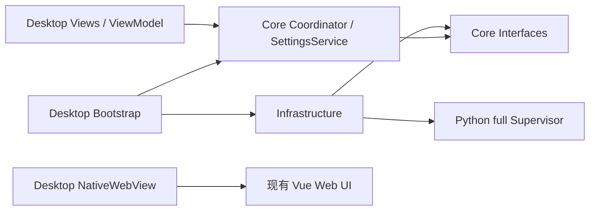

# amvar launcher 工程架构

状态：Windows x64 源码已实现。构建、测试及实机验收边界见 [实施记录](desktop-launcher-implementation.md)。

## 分层和依赖

解决方案为 [Amvar.Launcher.slnx](../../launcher/Amvar.Launcher.slnx)，包含三个生产工程；测试位于根 `tests/launcher/`，文件名为 `test_*.cs`。

| 工程 | 职责 | 依赖 |
| --- | --- | --- |
| Core | 配置规则、会话连接、退出用例、不可变快照 | .NET 基础库 |
| Infrastructure | Newtonsoft.Json、磁盘、HTTP、脚本进程、身份检查、单实例、构建信息 | Core |
| Desktop | Avalonia XAML、视图模型、窗口、托盘、NativeWebView | Core；仅 Bootstrap 引用 Infrastructure |



Core 不读取文件、操作 Process 或引用 Avalonia/Newtonsoft.Json。C# 不重新编排迁移、Broker、daemon、backend-service 和 Worker；这套规则继续由 Python full Supervisor 负责。模型、训练、推理、Workflow 和共享内存仍属于原平台。

`Desktop/Services/WindowsWindowFrame` 集中处理自定义窗口的 Windows 样式、DWM 小圆角、八方向非客户区命中测试及边缘留白；窗口关闭时解除回调。`MainWindow` 负责装配和窗口状态，Core 不依赖这些平台细节。WebView 保持在缩放区域内侧，最大化和全屏时恢复无留白布局。

## 实际源码目录

```text
launcher/
├─ Amvar.Launcher.slnx
├─ Directory.Build.props / Directory.Packages.props
├─ publish-win-x64.ps1
└─ src/
   ├─ Amvar.Launcher.Core/
   │  ├─ Abstractions/       设置、探测、栈控制与日志接口
   │  ├─ Application/        LauncherCoordinator、BackendSessionController、SettingsService
   │  ├─ Configuration/      LauncherSettings 与校验
   │  ├─ Runtime/            安装目录、会话模式、观察和停止结果
   │  ├─ Lifecycle/          枚举状态与 LauncherSnapshot
   │  └─ Diagnostics/        BuildInformation
   ├─ Amvar.Launcher.Infrastructure/
   │  ├─ Configuration/      JsonSettingsStore、LauncherPaths
   │  ├─ Contracts/          显式 wire DTO
   │  ├─ Serialization/      Newtonsoft.Json 统一策略
   │  ├─ Http/               HttpServiceProbe
   │  ├─ Processes/          ScriptProcess、ProcessInspector、SingleInstanceLease
   │  ├─ Runtime/            FullStackController
   │  ├─ Metadata/           构建信息与发行文件清单
   │  └─ Diagnostics/        有界文件日志
   └─ Amvar.Launcher.Desktop/
      ├─ Bootstrap/          唯一依赖组合入口
      ├─ Views/              MainWindow、SettingsWindow、AboutWindow、LogWindow
      ├─ ViewModels/         LauncherViewModel
      ├─ Services/           WebViewSession
      ├─ Assets/             项目图标
      └─ App.axaml            共享主题和按钮资源
```

标题栏、托盘和主窗口可见性由 MainWindow 管理；它把服务动作交给 Coordinator。设置与关于分别使用独立窗口，网页生命周期集中在 WebViewSession。没有为每个小视图机械新增类库或接口。

## 类型模型和 JSON

内部数据使用具名 class/record class；枚举表示有限状态。`LauncherSettings` 为不可变配置，`LauncherSnapshot` 为不可变 UI 快照。`StackStopResult` 包含成功标志与错误信息，调用方按结果及状态分支，不解析中文错误文案。

Infrastructure DTO 与 Core 配置分离。主要类型为 `LauncherSettingsDocumentV1`、`WindowPreferencesDocumentV1`、`SettingsHeader`、`ServiceHealthResponse`、`FullSupervisorStateV1`、`ProcessIdentityDocument`、`LauncherStatusDocumentV1`、`StopTargetDocumentV1`、`ProcessInspectionDocument` 和发行文件清单模型。

| 配置字段 | Core 属性 |
| --- | --- |
| schema_version | 磁盘 schema，当前为 1 |
| manage_service | ManageService，默认 true |
| project_root | ProjectRoot，默认 . |
| startup_timeout_seconds | StartupTimeout，5–86400 秒 |
| theme | System / Light / Dark，磁盘为小写字符串 |
| start_fullscreen | StartFullscreen，默认 false；下次启动时进入全屏 |
| window | 宽、高、最大化状态，单位 DIP |

JSON 使用 Newtonsoft.Json 13.0.4，固定 `TypeNameHandling.None`，拒绝重复键、未知配置字段、错误布尔类型、显式 null 和未知枚举。外部只读响应允许新增字段。JSON DOM 只在序列化模块检查重复键，不穿过接口；业务和配置不拼接 JSON 字符串。

发行根保留 EXE，程序集目录为其下的 `launcher/`。配置位于发行根 `launcher/config/launcher.json`，相对 project_root 基于入口 EXE 所在根解析，与进程工作目录无关。首次缺失采用默认配置；损坏或未知版本进入初始化错误，不能默认开启服务。保存使用同目录临时文件和原子替换；未知版本不可覆盖。自动保存窗口尺寸前重读磁盘有效配置，保留外部修改，遇到损坏文件停止自动保存。

`manage_service` 和项目目录在初始化时冻结。本轮设置保存不改变已建立会话的停止权限；外观可以立即更新。

## 状态和用例

| 应用阶段 | 行为 |
| --- | --- |
| Initializing / InitializationFailed | 读取配置、显示初始化问题 |
| Active | 连接、等待、导航或重试 |
| ExitRequested | 取消连接任务，等待创建登记，然后停止本次栈 |
| ExitBlocked | 停止失败，保留窗口、托盘、日志及重试入口 |
| ReadyToExit | 释放 WebView、托盘和单实例句柄，显式退出 |

后端阶段为 Unknown、Probing、Starting、Connected、Unavailable、Faulted、Stopping、StopFailed、Stopped。Connected 表示当前页面载入成功，不表示所有模型和 Worker 永久健康。页面导航失败会进入 Unavailable；启动器不自动重建或刷新正在编辑的 Workflow。

Coordinator 是快照唯一写入者。短临界区登记操作，IO 异步执行；重复连接/退出复用任务。`Revision` 排序 UI 回调，操作号和 `NavigationId` 拒绝退出后的迟到结果。退出使用独立的 90 秒清理 token，不复用已经取消的启动 token。

等待超时后保留原启动任务，重试继续观察，不能重复执行 full 脚本。已经退出的本次栈不会被重试自动替换；需要查看日志并重新启动启动器。

## 服务所有权与 Python 契约

| 现场情况 | 行为 |
| --- | --- |
| manage_service=false | 直接请求固定首页；不探测 full、不检查资产、不执行脚本 |
| true，现有服务可访问 | 仅连接，退出不停止外部服务 |
| true，端口拒绝连接且无存活 full | 检查发行资产后创建一次 full batch |
| 超时、无关 HTTP 响应、端口冲突 | 显示问题，不把它当作空闲端口 |

`ScriptProcess` 隐藏启动固定 batch，双引号保护参数，关闭延迟展开，持续排空 UTF-8 stdout/stderr。清除外部 Python 解释器覆盖值和 conda 环境标记；只使用发行根 `python/python.exe`。

进程归属采用 [inspect_process.py](../../runtimes/launchers/inspect_process.py) 复用 bundled Python/psutil 的完整身份定义。该工具只读身份、祖先链与指定监听端口，不执行业务或停止进程。C# 核对 PID、创建时间、可执行路径、工作目录、完整参数列表，以及 root 是否属于本次 batch 后代。当前端口的监听者也必须属于本次 root；磁盘 state 或 HTTP 连通本身不能授予管理权限。

Python full 已补齐：

- 迁移前写入 root state；迁移子进程登记到组件列表。
- 启动阶段和等待循环检查绑定 root 的停止请求；迁移先完成当前安全边界，再停止后续启动。
- `logs/full-stack/launcher-status.json` 使用 `amvision.launcher-status.v1`，状态为 starting/running/stopping/failed。完整启动后才写 running，失败摘要保留。
- stop 新增 `--expected-root-identity-file` 与 `--graceful-only`。桌面使用两者，拒绝换实例，等待失败不进入 stop 的强杀后备分支。Python Supervisor 自身既有组件回收规则保持原有职责。
- state、停止请求和阶段文件原子写入；清理持有文件锁并核对 root，旧 stop 不能删除新实例文件。

停止成功需核对本次 root、已观察组件及创建任务已结束；异常、身份变化或超时保留错误，不按端口杀进程。启动器重开不会接管前次崩溃留下的 full。

## 原生界面、WebView 与发行

主窗口使用 Avalonia 12 `WindowDecorations=None` 和 XAML 自定义标题栏，去除系统顶部边线，通过边缘拖动调用 `BeginResizeDrag` 调整大小。关闭主窗口隐藏到托盘，不释放 WebView；最小化和隐藏独立于服务状态。单实例使用按用户及项目目录生成的文件锁和仅当前用户可访问的命名管道，第二个实例只发送显示信号。

`FullscreenController` 保存进入全屏前的普通/最大化状态；F11 切换全屏并隐藏顶部栏和底部状态栏，退出后恢复原状态。`start_fullscreen` 仅决定启动状态，临时 F11 操作不覆盖配置，也不把全屏尺寸保存为普通窗口尺寸。原生界面监听 F11；Windows WebView2 通过 `WindowsFullscreenShortcut` 订阅 `AcceleratorKeyPressed`，同步标记已处理后异步切换窗口。只处理无修饰键的 F11，忽略长按重复，保留其他快捷键。COM 契约按 Microsoft 稳定 IDL 定义并隔离在 Desktop/Services/Interop 中，订阅随 WebView 适配器创建与释放；没有网页到本机的命令桥。

NativeWebView 只创建一次，独立数据目录为 `launcher/data/launcher/webview/`。固定入口为 `http://127.0.0.1:5600`。外部 HTTP/HTTPS 由系统浏览器打开；不提供任意网页地址栏或 JavaScript 执行本机命令桥。

WebViewSession 在页面就绪和 ActualThemeVariant 变化时发送固定主题事件。前端 `app/launcher-theme.ts` 校验 light/dark 后调用 Preferences store 的现有 setter，更新 DOM 和持久化值；不改变导航或重新加载页面。独立浏览器没有外壳事件，保持原有偏好行为。

前端挂载并完成首轮 nextTick 后设置 `data-amvision-ui-ready="v1"`。导航成功后最多等待 30 秒确认标记，单次脚本读取限 5 秒，整次导航有 45 秒兜底。预载时使用 1 DIP 原生宿主，保持 XAML 启动画面；就绪后展开 WebView，避免依赖透明 XAML 遮盖原生 HWND。实机交接效果需要独立验证。

MSBuild 将构建 UTC 时间与源码提交写入程序集；发行时从同一具名 BuildInformation 对象导出 JSON。关于显示启动器自己的构建信息。发行文件清单 `amvar.launcher-release.v2` 包含 win-x64、self-contained、WebView 版本与逐文件 SHA-256。

构建和使用命令见 [launcher README](../../launcher/README.md) 与 [部署说明](../deployment/desktop-launcher.md)。当前只实现 Windows x64；其他 64 位平台仍需各自的脚本、原生依赖与发行适配。
