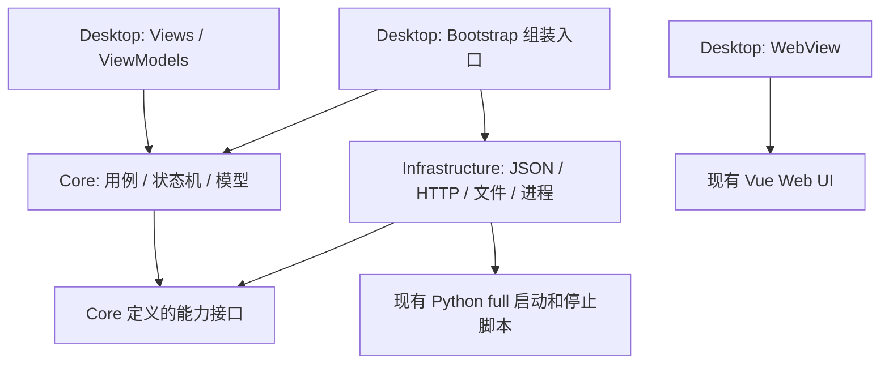

# amvar launcher 工程架构

状态：待实施的工程设计，当前 `launcher/` 仅有 README，尚未创建解决方案和 C# 工程。

本文定义项目层级、依赖、数据模型和状态管理；窗口外观、托盘动作、启动动画及发布行为见 [桌面启动器产品设计](../design/desktop-launcher.md)，逐步工作项、验证与完成条件见 [详细实施步骤](desktop-launcher-implementation.md)。三份文档分别维护工程契约、产品行为和执行计划。

## 项目划分与引用方向

一个解决方案、三个生产工程和位于仓库 `tests/` 的测试工程。三个生产工程运行在同一个桌面进程中，不是三个独立服务。

| 工程 | 职责 | 允许的项目引用 |
| --- | --- | --- |
| `Amvar.Launcher.Core` | 类型化模型、规则、启动/退出用例、状态机和外部能力接口 | 不引用其他启动器工程 |
| `Amvar.Launcher.Infrastructure` | Newtonsoft.Json、磁盘配置、HTTP 探测、脚本进程、本机状态文件、平台适配 | Core |
| `Amvar.Launcher.Desktop` | Avalonia XAML、ViewModel、窗口、托盘、WebView、主线程调度与启动组装 | Core；仅组装入口使用 Infrastructure |



Core 不引用 Avalonia、Newtonsoft.Json、Win32、文件读写或 `Process`。Infrastructure 不引用 Desktop，不打开窗口。ViewModel 只调用 Core 用例和 Desktop 的视图服务，不直接依赖 Infrastructure 实现。

不为每个小功能增加类库；Core 中按职责分目录，避免将小型启动器扩成通用 DDD、微服务或工作流框架。需要替换或隔离测试的外部能力才定义接口，不给每个模型和辅助类机械添加接口。

## 源码层级

以下均为计划创建的路径。

```text
launcher/
├─ README.md
├─ Amvar.Launcher.slnx
├─ Directory.Build.props
├─ Directory.Packages.props
└─ src/
   ├─ Amvar.Launcher.Core/
   │  ├─ Amvar.Launcher.Core.csproj
   │  ├─ Configuration/       配置模型与校验规则
   │  ├─ Runtime/             项目目录、会话、服务探测和停止结果模型
   │  ├─ Lifecycle/           状态、事件和合法迁移
   │  ├─ Application/         初始化、启动、重试、退出、保存设置用例
   │  ├─ Abstractions/        文件存储、探测、脚本、时间等边界接口
   │  └─ Diagnostics/         类型化错误、日志条目与构建信息模型
   ├─ Amvar.Launcher.Infrastructure/
   │  ├─ Amvar.Launcher.Infrastructure.csproj
   │  ├─ Serialization/       Newtonsoft.Json 设置及映射
   │  ├─ Contracts/           JSON 文件和 HTTP 响应的强类型 DTO
   │  ├─ Configuration/       磁盘加载、校验入口、原子保存
   │  ├─ Http/                health 和静态首页探测
   │  ├─ Processes/           脚本执行、异步日志、进程身份核对
   │  ├─ Runtime/             full 状态文件读取和核心模型映射
   │  ├─ Platforms/Windows/   隐藏启动、进程身份、单实例通信适配
   │  ├─ Metadata/            嵌入构建信息读取
   │  └─ Diagnostics/         有界日志缓冲与文件输出
   └─ Amvar.Launcher.Desktop/
      ├─ Amvar.Launcher.Desktop.csproj
      ├─ Program.cs / App.axaml
      ├─ Bootstrap/           唯一依赖组装入口
      ├─ Views/               MainWindow、StartupView、AboutWindow、SettingsWindow
      ├─ ViewModels/          对应视图状态和命令
      ├─ Controls/            标题栏、窗口按钮、信息行
      ├─ Services/            托盘、窗口显示、WebView 会话、UI 线程调度
      ├─ Platforms/Windows/   窗口装饰和 WebView2 环境适配
      ├─ Themes/             项目颜色、间距、字体、动效资源
      └─ Assets/             图标和随包许可证
tests/launcher/
├─ Amvar.Launcher.Core.Tests/
├─ Amvar.Launcher.Infrastructure.Tests/
└─ Amvar.Launcher.Desktop.Tests/
```

所有新增测试文件使用 `test_*.cs`，不放进生产工程。Core 测试不要求图形环境、Python 或真实后端；Infrastructure 的进程测试使用测试脚本；Desktop 测试验证命令、绑定和窗口生命周期，另做真实 Windows UI 验收。

生产工程沿用根 `global.json`，使用实施时最新稳定版 .NET 10 SDK/运行时，构建属性和包版本配置限于 launcher 范围。`tests/launcher/` 通过明确的相对导入共享该配置，避免测试工程遗漏包版本，也避免在仓库根新增构建属性影响 `sdks/dotnet/`。三个生产工程均使用 .NET 10，最终可执行入口为 `amvar.launcher.exe`；只发布显式 x64/ARM64 RID。不为旧 Windows 降级框架或增加兼容分支。

## 模块与对象职责

| 对象/模块 | 负责内容 | 不承担的职责 |
| --- | --- | --- |
| `LauncherCoordinator`（Core） | 应用初始化与退出意图，组织设置、后端会话和只读快照 | 窗口绘制、JSON、底层进程操作 |
| `BackendSessionController`（Core） | 连接、启动、继续等待、停止及后端会话状态迁移 | WebView 导航、系统托盘 |
| `SettingsService`（Core） | 配置校验、编辑副本、保存及下次启动生效规则 | 直接文件 IO、修改运行中的管理目标 |
| `ISettingsStore` / `JsonSettingsStore` | 通过强类型文档加载和原子保存配置 | 自动修改窗口或启动服务 |
| `IServiceProbe` / `HttpServiceProbe` | 返回类型化探测结果、区分拒绝连接/无关响应/超时/可访问 | 自行启动或重启服务 |
| `IStackController` / `FullStackController` | 启动/停止固定脚本，读本机状态，核对绑定的进程身份 | 决定 UI 状态、复制 Python 编排规则 |
| `IBuildInfoProvider` | 返回启动器构建元数据 | 查询后端后冒充启动器版本 |
| `WindowService` / `TrayService`（Desktop） | 窗口显示隐藏、原生菜单，将退出命令提交给 Coordinator | 直接停止进程或立即 Shutdown |
| `WebViewSession`（Desktop） | NativeWebView 生命周期、导航结果、下载与环境配置 | 启动 Python、修改后端生命周期 |
| ViewModel | 将状态快照投影成文案、命令可用性、动画开关 | 持有另一份业务状态机、轮询磁盘或 HTTP |

只在 `Bootstrap` 进行构造器依赖注入和平台实现选择；不在 ViewModel 中查找全局容器。Core 的会话服务、时间源、进程管理和日志服务由应用级作用域持有；窗口隐藏不释放它们。关于和设置窗口的视图订阅随窗口释放，后台监测任务不挂在窗口事件中。

## 类型化数据模型

所有固定结构的数据定义具名 `class`，枚举表达有限状态。跨异步边界发布的快照使用不可变 class 或 `record class`。集合使用明确元素类型，时间使用 `DateTimeOffset`/`TimeSpan`，地址使用 `Uri`，不用 `dynamic`、匿名对象或 `Dictionary<string, object>` 充当业务模型。

| 核心模型 | 内容和约束 |
| --- | --- |
| `LauncherSettings` | `ManageService`（默认 true）、项目目录、启动等待时限、`ThemePreference`、`WindowPreferences`；仅含可保存设置 |
| `WindowPreferences` | 普通窗口宽高及上次是否最大化；隐藏到托盘不覆盖为零尺寸 |
| `ProjectInstallation` | 规范化的项目根、固定入口地址、脚本/Python/manifest 路径；由校验后的设置解析 |
| `BackendSession` | 本次会话 ID、启动时的管理配置、绑定的 Installation、本次创建的启动任务、连接来源、受管理身份；设置编辑不能替换当前会话目标 |
| `SessionManagementMode` | ManagedFullStack / ObserveOnly；配置允许管理且栈确由本次会话启动才可管理；外部已有服务始终仅查看 |
| `SettingsLoadResult` | 有效配置/首次缺失/损坏/不支持版本，以及自动保存是否允许 |
| `ServiceProbeResult` | 探测分类、API/首页可用性及问题信息；区分仅连通与 full 栈就绪 |
| `StackObservation` | 当前栈身份、脚本状态、组件退出情况和采样时间；不是 JSON 原文 |
| `StackStopResult` | 已停止/已不存在/失败/身份不符、退出码和残留对象，禁止单个 bool 丢失原因 |
| `LauncherSnapshot` | 应用阶段、后端阶段、当前操作 ID、问题和已等待时间的只读快照 |
| `LauncherProblem` | `ProblemCode`、可读信息、可选诊断详情和重试方式；文案不参与分支判断 |
| `LauncherBuildInfo` | 产品名、版本、构建时间、提交、许可证、仓库和官网；只读构建资产 |
| `LauncherLogEntry` | 时间、级别、来源、内容；显示缓冲有条目上限 |

持久化/通信 DTO 放在 Infrastructure，显式定义 wire 字段并映射为 Core 模型：

配置字段冻结为以下映射，避免类定义与产品文档的 JSON 示例各自演化：

| JSON 字段 | 文档 class 属性 | Core 属性 |
| --- | --- | --- |
| `schema_version` | `LauncherSettingsDocumentV1.SchemaVersion : int` | 只用于文件版本校验，不作为运行时业务设置 |
| `manage_service` | `ManageService : bool`，缺省 true | `LauncherSettings.ManageService : bool`；只允许 JSON 布尔值，显式 null、字符串和数字拒绝 |
| `project_root` | `ProjectRoot : string` | `LauncherSettings.ProjectRoot : string`；解析后生成 Installation |
| `startup_timeout_seconds` | `StartupTimeoutSeconds : int` | `LauncherSettings.StartupTimeout : TimeSpan` |
| `theme` | `Theme : ThemePreference`，限定字符串映射 | `LauncherSettings.Theme : ThemePreference` |
| `window` | `Window : WindowPreferencesDocumentV1` | `LauncherSettings.Window : WindowPreferences` |
| `window.width` / `window.height` | `Width / Height : double`，单位 DIP | 对应 WindowPreferences 宽高 |
| `window.maximized` | `Maximized : bool` | `WindowPreferences.Maximized : bool` |

`ThemePreference` 只允许 System/Light/Dark，磁盘值固定为 system/light/dark，拒绝整数和未知字符串。上述默认值沿用产品配置示例；显式 null 不等于字段缺省，必须按字段约束校验。

| DTO class | 对应内容 |
| --- | --- |
| `LauncherSettingsDocumentV1`、`WindowPreferencesDocumentV1` | `config/launcher.json` |
| `LauncherBuildInfoDocumentV1` | 嵌入的构建 JSON，构建工具同样由类型化对象序列化生成 |
| `ServiceHealthResponse`、`LocalBufferHealthResponse` | 当前 health 接口字段 |
| `FullSupervisorStateV1`、`SupervisedComponentDocument` | 当前 `amvision.full-supervisor-state.v1` 文件；只读 |
| `ProcessIdentityDocument` | `pid`、`create_time`、`executable`、`working_directory`、`command_line` |
| `LauncherStatusDocumentV1` | 待实现的 `amvision.launcher-status.v1` 文件；只读 |
| `StopTargetDocumentV1` | 停止调用携带的预期 root 身份，防止停止另一轮 Supervisor；待实现 |

`ProcessIdentityDocument.CreateTime` 保留现有协议的数值秒语义，命令行保持 `List<string>`；不把命令行拼成字符串后再拆分比较。当前 Python 按创建时间误差、可执行路径、工作目录与完整参数列表核对身份，C# 适配必须对齐并用契约样本验证。字段以 [common.py](../../runtimes/launchers/common.py) 和 [full 状态写入](../../runtimes/launchers/full/start_amvision_full.py) 为准，不凭字段名称推测。

配置 DTO 与 Core 设置模型分开，是为了隔离磁盘 schema 版本和内存规则；不为所有内部类型额外复制 DTO。进程句柄、CancellationTokenSource、Task、WebView、认证数据和动画状态不得序列化进设置文件。

## Newtonsoft.Json 序列化边界

文件和 HTTP JSON 一律由 Newtonsoft.Json 序列化/反序列化；不拼接 JSON 字符串，不通过字符串替换修改 JSON，不让 `JObject`/`JToken` 穿过 Infrastructure 边界。

加载路径为“读取→反序列化具名 DTO→检查 schema/必需字段→映射→核心规则校验”；保存路径为“校验编辑副本→映射 DTO→序列化→同目录临时文件→原子替换→更新已保存快照”。保存失败保留旧文件和编辑副本。

映射约定：

- DTO 通过 `[JsonProperty]` 明确 snake_case 字段；枚举使用明确字符串映射，不持久化枚举序号。
- 固定 `TypeNameHandling.None`。JSON 不能指定要实例化的 .NET 类型。
- 配置允许文档规定的可选字段缺省；schema 标识、进程身份等关键字段缺失或 null 必须报错，不能靠数值类型默认 0 蒙混通过。
- 配置未知版本拒绝覆盖；未来升级按具名旧版 DTO→新版 DTO 显式转换，不在视图中做兼容处理。
- 当前配置版本出现未定义字段时报告字段问题，避免保存时悄悄删除；只读服务响应可忽略新增字段，但仍校验必要字段与格式 ID。
- `MissingMemberHandling.Error` 检查的是 JSON 中不存在于目标类型的属性，不等于检查必填字段。必填由 `Required` 标注或显式校验处理。[Newtonsoft 设置说明](https://www.newtonsoft.com/json/help/html/SerializationSettings.htm)、[必需属性](https://www.newtonsoft.com/json/help/html/JsonPropertyRequired.htm)。
- 读 schema 头部时也用具名 Header class。v1 首版不增加通用动态迁移框架；确需旧版兼容时再补对应类型和迁移测试。

序列化设置集中在一个 Infrastructure 模块，按“可写配置”和“只读外部响应”提供明确策略。对外暴露 `LoadAsync`/`SaveAsync` 等强类型业务边界，不让 UI 传任意文件路径和任意类型给通用 JSON 工具。

## 状态机和并发

应用退出状态、后端运行状态和窗口可见性分开表达，避免把“隐藏窗口”当成“停止后端”。状态只有一个写入者；ViewModel 的 `CanRetry`、动画开关、按钮禁用从快照推导，不能由多个事件各自修改一组互相矛盾的 bool。

### 应用会话状态（Core）

| 状态/事件 | 下一状态与动作 |
| --- | --- |
| `Initializing`，配置和依赖准备成功 | `Active`；ManageService=true 开始服务探测，false 直接请求 WebView 导航，仅观察连接结果 |
| `Initializing`，初始化失败 | `InitializationFailed`，展示具体错误；可重试或请求退出 |
| `Initializing` / `InitializationFailed` / `Active`，请求退出 | `ExitRequested`，禁止新的启动与导航意图，组织停止已有会话 |
| `ExitRequested`，停止和退出前处理成功 | `ReadyToExit`，由 Desktop 释放 UI 并执行显式 Shutdown |
| `ExitRequested`，停止失败或目标身份不符 | `ExitBlocked`，保留应用和托盘，显示原因 |
| `ExitBlocked`，重试退出 | `ExitRequested`，核对现状后继续停止 |

`ReadyToExit` 不再接受新启动。应用初始化失败的重试返回 `Initializing`。配置存储失败、WebView 导航失败均有自己的结果，不能误判为后端进程失败。

### 后端会话状态（Core）

| 状态/事件 | 下一状态与动作 |
| --- | --- |
| `Unknown` / `Stopped`，开始连接 | `Probing`，读取实际观察结果 |
| 仅显示模式开始导航 / 导航成功 / 导航失败 | 分别进入 `Probing` / `Connected` / `Unavailable`，这里只观察网页连接结果，不执行服务探测或脚本；重试重新导航 |
| `Probing`，已运行服务可用 | `Connected`；本次会话未创建该栈时为 ObserveOnly，即使配置允许管理也不接管 |
| `Probing`，确认未运行且允许启动 | `Starting`，只执行一次完整启动脚本 |
| `Starting`，同一身份的 full running 且页面可访问 | `Connected` |
| `Starting`，等待窗口超时但进程还存活 | 保持 `Starting`，记录 `WaitExpired` 问题；继续等待不再次执行脚本 |
| `Probing` / `Starting`，失败 | `Faulted`，记录类型化问题；重试先探测，不能直接再开进程 |
| `Connected`，确认失去连接 | `Unavailable`，保留现有 WebView，停止宣称服务可用；不自动启动新栈 |
| `Unavailable` / `Faulted`，重试连接 | `Probing` |
| ManagedFullStack 会话的任一未终止状态，应用请求退出 | `Stopping`，处理启动中取消和对应栈回收 |
| `Stopping`，确认全部停止或原本不存在 | `Stopped` |
| `Stopping`，停止失败 | `StopFailed`；重试退出返回 `Stopping` |

ObserveOnly 会话退出时释放连接观察，不把外部后端状态改为 Stopping/Stopped；应用完成自身收尾后进入 ReadyToExit。初始化失败且尚未绑定管理会话时，同样不猜测一个进程目标去停止。

`ManageService=false` 从一开始固定为 ObserveOnly，不执行 full 状态读取、进程归属检查、发行资产校验或脚本调用；不以 health/full running 作为导航前提。网页导航结果用于更新连接显示；失败与重试只重新连接。不得因默认配置为 true 而在损坏配置时启动服务：配置损坏或版本不支持仍停留在 InitializationFailed，修复后才按有效配置继续。

Desktop 另有 `WindowVisibilityState`（Visible/Minimized/HiddenToTray）和 `WebWorkspaceState`（NotCreated/Initializing/Navigating/Ready/Failed/Disposed），只管理窗口和网页。关闭主窗口改变可见性，不触发 Core 的退出迁移；托盘退出调用唯一 `RequestExitAsync`。窗口隐藏期间 Core 仍可从 Starting 进入 Connected，但不强行激活窗口。

### 执行规则

观察结果的处理有固定优先级：正在退出优先于其他结果；同一身份的 Supervisor 存活或正在启动时，即使 HTTP 拒绝连接，也不能再次启动；仅在没有存活的受管理栈、没有创建中的进程且端口未监听时执行首次启动。HTTP 超时、403、无关内容均不等于服务未运行。

首版只管理配置开启时由本次启动器会话实际启动的发行 full 完整栈。手工终端开发前后端、第三方软件启动的服务、同目录预先运行的 full 栈均归入 ObserveOnly：允许连接查看，退出只结束启动器，不调用 stop 脚本。启动器重开不接管上次崩溃遗留栈，磁盘身份文件不能代替本次创建证据。`ManageService` 和项目目录修改均下次启动应用生效，本次会话权限保持不变。

- 使用枚举、具名事件和显式迁移函数；首版不为每种状态创建独立类，也不引入通用状态机库。
- 使用短临界区保护状态迁移和操作任务登记，实际 HTTP、等待与进程 IO 在锁外异步运行。不能持锁等待整个启动过程，否则退出无法抢占。
- 所有启动、继续等待、重试、退出入口走同一 Coordinator。重复启动复用当前任务，重复退出复用当前退出任务。
- 每轮操作有 ID，异步完成结果必须与当前会话和操作匹配。退出请求使旧探测/导航成功结果失效，不能在退出时又打开网页或启动进程。
- “取消 C# 等待”不等于“取消 Python 启动”。退出使用独立清理 CancellationToken 和超时，必须通过脚本停止已创建的栈；不能复用已经取消的启动 token 导致清理立即被跳过。
- 已创建的进程必须登记，即使启动与退出同时发生也纳入停止；尚未调用进程创建时收到退出意图则禁止创建。状态文件未出现的早期窗口按产品设计补齐 Python 停止边界。
- Core 发布有序只读快照；Desktop 将快照调度到 UI 线程。订阅和后台 Task 有明确所有者，异常被观察并转换为结果，禁止未管理的 fire-and-forget。
- 时限与持续时间使用可注入时间源和单调计时；构建时间及日志时间使用时间戳，不将系统时钟跳变当成等待超时。

## 设计模式的使用范围

| 模式 | 具体用途 |
| --- | --- |
| MVVM | XAML 显示与命令绑定；ViewModel 只投影状态和发起用例 |
| 构造器依赖注入 / 组装入口 | 固定依赖关系，测试可换外部能力实现 |
| Adapter | Newtonsoft、HTTP、脚本、操作系统和 WebView 对接各自边界 |
| 应用服务 / Coordinator | 组织启动与退出顺序；不把所有功能实现装进同一个类 |
| 显式状态机 | 合法迁移、重复动作合并、退出优先、错误与重试 |
| Observer | 有序快照通知 UI，订阅随所有者释放 |

首版不引入消息总线、CQRS、事件溯源、插件框架、数据库 Repository 或全局 Service Locator。设置存储接口直接表达配置读写，不包装成通用数据库。平台差异在组装时选择适配实现，不能在各个 ViewModel 中散落操作系统判断。

## 实施前补齐的边界

以下为设计审查后确定的实现约束，均尚未落地到代码。

### 管理目标与停止竞态

管理权限来自“有效配置 `ManageService=true` 且本次会话实际创建了发行 full 启动任务”，在创建时登记；完整 root 身份出现后，核对与本次创建进程链的关系、项目目录与 state 的 `app_root`、root 身份有效性，再绑定停止目标。启动早期没有 backend-service/监听端口时仍必须收尾已创建任务，不能因尚未就绪改成 ObserveOnly 后直接退出。进入网页时再核对 5600 监听者属于该栈；不属该栈时显示冲突，不能接管外部监听者。

仅找到同目录 JSON 或收到 health 响应不构成管理证明。实际创建、进程身份及进程关系检查放在 Infrastructure；脚本遇到第三方先启动并退出时，不得把对方 root 绑定为本次目标。没有本次创建记录的已有服务一律 ObserveOnly；已创建任务但暂时无法确认身份则保留诊断与重试，不自动提权、按端口结束进程或假报已回收。

会话只绑定与本次创建任务关联、验证通过的完整 root 身份。设置变化和旧异步结果不能替换它。服务自行重启为另一轮 Supervisor 时，UI 可重新探测连接，但旧的退出请求不能静默改为停止新实例。

当前停止脚本只按调用时的 state 文件决定目标，尚未接收调用者的预期身份。计划增加两个可选参数：

- `--expected-root-identity-file`：由 `StopTargetDocumentV1` 序列化生成，包含 `format_id=amvision.launcher-stop-target.v1` 和完整 `root_process`。stop 先比较请求身份与 state，再执行现有身份检查；不符返回明确失败，绝不改为停止当前的新 root。
- `--graceful-only`：桌面默认使用，等待超时保留状态并返回失败，不进入现有强杀分支。用户可继续等待或重试，界面不假报退出。原命令行未传此参数时保留已有行为。

请求文件归应用级调用所有者管理，放在启动器数据目录的独立请求路径，脚本结束后清理。stop 清理 state、shutdown request 和 launcher status 前还要确认文件仍属于预期实例；与启动/写状态的互斥规则一起实现，防止旧 stop 删除新实例文件。不能简单在停止后无条件 unlink 同名文件。

迁移阶段退出先阻止启动后续组件，等待迁移按安全边界结束，再回收本次栈；桌面不通过取消等待或强杀来伪装完成。还需将迁移子进程纳入应用级观察与收尾，不能只提前写入 root state 就认为问题已经解决。CLI 参数、Python 行为与 C# DTO 必须在同一实现阶段增加契约测试。

### 配置保存资格

`SettingsLoadResult` 明确区分首次不存在、有有效文档、损坏文档和未知版本。仅首次默认文档或已验证文档允许自动保存窗口几何信息。损坏/未知版本下用于显示界面的默认设置，不自动变成允许写盘的设置。

因此启动、隐藏到托盘、退出、自动重试均不能用默认值覆盖损坏或新版配置。损坏文档只有经过用户主动修复保存后才恢复自动保存资格；未知版本仍保持不可覆盖。窗口几何自动保存必须合并到当前有效设置快照，不能覆盖设置窗口尚未提交的编辑副本。

### 启动状态文件的最小契约

`LauncherStatusDocumentV1` 必需字段固定为 `format_id`、`root_process`、`state`；`state` 为 starting/running/stopping/failed，`error` 为可选的具名问题对象（`code`、`message`）。状态写入由 Python Supervisor 单点负责，C# 只读，不写回“自己认为”的状态。

该文件中的 running 只表示完整栈完成过启动，不代表以后所有 Worker/模型永久健康。进入网页仍要核对当前 API 与首页；失败记录在确认属于本次会话后可用于显示错误，即使 root 已退出，也不能把它当成存活证明。不同文件尚未同时更新时暂不判为就绪；读失败做有界重试，不使用上一次 running 掩盖状态变化。

### WebView 首屏判据与技术验证

当前前端 `bootstrapApplication()` 等待 runtime config、router ready 后才挂载 Vue，见 [bootstrap.ts](../../frontend/web-ui/src/app/bootstrap.ts)。计划在挂载且 Vue 首轮更新完成后，设置只读 DOM 标记 `data-amvision-ui-ready="v1"`。桌面 WebView 仅对当前本机 origin、当前导航轮次读取标记；这不是任意网页向 C# 执行命令的桥。

页面 NavigationCompleted 成功且当前文档具备该标记后结束启动页；登录页也算 UI 就绪，不等待用户登录或全部业务数据请求。导航后等待标记默认最长 30 秒，超时显示“工作台载入失败”与重试入口，后端仍保持原状态。该标记尚未存在，前端改动与桌面读取一起测试，不能误称当前代码已支持。

NativeWebView 的上传、Blob 下载、快捷键、WebSocket、固定版环境、自定义窗口及首屏交接，安排在骨架和模型建立后的独立功能验证步骤，在可用 Windows x64 环境执行。未通过前修复控件适配，不继续堆叠完整桌面页面；不增加旧 Windows 专项兼容调查或历史系统验收门禁。该验证不改变三个工程的引用方向，也不在业务目录加入临时演示应用。

## 创建工程与分步验收

**第一步是创建可构建的工程骨架，不先堆界面功能。**

完整步骤统一维护在 [详细实施步骤](desktop-launcher-implementation.md)：工程骨架→Core 模型和状态机→JSON 配置与诊断→WebView 功能验证→Python full 契约→Windows 进程适配→主窗口和托盘→设置与关于→启动动画和 UI 接线→集成回归→根目录发行→功能验收与交付。该文档逐步定义源码位置、测试范围、前置条件和完成标准。

每一步完成构建、适当测试和代码核对后再进入下一步。测试覆盖行为和边界，不以大量镜像实现的测试代替模块隔离。工程引用检查应确保 Core 没有 UI/平台/序列化依赖、Infrastructure 没有 Desktop 引用、Desktop 的非 Bootstrap 代码未绕过 Core。此处是实施顺序，尚不表示工程、模型或状态机已经创建。
