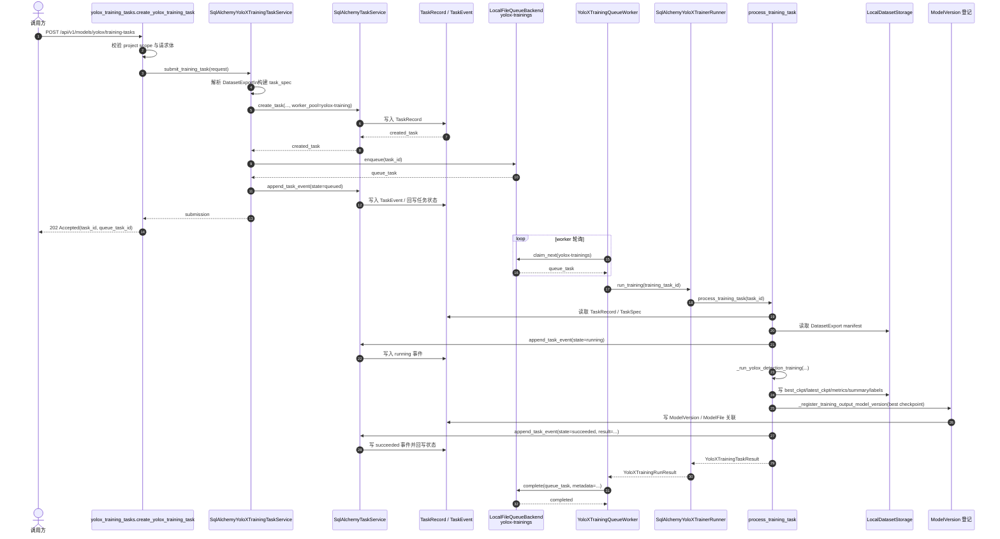
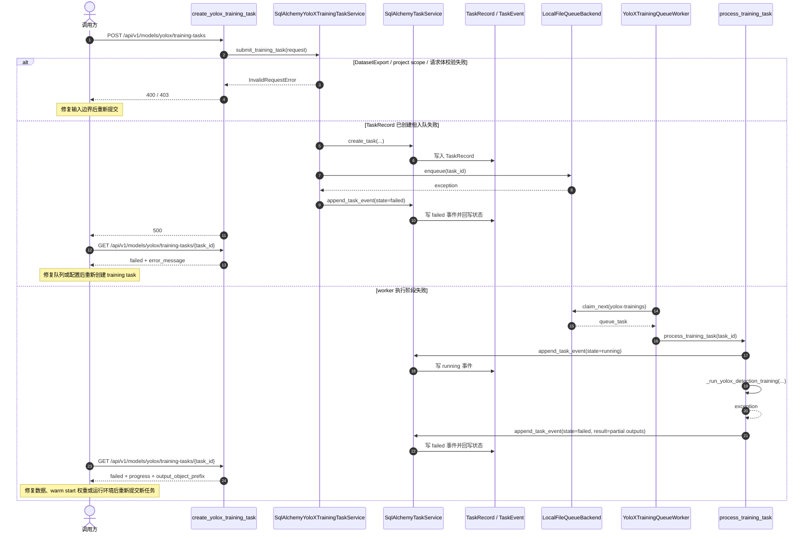
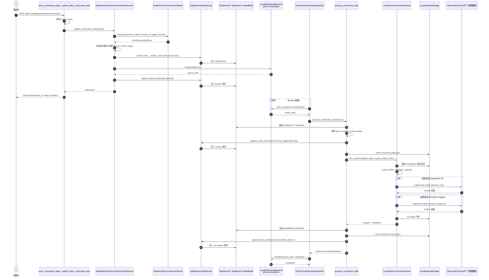
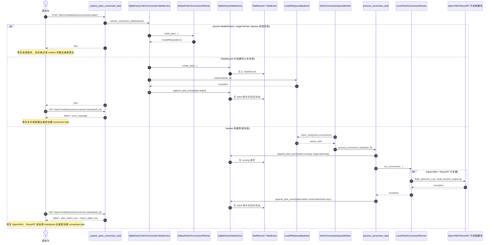
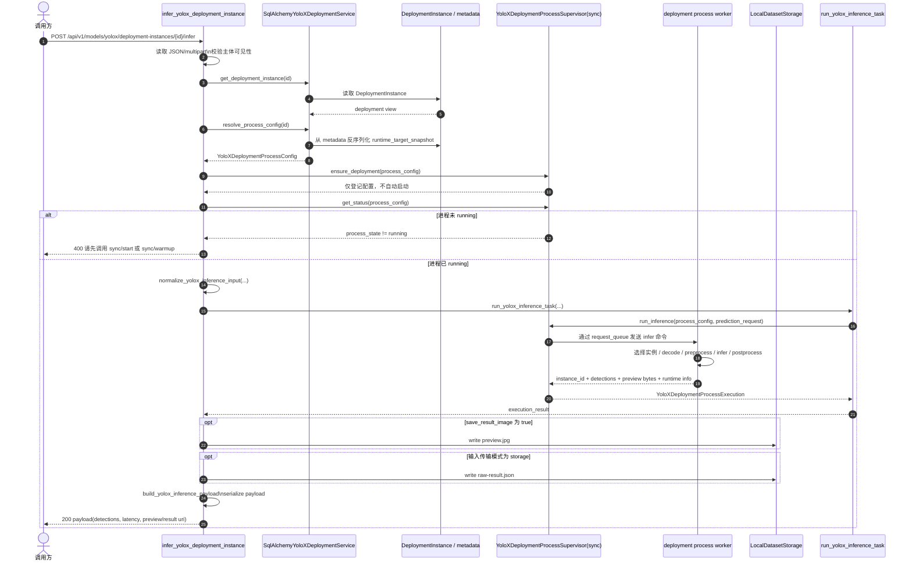
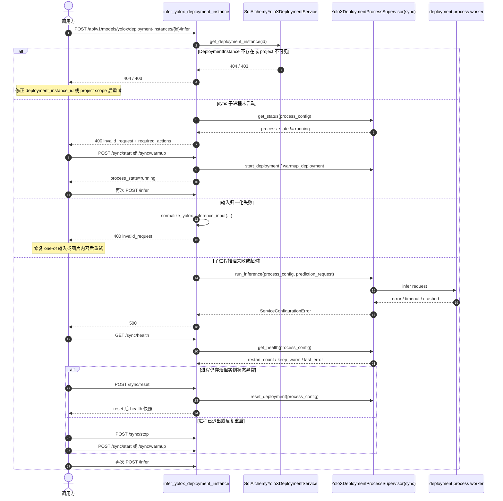
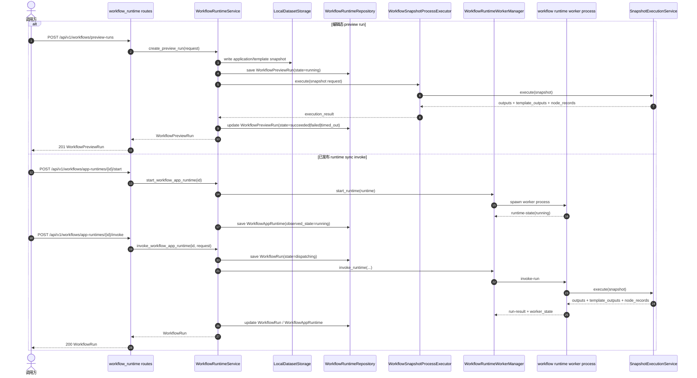
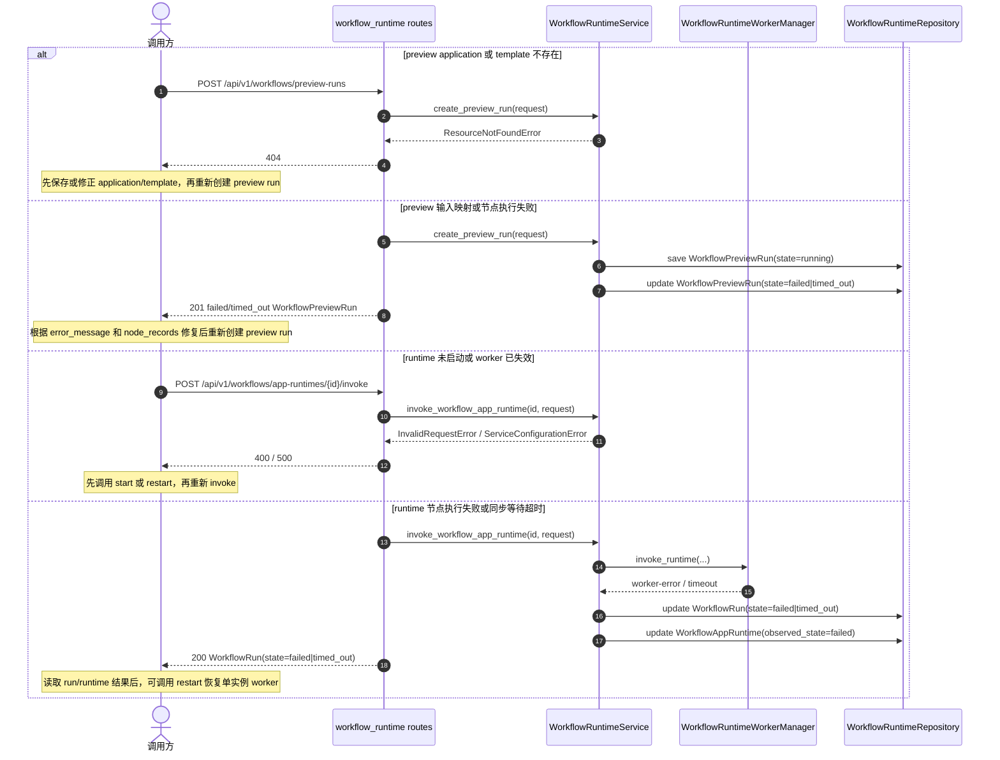

# 关键执行顺序图

## 文档目的

本文档收敛当前主干中训练、转换、部署推理和 workflow runtime 四条常用执行链的调用顺序，方便定位入口、任务状态回写点、文件写入点和进程边界。

本文档聚焦当前代码已经落地的顺序关系，不展开字段细节、部署步骤或历史方案。

## 适用范围

- YOLOX training task 提交与执行
- YOLOX conversion task 提交与执行
- DeploymentInstance 同步直返推理
- WorkflowPreviewRun 编辑态试跑
- WorkflowAppRuntime 同步调用

## 当前边界

- 训练和转换都先创建 TaskRecord，再写入 LocalFileQueueBackend，由独立 worker 消费。
- 部署推理顺序图覆盖同步直返接口，不展开异步 inference task 链。
- 同步 deployment 推理接口不会自动启动 sync 子进程；未启动时会要求先调用 start 或 warmup。
- workflow runtime 当前公开接口已经拆成两条路径：preview-runs 走隔离子进程；app-runtimes/{workflow_runtime_id}/invoke 走单实例 worker。

## 训练链

- REST 入口：[backend/service/api/rest/v1/routes/yolox_training_tasks.py](../../backend/service/api/rest/v1/routes/yolox_training_tasks.py)
- 任务服务：[backend/service/application/models/yolox_training_service.py](../../backend/service/application/models/yolox_training_service.py)
- worker 入口：[backend/workers/training/yolox_training_queue_worker.py](../../backend/workers/training/yolox_training_queue_worker.py)

训练链的关键点是 REST 层只负责创建任务和入队，真正的训练、训练输出文件写入和 ModelVersion 登记都在 worker 消费阶段完成。

### 训练链异常分支

训练失败态会把 `failed` 状态和当前可见输出路径写回 TaskRecord；`resume` 只用于 `paused` 任务，不用于已经 `failed` 的任务恢复。

## 转换链

- REST 入口：[backend/service/api/rest/v1/routes/yolox_conversion_tasks.py](../../backend/service/api/rest/v1/routes/yolox_conversion_tasks.py)
- 任务服务：[backend/service/application/conversions/yolox_conversion_task_service.py](../../backend/service/application/conversions/yolox_conversion_task_service.py)
- worker 入口：[backend/workers/conversion/yolox_conversion_queue_worker.py](../../backend/workers/conversion/yolox_conversion_queue_worker.py)
- 转换 runner：[backend/workers/conversion/yolox_conversion_runner.py](../../backend/workers/conversion/yolox_conversion_runner.py)

转换链的关键点是规划阶段先在 service 层固化，真正的 ONNX、OpenVINO、TensorRT 构建发生在 worker 侧；其中 OpenVINO 和 TensorRT 进一步通过独立脚本子进程执行。

### 转换链异常分支

转换失败态会稳定回写 `plan_object_key`，并预留 `report_object_key`；如果失败发生在报告真正写出之前，`result` 接口可能返回文件缺失，此时应先查看任务详情和事件流定位失败阶段。

## 部署推理链

- REST 入口：[backend/service/api/rest/v1/routes/yolox_inference_tasks.py](../../backend/service/api/rest/v1/routes/yolox_inference_tasks.py)
- Deployment 服务：[backend/service/application/deployments/yolox_deployment_service.py](../../backend/service/application/deployments/yolox_deployment_service.py)
- 推理监督器：[backend/service/application/runtime/yolox_deployment_process_supervisor.py](../../backend/service/application/runtime/yolox_deployment_process_supervisor.py)

部署推理链的关键点是 DeploymentInstance 先解析出 process config，再由 supervisor 把推理请求转发到独立 deployment 子进程；同步直返接口本身不负责自动拉起进程。

### 部署推理链异常分支

同步直返推理没有 TaskRecord 回写点，恢复动作主要依赖 deployment 的 `status`、`health`、`reset`、`stop` 和 `start` 接口，而不是任务事件流。

## Workflow Runtime 链

- preview 控制面：[backend/service/api/rest/v1/routes/workflow_runtime.py](../../backend/service/api/rest/v1/routes/workflow_runtime.py)
- runtime 服务：[backend/service/application/workflows/runtime_service.py](../../backend/service/application/workflows/runtime_service.py)
- preview 子进程执行器：[backend/service/application/workflows/snapshot_execution.py](../../backend/service/application/workflows/snapshot_execution.py)
- runtime worker 管理器：[backend/service/application/workflows/runtime_worker.py](../../backend/service/application/workflows/runtime_worker.py)

workflow runtime 链的关键点是编辑态试跑和已发布应用运行已经拆成两条公开路径。preview 通过固定 snapshot 在隔离子进程执行；已发布应用通过单实例 worker 进程执行 start、stop、restart、health、instances 和 sync invoke。

### Workflow Runtime 链异常分支

workflow runtime 当前没有独立 TaskRecord；preview 和 sync invoke 的失败信息通过 WorkflowPreviewRun、WorkflowRun 和 WorkflowAppRuntime 这三类资源稳定表达。

## 相关文档

- [docs/architecture/current-implementation-status.md](current-implementation-status.md)
- [docs/architecture/backend-service.md](backend-service.md)
- [docs/architecture/task-system.md](task-system.md)
- [docs/architecture/workflow-json-contracts.md](workflow-json-contracts.md)