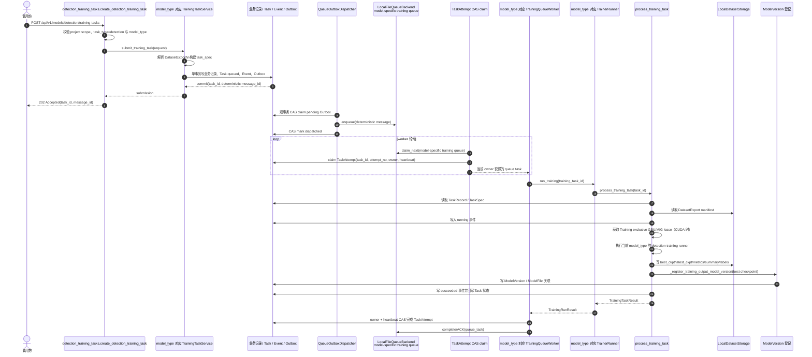
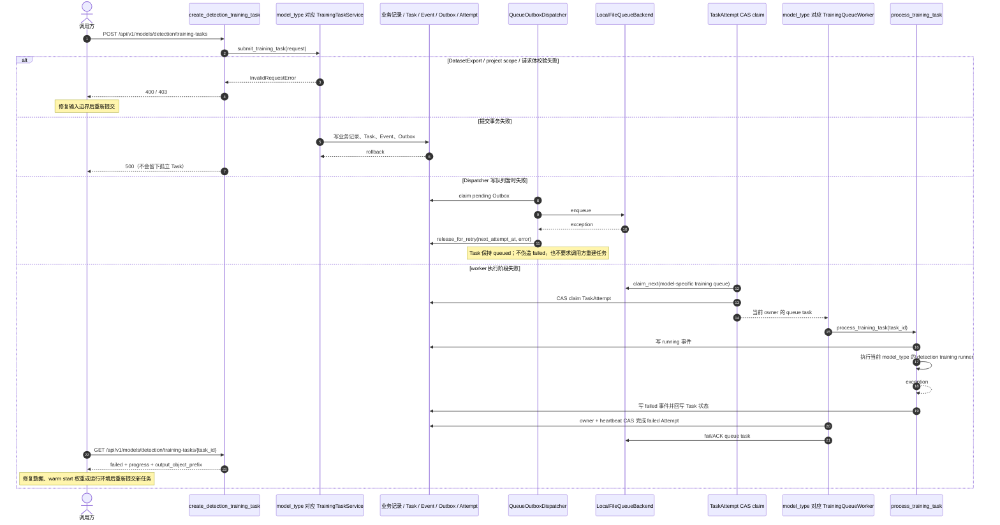
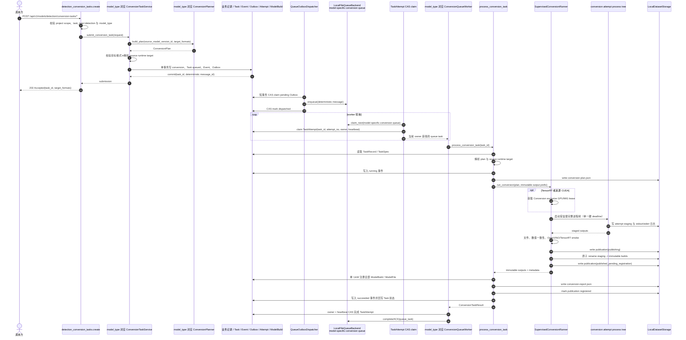
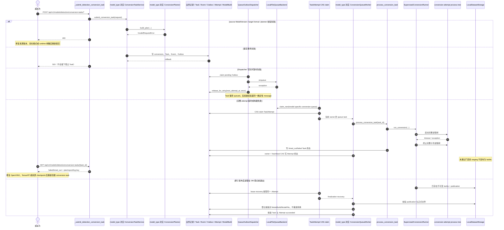
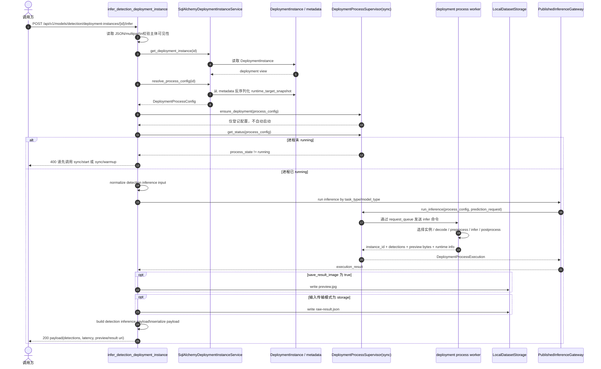
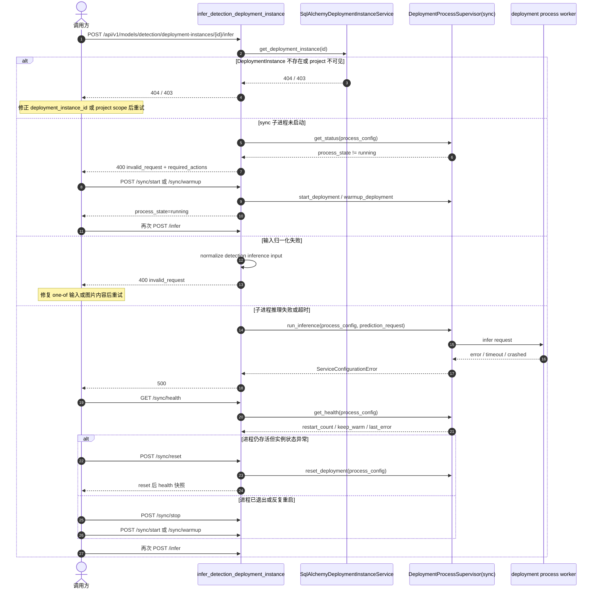
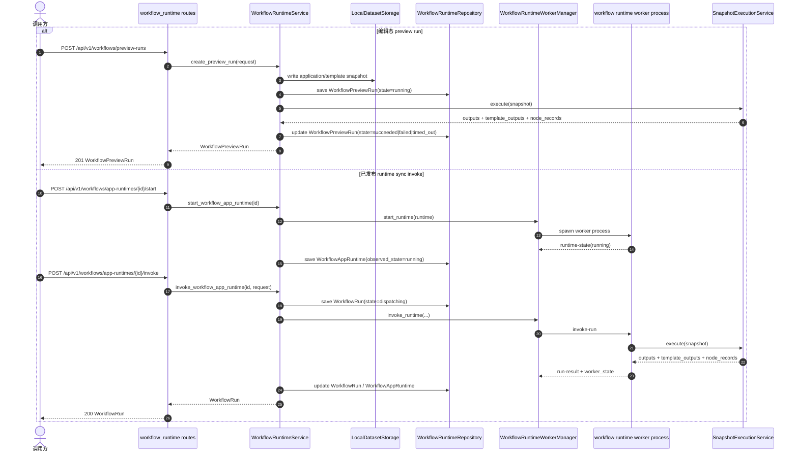
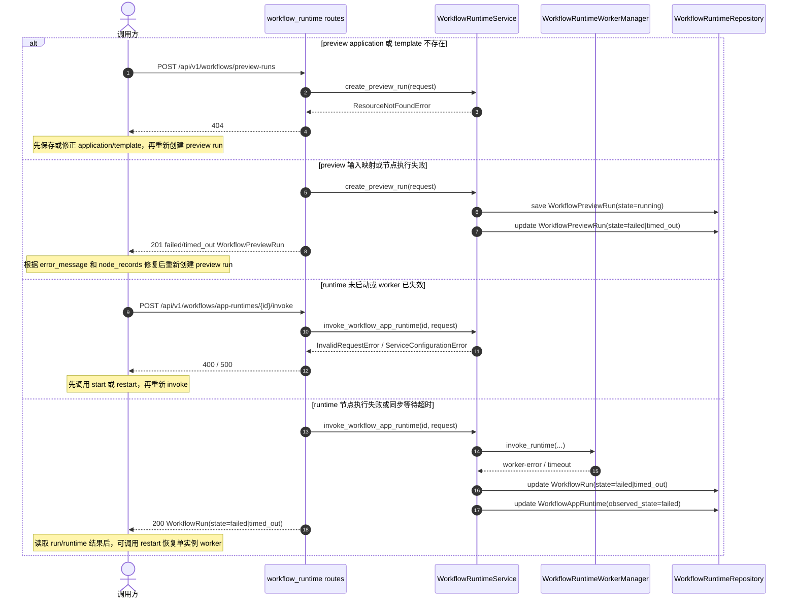

# 关键执行顺序图

## 文档目的

本文档收敛当前主干中训练、转换、部署推理和 workflow runtime 四条常用执行链的调用顺序，方便定位入口、任务状态回写点、文件写入点和进程边界。

本文档聚焦当前代码已经落地的顺序关系，不展开字段细节、部署步骤或历史方案。

## 适用范围

- detection training task 提交与执行，并说明 `model_type` 如何分发到各模型专属实现
- detection conversion task 提交与执行，并说明 `model_type` 如何分发到各模型专属实现
- DeploymentInstance 同步直返推理
- WorkflowPreviewRun 编辑态试跑
- WorkflowAppRuntime 同步调用

## 当前边界

- 训练和转换提交都在一个 Unit of Work 中写业务记录、TaskRecord、初始 TaskEvent 和 QueueOutboxMessage；Dispatcher 提交事务后再写 LocalFileQueueBackend。
- 持久任务进入业务 Worker 前必须按 `task_id + attempt_no` 原子领取 TaskAttempt；重复消息和失去 owner 的旧执行者不能重复副作用或覆盖终态。
- 部署推理顺序图覆盖同步直返接口，不展开异步 inference task 链。
- 同步 deployment 推理接口不会自动启动 sync 子进程；未启动时会要求先调用 start 或 warmup。
- workflow runtime 当前公开接口已经拆成两条路径：preview-runs 在 backend-service 当前进程同步直调；app-runtimes/{workflow_runtime_id}/invoke 走长期 worker。

## 训练链

- REST 入口：[backend/service/api/rest/v1/routes/detection_training_tasks/router.py](../../backend/service/api/rest/v1/routes/detection_training_tasks/router.py)
- 任务服务：REST 层按 `model_type` 分发到 `SqlAlchemyYoloXTrainingTaskService`、`SqlAlchemyYoloV8TrainingTaskService`、`SqlAlchemyYolo11TrainingTaskService`、`SqlAlchemyYolo26TrainingTaskService` 或 `SqlAlchemyRfdetrTrainingTaskService`
- worker 入口：`backend/workers/training/*_training_queue_worker.py` 中的模型专属 worker；YOLOv8 / YOLO11 / YOLO26 的 classification、segmentation、pose、obb 训练由 `yolo_training_queue_worker.py` 按 `task_type` 消费

```mermaid
sequenceDiagram
    autonumber
    actor Client as 调用方
    participant API as detection_training_tasks.create_detection_training_task
    participant TrainSvc as model_type 对应 TrainingTaskService
    participant DB as 业务记录 / Task / Event / Outbox
    participant Dispatcher as QueueOutboxDispatcher
    participant Queue as LocalFileQueueBackend<br/>model-specific training queue
    participant Claim as TaskAttempt CAS claim
    participant Worker as model_type 对应 TrainingQueueWorker
    participant Runner as model_type 对应 TrainerRunner
    participant TrainProc as process_training_task
    participant Storage as LocalDatasetStorage
    participant ModelReg as ModelVersion 登记

    Client->>API: POST /api/v1/models/detection/training-tasks
    API->>API: 校验 project scope、task_type=detection 与 model_type
    API->>TrainSvc: submit_training_task(request)
    TrainSvc->>TrainSvc: 解析 DatasetExport\n构建 task_spec
    TrainSvc->>DB: 单事务写业务记录、Task queued、Event、Outbox
    DB-->>TrainSvc: commit(task_id, deterministic message_id)
    TrainSvc-->>API: submission
    API-->>Client: 202 Accepted(task_id, message_id)

    Dispatcher->>DB: 短事务 CAS claim pending Outbox
    Dispatcher->>Queue: enqueue(deterministic message)
    Dispatcher->>DB: CAS mark dispatched

    loop worker 轮询
        Claim->>Queue: claim_next(model-specific training queue)
        Claim->>DB: claim TaskAttempt(task_id, attempt_no, owner, heartbeat)
        Claim-->>Worker: 当前 owner 获得的 queue task
    end
    Worker->>Runner: run_training(training_task_id)
    Runner->>TrainProc: process_training_task(task_id)
    TrainProc->>DB: 读取 TaskRecord / TaskSpec
    TrainProc->>Storage: 读取 DatasetExport manifest
    TrainProc->>DB: 写入 running 事件
    TrainProc->>TrainProc: 获取 Training exclusive GPU/MIG lease（CUDA 时）
    TrainProc->>TrainProc: 执行当前 model_type 的 detection training runner
    TrainProc->>Storage: 写 best_ckpt/latest_ckpt/metrics/summary/labels
    TrainProc->>ModelReg: _register_training_output_model_version(best checkpoint)
    ModelReg->>DB: 写 ModelVersion / ModelFile 关联
    TrainProc->>DB: 写 succeeded 事件并回写 Task 状态
    TrainProc-->>Runner: TrainingTaskResult
    Runner-->>Worker: TrainingRunResult
    Worker->>DB: owner + heartbeat CAS 完成 TaskAttempt
    Worker->>Queue: complete/ACK(queue_task)
```

训练链的关键点是 REST 层只负责创建任务和入队，真正的训练、训练输出文件写入和 ModelVersion 登记都在 worker 消费阶段完成。

当前公开入口按 `task_type` 组织，detection 训练统一走 `/api/v1/models/detection/training-tasks`；模型内部执行仍按 `model_type` 隔离，`yolox-training`、`yolov8-training`、`yolo11-training`、`yolo26-training`、`rfdetr-training` 这些 worker kind 不应改成一个模糊的 `detection-training`。这种边界能同时保证公开入口统一、模型实现不混线。

### 训练链异常分支

```mermaid
sequenceDiagram
    autonumber
    actor Client as 调用方
    participant API as create_detection_training_task
    participant TrainSvc as model_type 对应 TrainingTaskService
    participant DB as 业务记录 / Task / Event / Outbox / Attempt
    participant Dispatcher as QueueOutboxDispatcher
    participant Queue as LocalFileQueueBackend
    participant Claim as TaskAttempt CAS claim
    participant Worker as model_type 对应 TrainingQueueWorker
    participant Proc as process_training_task

    Client->>API: POST /api/v1/models/detection/training-tasks
    API->>TrainSvc: submit_training_task(request)
    alt DatasetExport / project scope / 请求体校验失败
        TrainSvc-->>API: InvalidRequestError
        API-->>Client: 400 / 403
        Note over Client: 修复输入边界后重新提交
    else 提交事务失败
        TrainSvc->>DB: 写业务记录、Task、Event、Outbox
        DB-->>TrainSvc: rollback
        API-->>Client: 500（不会留下孤立 Task）
    else Dispatcher 写队列暂时失败
        Dispatcher->>DB: claim pending Outbox
        Dispatcher->>Queue: enqueue
        Queue-->>Dispatcher: exception
        Dispatcher->>DB: release_for_retry(next_attempt_at, error)
        Note over Dispatcher: Task 保持 queued；不伪造 failed，也不要求调用方重建任务
    else worker 执行阶段失败
        Claim->>Queue: claim_next(model-specific training queue)
        Claim->>DB: CAS claim TaskAttempt
        Claim-->>Worker: 当前 owner 的 queue task
        Worker->>Proc: process_training_task(task_id)
        Proc->>DB: 写 running 事件
        Proc->>Proc: 执行当前 model_type 的 detection training runner
        Proc-->>Proc: exception
        Proc->>DB: 写 failed 事件并回写 Task 状态
        Worker->>DB: owner + heartbeat CAS 完成 failed Attempt
        Worker->>Queue: fail/ACK queue task
        Client->>API: GET /api/v1/models/detection/training-tasks/{task_id}
        API-->>Client: failed + progress + output_object_prefix
        Note over Client: 修复数据、warm start 权重或运行环境后重新提交新任务
    end
```

训练失败态会把 `failed` 状态和当前可见输出路径写回 TaskRecord。`paused` 任务以及
仍有完整 `latest checkpoint` 的 `failed` 任务可以重新入队；恢复从最近一次已落盘
checkpoint 的下一轮继续，不恢复异常前尚未落盘的 batch、epoch 或 RNG 状态。默认
checkpoint 周期为 5，因此普通崩溃最多重跑最近 checkpoint 后的 4 轮。checkpoint
不存在、损坏或与当前不可变训练参数不一致时必须拒绝恢复或再次进入 `failed`。

## 转换链

- REST 入口：[backend/service/api/rest/v1/routes/detection_conversion_tasks/router.py](../../backend/service/api/rest/v1/routes/detection_conversion_tasks/router.py)
- 任务服务：REST 层按 `model_type` 分发到 `SqlAlchemyYoloXConversionTaskService`、`SqlAlchemyYoloV8ConversionTaskService`、`SqlAlchemyYolo11ConversionTaskService`、`SqlAlchemyYolo26ConversionTaskService` 或 `SqlAlchemyRfdetrConversionTaskService`
- worker 入口：`backend/workers/conversion/*_conversion_queue_worker.py` 中的模型专属 worker
- 转换 runner：YOLOX 走 `LocalYoloXConversionRunner`；YOLOv8 / YOLO11 / YOLO26 走 `LocalYoloModelConversionRunner` 派生 runner，并由各自 `*_core/export/` 提供 ONNX / OpenVINO / TensorRT 细节；RF-DETR 走 `LocalRfdetrConversionRunner`

```mermaid
sequenceDiagram
    autonumber
    actor Client as 调用方
    participant API as detection_conversion_tasks.create
    participant ConvSvc as model_type 对应 ConversionTaskService
    participant Planner as model_type 对应 ConversionPlanner
    participant DB as 业务记录 / Task / Event / Outbox / Attempt / ModelBuild
    participant Dispatcher as QueueOutboxDispatcher
    participant Queue as LocalFileQueueBackend<br/>model-specific conversion queue
    participant Claim as TaskAttempt CAS claim
    participant Worker as model_type 对应 ConversionQueueWorker
    participant Proc as process_conversion_task
    participant Supervisor as SupervisedConversionRunner
    participant AttemptProc as conversion attempt process tree
    participant Storage as LocalDatasetStorage

    Client->>API: POST /api/v1/models/detection/conversion-tasks/*
    API->>API: 校验 project scope、task_type=detection 与 model_type
    API->>ConvSvc: submit_conversion_task(request)
    ConvSvc->>Planner: build_plan(source_model_version_id, target_formats)
    Planner-->>ConvSvc: ConversionPlan
    ConvSvc->>ConvSvc: 校验目标格式\n解析 source runtime target
    ConvSvc->>DB: 单事务写 conversion、Task queued、Event、Outbox
    DB-->>ConvSvc: commit(task_id, deterministic message_id)
    ConvSvc-->>API: submission
    API-->>Client: 202 Accepted(task_id, target_formats)

    Dispatcher->>DB: 短事务 CAS claim pending Outbox
    Dispatcher->>Queue: enqueue(deterministic message)
    Dispatcher->>DB: CAS mark dispatched

    loop worker 轮询
        Claim->>Queue: claim_next(model-specific conversion queue)
        Claim->>DB: claim TaskAttempt(task_id, attempt_no, owner, heartbeat)
        Claim-->>Worker: 当前 owner 获得的 queue task
    end
    Worker->>Proc: process_conversion_task(task_id)
    Proc->>DB: 读取 TaskRecord / TaskSpec
    Proc->>Proc: 解析 plan 与 source runtime target
    Proc->>DB: 写入 running 事件
    Proc->>Storage: write conversion-plan.json
    Proc->>Supervisor: run_conversion(plan, immutable output prefix)
    opt TensorRT 或来源 CUDA
        Supervisor->>Supervisor: 获取 Conversion exclusive GPU/MIG lease
    end
    Supervisor->>AttemptProc: 启动受监督完整进程树（单一硬 deadline）
    AttemptProc->>Storage: 写 attempt staging 与 stdout/stderr 日志
    AttemptProc-->>Supervisor: staged outputs
    Supervisor->>Supervisor: 文件、数值一致性、OpenVINO/TensorRT smoke
    Supervisor->>Storage: write publication(publishing)
    Supervisor->>Storage: 原子 rename staging -> immutable builds
    Supervisor->>Storage: write publication(published_pending_registration)
    Supervisor-->>Proc: immutable outputs + metadata
    Proc->>DB: 单 UoW 注册全部 ModelBuild / ModelFile
    Proc->>Storage: write conversion-report.json
    Proc->>Storage: mark publication registered
    Proc->>DB: 写入 succeeded 事件并回写 Task 状态
    Proc-->>Worker: ConversionTaskResult
    Worker->>DB: owner + heartbeat CAS 完成 TaskAttempt
    Worker->>Queue: complete/ACK(queue_task)
```

转换链的关键点是规划阶段先在 service 层固化，整个构建与其辅助程序都位于一个可终止的子进程树内；任何产物在通过完整门禁和原子 rename 前都不是正式 ModelBuild。

当前公开入口按 `task_type` 组织，detection 转换统一走 `/api/v1/models/detection/conversion-tasks/*`；具体转换仍按 `model_type` 进入 `yolox-conversion`、`yolov8-conversion`、`yolo11-conversion`、`yolo26-conversion` 或 `rfdetr-conversion`。这里的队列和 runner 是模型实现边界，不应被重命名成单一 `detection-conversion`。

### 转换链异常分支

```mermaid
sequenceDiagram
    autonumber
    actor Client as 调用方
    participant API as _submit_detection_conversion_task
    participant ConvSvc as model_type 对应 ConversionTaskService
    participant Planner as model_type 对应 ConversionPlanner
    participant DB as 业务记录 / Task / Event / Outbox / Attempt / ModelBuild
    participant Dispatcher as QueueOutboxDispatcher
    participant Queue as LocalFileQueueBackend
    participant Claim as TaskAttempt CAS claim
    participant Worker as model_type 对应 ConversionQueueWorker
    participant Proc as process_conversion_task
    participant Supervisor as SupervisedConversionRunner
    participant AttemptProc as conversion attempt process tree
    participant Storage as LocalDatasetStorage

    Client->>API: POST /api/v1/models/detection/conversion-tasks/*
    API->>ConvSvc: submit_conversion_task(request)
    alt source ModelVersion / target format / planner 校验失败
        ConvSvc->>Planner: build_plan(...)
        Planner-->>ConvSvc: InvalidRequestError
        API-->>Client: 400
        Note over Client: 修复来源版本、目标格式或 runtime 参数后重新提交
    else 提交事务失败
        ConvSvc->>DB: 写 conversion、Task、Event、Outbox
        DB-->>ConvSvc: rollback
        API-->>Client: 500（不会留下孤立 Task）
    else Dispatcher 写队列暂时失败
        Dispatcher->>DB: claim pending Outbox
        Dispatcher->>Queue: enqueue
        Queue-->>Dispatcher: exception
        Dispatcher->>DB: release_for_retry(next_attempt_at, error)
        Note over Dispatcher: Task 保持 queued，后续继续投递同一确定性 message
    else 完整 attempt 超时或构建失败
        Claim->>Queue: claim_next(model-specific conversion queue)
        Claim->>DB: CAS claim TaskAttempt
        Claim-->>Worker: 当前 owner 的 queue task
        Worker->>Proc: process_conversion_task(task_id)
        Proc->>Supervisor: run_conversion(...)
        Supervisor->>AttemptProc: 启动完整进程树
        AttemptProc-->>Supervisor: timeout / exception
        Supervisor->>AttemptProc: 终止完整子孙进程树
        Proc->>DB: 写 timed_out/failed Task 终态
        Worker->>DB: owner + heartbeat CAS 写 Attempt 终态
        Note over Storage: 未通过门禁的 staging 不发布为 builds
        Client->>API: GET /api/v1/models/detection/conversion-tasks/{task_id}
        API-->>Client: failed/timed_out + plan/report/log key
        Note over Client: 修复 OpenVINO、TensorRT 或来源 checkpoint 后重新创建 conversion task
    else 原子发布后进程在 DB 登记前退出
        Supervisor->>Storage: 已存在不可变 builds + publication
        Claim->>DB: lease recovery 接管同一 Attempt
        Claim-->>Worker: finalization recovery
        Worker->>Storage: 校验 publication 与正式文件
        Worker->>DB: 登记或核对 ModelBuild/ModelFile，不重放转换
        Worker->>DB: 收敛 Task 与 Attempt succeeded
    end
```

转换失败态会保留 plan、attempt stdout/stderr 和可用报告诊断。已发布文件与 DB 之间的崩溃窗口由不可变 publication 恢复；任务已终止、没有任何 DB build 且超过 grace 的孤儿才由 reconciler 回收，运行中或状态不明确的目录不会被猜测删除。

## 部署推理链

- REST 入口：[backend/service/api/rest/v1/routes/detection_inference_tasks/router.py](../../backend/service/api/rest/v1/routes/detection_inference_tasks/router.py)
- Deployment 服务：[backend/service/application/deployments/deployment_instance_service.py](../../backend/service/application/deployments/deployment_instance_service.py)
- 推理监督器：[backend/service/application/runtime/deployment/deployment_process_supervisor.py](../../backend/service/application/runtime/deployment/deployment_process_supervisor.py)

```mermaid
sequenceDiagram
    autonumber
    actor Client as 调用方
    participant API as infer_detection_deployment_instance
    participant DeploySvc as SqlAlchemyDeploymentInstanceService
    participant DB as DeploymentInstance / metadata
    participant SyncSup as DeploymentProcessSupervisor(sync)
    participant Child as deployment process worker
    participant Storage as LocalDatasetStorage
    participant Pred as PublishedInferenceGateway

    Client->>API: POST /api/v1/models/detection/deployment-instances/{id}/infer
    API->>API: 读取 JSON/multipart\n校验主体可见性
    API->>DeploySvc: get_deployment_instance(id)
    DeploySvc->>DB: 读取 DeploymentInstance
    DB-->>DeploySvc: deployment view
    API->>DeploySvc: resolve_process_config(id)
    DeploySvc->>DB: 从 metadata 反序列化 runtime_target_snapshot
    DeploySvc-->>API: DeploymentProcessConfig
    API->>SyncSup: ensure_deployment(process_config)
    SyncSup-->>API: 仅登记配置，不自动启动
    API->>SyncSup: get_status(process_config)
    alt 进程未 running
        SyncSup-->>API: process_state != running
        API-->>Client: 400 请先调用 sync/start 或 sync/warmup
    else 进程已 running
        API->>API: normalize detection inference input
        API->>Pred: run inference by task_type/model_type
        Pred->>SyncSup: run_inference(process_config, prediction_request)
        SyncSup->>Child: 通过 request_queue 发送 infer 命令
        Child->>Child: 选择实例 / decode / preprocess / infer / postprocess
        Child-->>SyncSup: instance_id + detections + preview bytes + runtime info
        SyncSup-->>Pred: DeploymentProcessExecution
        Pred-->>API: execution_result
        opt save_result_image 为 true
            API->>Storage: write preview.jpg
        end
        opt 输入传输模式为 storage
            API->>Storage: write raw-result.json
        end
        API->>API: build detection inference payload\nserialize payload
        API-->>Client: 200 payload(detections, latency, preview/result uri)
    end
```

部署推理链的关键点是 DeploymentInstance 先解析出 process config，再由 supervisor 把推理请求转发到独立 deployment 子进程；同步直返接口本身不负责自动拉起进程。

### 部署推理链异常分支

```mermaid
sequenceDiagram
    autonumber
    actor Client as 调用方
    participant API as infer_detection_deployment_instance
    participant DeploySvc as SqlAlchemyDeploymentInstanceService
    participant SyncSup as DeploymentProcessSupervisor(sync)
    participant Child as deployment process worker

    Client->>API: POST /api/v1/models/detection/deployment-instances/{id}/infer
    API->>DeploySvc: get_deployment_instance(id)
    alt DeploymentInstance 不存在或 project 不可见
        DeploySvc-->>API: 404 / 403
        API-->>Client: 404 / 403
        Note over Client: 修正 deployment_instance_id 或 project scope 后重试
    else sync 子进程未启动
        API->>SyncSup: get_status(process_config)
        SyncSup-->>API: process_state != running
        API-->>Client: 400 invalid_request + required_actions
        Client->>API: POST /sync/start 或 /sync/warmup
        API->>SyncSup: start_deployment / warmup_deployment
        API-->>Client: process_state=running
        Client->>API: 再次 POST /infer
    else 输入归一化失败
        API->>API: normalize detection inference input
        API-->>Client: 400 invalid_request
        Note over Client: 修复 one-of 输入或图片内容后重试
    else 子进程推理失败或超时
        API->>SyncSup: run_inference(process_config, prediction_request)
        SyncSup->>Child: infer request
        Child-->>SyncSup: error / timeout / crashed
        SyncSup-->>API: ServiceConfigurationError
        API-->>Client: 500
        Client->>API: GET /sync/health
        API->>SyncSup: get_health(process_config)
        SyncSup-->>API: restart_count / keep_warm / last_error
        alt 进程仍存活但实例状态异常
            Client->>API: POST /sync/reset
            API->>SyncSup: reset_deployment(process_config)
            API-->>Client: reset 后 health 快照
        else 进程已退出或反复重启
            Client->>API: POST /sync/stop
            Client->>API: POST /sync/start 或 /sync/warmup
        end
        Client->>API: 再次 POST /infer
    end
```

同步直返推理没有 TaskRecord 回写点，恢复动作主要依赖 deployment 的 `status`、`health`、`reset`、`stop` 和 `start` 接口，而不是任务事件流。

## Workflow Runtime 链

- preview / app runtime 控制面入口：[backend/service/api/rest/v1/routes/workflow_runtime/router.py](../../backend/service/api/rest/v1/routes/workflow_runtime/router.py)
- runtime 服务门面：[backend/service/application/workflows/runtime_service.py](../../backend/service/application/workflows/runtime_service.py)
- preview 直接执行器：[backend/service/application/workflows/snapshot_execution.py](../../backend/service/application/workflows/snapshot_execution.py)
- runtime worker 管理器：[backend/service/application/workflows/worker/manager.py](../../backend/service/application/workflows/worker/manager.py)

```mermaid
sequenceDiagram
    autonumber
    actor Client as 调用方
    participant API as workflow_runtime routes
    participant RuntimeSvc as WorkflowRuntimeService
    participant Storage as LocalDatasetStorage
    participant DB as WorkflowRuntimeRepository
    participant WorkerMgr as WorkflowRuntimeWorkerManager
    participant RuntimeProc as workflow runtime worker process
    participant SnapshotExec as SnapshotExecutionService

    alt 编辑态 preview run
        Client->>API: POST /api/v1/workflows/preview-runs
        API->>RuntimeSvc: create_preview_run(request)
        RuntimeSvc->>Storage: write application/template snapshot
        RuntimeSvc->>DB: save WorkflowPreviewRun(state=running)
        RuntimeSvc->>SnapshotExec: execute(snapshot)
        SnapshotExec-->>RuntimeSvc: outputs + template_outputs + node_records
        RuntimeSvc->>DB: update WorkflowPreviewRun(state=succeeded|failed|timed_out)
        RuntimeSvc-->>API: WorkflowPreviewRun
        API-->>Client: 201 WorkflowPreviewRun
    else 已发布 runtime sync invoke
        Client->>API: POST /api/v1/workflows/app-runtimes/{id}/start
        API->>RuntimeSvc: start_workflow_app_runtime(id)
        RuntimeSvc->>WorkerMgr: start_runtime(runtime)
        WorkerMgr->>RuntimeProc: spawn worker process
        RuntimeProc-->>WorkerMgr: runtime-state(running)
        RuntimeSvc->>DB: save WorkflowAppRuntime(observed_state=running)
        Client->>API: POST /api/v1/workflows/app-runtimes/{id}/invoke
        API->>RuntimeSvc: invoke_workflow_app_runtime(id, request)
        RuntimeSvc->>DB: save WorkflowRun(state=dispatching)
        RuntimeSvc->>WorkerMgr: invoke_runtime(...)
        WorkerMgr->>RuntimeProc: invoke-run
        RuntimeProc->>SnapshotExec: execute(snapshot)
        SnapshotExec-->>RuntimeProc: outputs + template_outputs + node_records
        RuntimeProc-->>WorkerMgr: run-result + worker_state
        RuntimeSvc->>DB: update WorkflowRun / WorkflowAppRuntime
        RuntimeSvc-->>API: WorkflowRun
        API-->>Client: 200 WorkflowRun
    end
```

workflow runtime 链的关键点是编辑态试跑和已发布应用运行已经拆成两条公开路径。preview 通过固定 snapshot 在 backend-service 当前进程直接执行；已发布应用通过长期 worker 进程执行 start、stop、restart、health、instances 和 sync invoke。

### Workflow Runtime 链异常分支

```mermaid
sequenceDiagram
    autonumber
    actor Client as 调用方
    participant API as workflow_runtime routes
    participant RuntimeSvc as WorkflowRuntimeService
    participant WorkerMgr as WorkflowRuntimeWorkerManager
    participant DB as WorkflowRuntimeRepository

    alt preview application 或 template 不存在
        Client->>API: POST /api/v1/workflows/preview-runs
        API->>RuntimeSvc: create_preview_run(request)
        RuntimeSvc-->>API: ResourceNotFoundError
        API-->>Client: 404
        Note over Client: 先保存或修正 application/template，再重新创建 preview run
    else preview 输入映射或节点执行失败
        API->>RuntimeSvc: create_preview_run(request)
        RuntimeSvc->>DB: save WorkflowPreviewRun(state=running)
        RuntimeSvc->>DB: update WorkflowPreviewRun(state=failed|timed_out)
        API-->>Client: 201 failed/timed_out WorkflowPreviewRun
        Note over Client: 根据 error_message 和 node_records 修复后重新创建 preview run
    else runtime 未启动或 worker 已失效
        Client->>API: POST /api/v1/workflows/app-runtimes/{id}/invoke
        API->>RuntimeSvc: invoke_workflow_app_runtime(id, request)
        RuntimeSvc-->>API: InvalidRequestError / ServiceConfigurationError
        API-->>Client: 400 / 500
        Note over Client: 先调用 start 或 restart，再重新 invoke
    else runtime 节点执行失败或同步等待超时
        API->>RuntimeSvc: invoke_workflow_app_runtime(id, request)
        RuntimeSvc->>WorkerMgr: invoke_runtime(...)
        WorkerMgr-->>RuntimeSvc: worker-error / timeout
        RuntimeSvc->>DB: update WorkflowRun(state=failed|timed_out)
        RuntimeSvc->>DB: update WorkflowAppRuntime(observed_state=failed)
        API-->>Client: 200 WorkflowRun(state=failed|timed_out)
        Note over Client: 读取 run/runtime 结果后，可调用 restart 恢复单实例 worker
    end
```

workflow runtime 当前没有独立 TaskRecord；preview 和 sync invoke 的失败信息通过 WorkflowPreviewRun、WorkflowRun 和 WorkflowAppRuntime 这三类资源稳定表达。

## 相关文档

- [docs/architecture/system-overview.md](system-overview.md)
- [docs/architecture/platform/backend-service.md](platform/backend-service.md)
- [docs/architecture/platform/task-system.md](platform/task-system.md)
- [docs/architecture/workflows/json-contracts.md](workflows/json-contracts.md)

