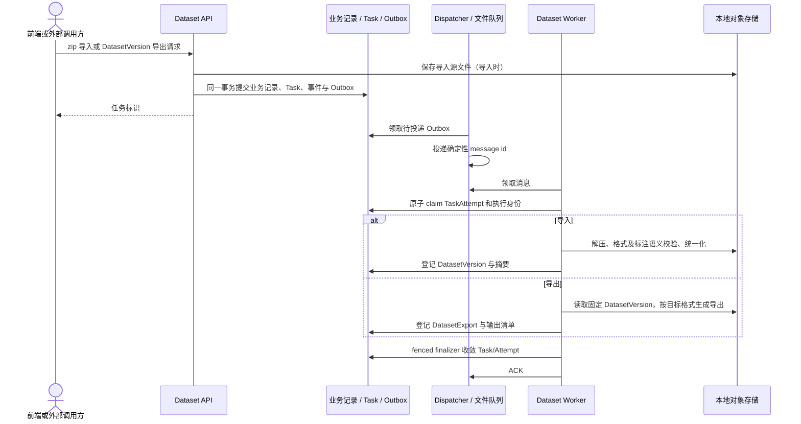
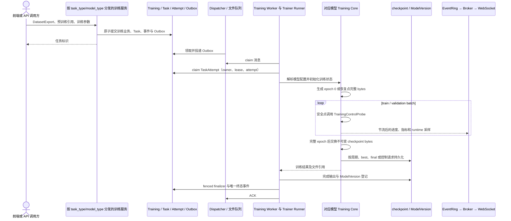
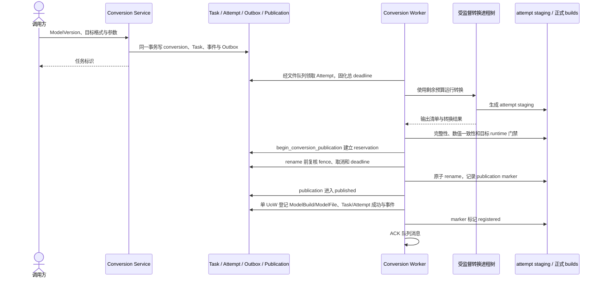
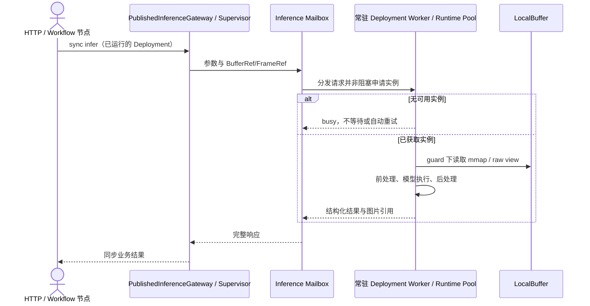
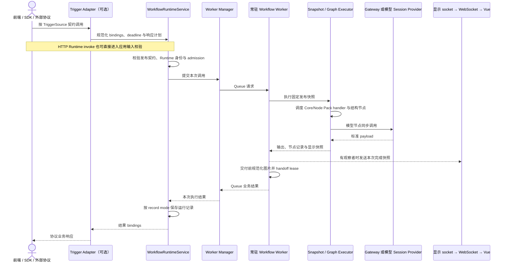

# 关键执行顺序图

## 文档目的

本文按当前代码说明数据集、训练、转换、Deployment、Workflow、Trigger 和前端之间的调用关系。字段及容量以对应契约为准，图中不把实现存在等同于目标发行环境已经完成验收。

## 当前边界

- 持久后台任务通过业务记录、Task、TaskEvent 和 Outbox 的提交进入文件队列；Worker claim 成功后才执行，结果持久化后 ACK。
- Task 状态由专用命令和条件更新推进。普通 TaskEvent 只记录观察，训练高频遥测走独立 EventRing。
- 同步 Deployment 使用常驻推理进程、结构化 Mailbox 和 LocalBuffer，不创建一次性推理 Task。
- Preview 在 backend-service 当前进程执行固定快照；已发布 Workflow App Runtime 在独立常驻 Worker 中执行。
- Runtime 请求/响应保留 Queue；显示通道使用独立有界 socket，不能替代业务响应或持久运行记录。

## 数据集导入与导出

```mermaid
sequenceDiagram
    actor Client as 前端或外部调用方
    participant API as Dataset API
    participant DB as 业务记录 / Task / Outbox
    participant Queue as Dispatcher / 文件队列
    participant Worker as Dataset Worker
    participant Store as 本地对象存储
    Client->>API: zip 导入或 DatasetVersion 导出请求
    API->>Store: 保存导入源文件（导入时）
    API->>DB: 同一事务提交业务记录、Task、事件与 Outbox
    API-->>Client: 任务标识
    Queue->>DB: 领取待投递 Outbox
    Queue->>Queue: 投递确定性 message id
    Worker->>Queue: 领取消息
    Worker->>DB: 原子 claim TaskAttempt 和执行身份
    alt 导入
        Worker->>Store: 解压、格式及标注语义校验、统一化
        Worker->>DB: 登记 DatasetVersion 与摘要
    else 导出
        Worker->>Store: 读取固定 DatasetVersion，按目标格式生成导出
        Worker->>DB: 登记 DatasetExport 与输出清单
    end
    Worker->>DB: fenced finalizer 收敛 Task/Attempt
    Worker->>Queue: ACK
```

DatasetVersion 是统一数据事实，DatasetExport 是面向训练/交换的格式化产物；训练引用选定导出，不直接把上传 zip 当作训练目录。格式与模型/任务组合均由相应注册表限制。

代码入口：[导入任务](../../backend/service/application/datasets/tasks/imports.py)、[导入处理](../../backend/service/application/datasets/imports/service.py)、[导出任务](../../backend/service/application/datasets/exports/task_service.py)、[导出处理](../../backend/service/application/datasets/exports/service.py)。

## 训练链

当前正式模型/任务组合为 YOLOX detection，YOLOv8/11/26 各五类任务，以及 RF-DETR detection/segmentation，共 18 组。独立评估使用 `evaluation` Worker Profile，具体指标口径见[模型支持矩阵](../reference/models/support-matrix.md)。

```mermaid
sequenceDiagram
    actor Client as 前端或 API 调用方
    participant API as 按 task_type/model_type 分发的训练服务
    participant DB as Training / Task / Attempt / Outbox
    participant Queue as Dispatcher / 文件队列
    participant Worker as Training Worker 与 Trainer Runner
    participant Core as 对应模型 Training Core
    participant Store as checkpoint / ModelVersion
    participant Telemetry as EventRing → Broker → WebSocket
    Client->>API: DatasetExport、预训练引用、训练参数
    API->>DB: 原子提交训练业务、Task、事件与 Outbox
    API-->>Client: 任务标识
    Queue->>DB: 领取并投递 Outbox
    Worker->>Queue: claim 消息
    Worker->>DB: claim TaskAttempt（owner、lease、attempt）
    Worker->>Core: 解析模型配置并初始化训练状态
    Core->>Core: 生成 epoch 0 或恢复点完整 bytes
    loop train / validation batch
        Core->>Core: 安全点调用 TrainingControlProbe
        Core-->>Telemetry: 节流后的进度、指标和 runtime 采样
    end
    Core->>Core: 完整 epoch 后交换不可变 checkpoint bytes
    Core->>Store: 按周期、best、final 或控制请求持久化
    Core-->>Worker: 训练结果及文件引用
    Worker->>Store: 完成输出与 ModelVersion 登记
    Worker->>DB: fenced finalizer 与唯一终态事件
    Worker->>Queue: ACK
```

### 训练链异常分支

暂停请求只写数据库控制意图，Task 仍为 `running`；batch 安全点观察后丢弃未完成 epoch，持久化或复用最近完整 epoch 的 bytes，再收敛 Task/Attempt 为 `paused`。Resume 在同一事务写入排队状态与新 Outbox，下一轮 claim 才推进 `current_attempt_no`。

进度、事件与 finalizer 均校验执行身份，旧 Worker 不能覆盖新 owner。相同终态确认只 ACK，不再次执行模型。EventRing 允许覆盖和缺口，checkpoint、终态和控制意图不依赖页面在线或遥测必达。

协议见 [Task 执行、暂停与终态](platform/task-execution.md)、[训练与评估](models/training-evaluation.md)、[本机结构化消息通道](platform/local-message-channel.md)。

## 转换链

```mermaid
sequenceDiagram
    actor Client as 调用方
    participant API as Conversion Service
    participant DB as Task / Attempt / Outbox / Publication
    participant Worker as Conversion Worker
    participant Helper as 受监督转换进程树
    participant Store as attempt staging / 正式 builds
    Client->>API: ModelVersion、目标格式与参数
    API->>DB: 同一事务写 conversion、Task、事件与 Outbox
    API-->>Client: 任务标识
    Worker->>DB: 经文件队列领取 Attempt，固化总 deadline
    Worker->>Helper: 使用剩余预算运行转换
    Helper->>Store: 生成 attempt staging
    Helper-->>Worker: 输出清单与转换结果
    Worker->>Store: 完整性、数值一致性和目标 runtime 门禁
    Worker->>DB: begin_conversion_publication 建立 reservation
    Worker->>DB: rename 前复核 fence、取消和 deadline
    Worker->>Store: 原子 rename，记录 publication marker
    Worker->>DB: publication 进入 published
    Worker->>DB: 单 UoW 登记 ModelBuild/ModelFile、Task/Attempt 成功与事件
    Worker->>Store: marker 标记 registered
    Worker->>Worker: ACK 队列消息
```

### 转换链异常分支

文件发布前失败、取消或 deadline 到期，不登记半成品 build；超时按统一监督协议终止整棵进程树。rename 成功后崩溃，恢复读取固化 run result 并验证正式文件，完成登记而不重跑转换。数据库 reservation 与磁盘 marker 分别描述事务事实和文件事实；成功必须经过 publication 专用提交，通用 finalizer 不能绕过它。

各门禁、状态和回收条件见[模型转换执行与发布](models/conversion-runtime.md)。

## 部署推理链

Deployment 选择已登记 ModelVersion/ModelBuild，并把 runtime、设备和实例参数固化到配置。start/warmup/stop/reset 走持久控制队列；infer、只读状态与结构化结果走 Inference Mailbox。

```mermaid
sequenceDiagram
    actor Client as HTTP / Workflow 节点
    participant Gateway as PublishedInferenceGateway / Supervisor
    participant Mailbox as Inference Mailbox
    participant Pool as 常驻 Deployment Worker / Runtime Pool
    participant Buffer as LocalBuffer
    Client->>Gateway: sync infer（已运行的 Deployment）
    Gateway->>Mailbox: 参数与 BufferRef/FrameRef
    Mailbox->>Pool: 分发请求并非阻塞申请实例
    alt 无可用实例
        Pool-->>Mailbox: busy，不等待或自动重试
    else 已获取实例
        Pool->>Buffer: guard 下读取 mmap / raw view
        Pool->>Pool: 前处理、模型执行、后处理
        Pool-->>Mailbox: 结构化结果与图片引用
    end
    Mailbox-->>Gateway: 完整响应
    Gateway-->>Client: 同步业务结果
```

memory image-ref 在 Workflow 同步模型桥接处写入临时 LocalBuffer；已有 buffer/frame 引用可复用。Mailbox 不承载图片主体。同步调用不自动启动尚未启动的 Deployment，需显式 start 或 warmup。

持久异步推理提交正式 Task/Outbox，图片使用可跨重启的 ObjectStore key，Worker 读取稳定输入并把结果图写回 ObjectStore，再完成 Task/Attempt。短期 memory handle 和 LocalBuffer lease 不能作为持久队列输入。

### 部署推理链异常分支

未运行、容量满、deadline、owner epoch 变化和模型失败分别返回对应错误，不在同步热路径增加业务等待队列或切换传输。控制面通过 status/health/reset/stop/start 观察与恢复进程。

详见[模型部署运行时](models/deployment-runtime.md)与[高性能图片数据面](platform/image-data-plane.md)。

## Workflow Runtime 链

```mermaid
sequenceDiagram
    actor Client as 前端 / SDK / 外部协议
    participant Trigger as Trigger Adapter（可选）
    participant Service as WorkflowRuntimeService
    participant Manager as Worker Manager
    participant Runtime as 常驻 Workflow Worker
    participant Executor as Snapshot / Graph Executor
    participant Model as Gateway 或模型 Session Provider
    participant Display as 显示 socket → WebSocket → Vue
    Client->>Trigger: 按 TriggerSource 契约调用
    Trigger->>Service: 规范化 bindings、deadline 与响应计划
    Note over Client,Service: HTTP Runtime invoke 也可直接进入应用输入校验
    Service->>Service: 校验发布契约、Runtime 身份与 admission
    Service->>Manager: 提交本次调用
    Manager->>Runtime: Queue 请求
    Runtime->>Executor: 执行固定发布快照
    Executor->>Executor: 调度 Core/Node Pack handler 与结构节点
    Executor->>Model: 模型节点同步调用
    Model-->>Executor: 标准 payload
    Executor-->>Runtime: 输出、节点记录与显示快照
    Runtime-->>Display: 有观察者时发送本次完成快照
    Runtime->>Runtime: 交付前规范化图片并 handoff lease
    Runtime-->>Manager: Queue 业务结果
    Manager-->>Service: 本次执行结果
    Service->>Service: 按 record mode 保存运行记录
    Service-->>Trigger: 结果 bindings
    Trigger-->>Client: 协议业务响应
```

App Version 固定模板、节点包版本和公开输入契约；Runtime revision/generation 表示运行实例身份。Core 与受信任 Node Pack 共用图执行器和 payload，不为每个节点再启动业务进程。普通已发布模型走 Gateway；SAM3/YOLOE 等专用能力通过已注册的 WorkflowModelSessionProvider 和 scope lease 管理。

HTTP、ZeroMQ、目录监听与本机共享内存 Trigger 复用 Runtime，但各自拥有输入转换和交付规则。本机共享内存 Trigger 仅支持 sync，Mailbox 与 Inference Mailbox 独立，图片仍使用 LocalBuffer。有图片时先 PREPARE、写入并发布，event-only 跳过图片阶段；响应 lease 通过 ACK/释放协议回收。

编辑态 Preview 不经过上述常驻 Worker：backend-service 固定 snapshot 后调用同一个 Snapshot/Graph Executor，并记录 WorkflowPreviewRun。它采用协作取消；不可协作的同进程 Python handler 不能被安全强杀。

### Workflow Runtime 链异常分支

- Runtime 不可用、版本或实例身份不匹配、admission busy 时拒绝调用，不隐藏启动、排队或重放。
- Node Pack timeout 由节点生命周期消息与 Manager watchdog 协作，必要时结束整个 Runtime generation；Core 节点不发送这组 Node Pack timeout 控制消息。
- 图执行失败与 Runtime 强制退出按实际业务响应及已启用的运行记录表达，显示连接断开不补造 Run 终态。
- Runtime 显示与 App Mode 共用观察通道。当前 16 个大图客户端场景仍有 P95/P99 尾延迟限制，不能声称已通过该性能验收。

## 相关文档

- [系统总览](system-overview.md)、[项目结构](project-structure.md)、[任务系统](platform/task-system.md)。
- [节点系统](workflows/node-system.md)、[Workflow App 输入契约](workflows/app-inputs.md)、[Runtime 显示与 App Mode](workflows/runtime-display.md)。
- [LocalBufferBroker](platform/local-buffer-broker.md)、[本机结构化消息通道](platform/local-message-channel.md)、[本机共享内存 Trigger](workflows/local-shared-memory-trigger.md)。
