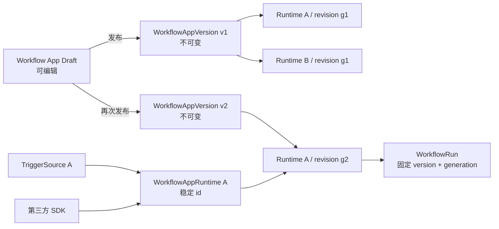

# Workflow App 版本管理与 Runtime 稳定切换设计

## 文档状态

本文档是 Workflow App 版本管理链路的现行规范。不可变 `WorkflowAppVersion`、`WorkflowRuntimeRevision`、Application lifecycle CAS、generation CAS、stopped-only 版本选择、运行来源记录、旧 Runtime 幂等迁移和失败恢复已经实现。

当前实现保留 `/api/v1` 的兼容期：新调用使用准确 `workflow_app_version_id` 创建 Runtime，旧客户端仍可暂时使用互斥的 `application_id`，服务会立即把该 Runtime 自己的快照导入为不可变版本。既有 Runtime/Trigger id 和调用地址不会变化。

正式接口见 [docs/api/workflow-app-versions.md](../api/workflow-app-versions.md) 和 [docs/api/workflow-app-runtimes.md](../api/workflow-app-runtimes.md)。

## 文档目的

本文档固定下面这些长期规则：

- Workflow App 如何从可变草稿发布为不可变版本
- 已经被第三方调用的 Runtime 和 Trigger 如何在不改变 id、地址和 SDK 配置的情况下切换版本
- 多个 Runtime 如何同时选择同一 Workflow App 的不同版本
- 更新失败、回滚、并发更新和服务重启时如何保持可恢复状态
- WorkflowRun 如何记录本次实际执行的版本和 Runtime generation
- 输入输出契约变化如何判断兼容性，什么时候必须阻止更新
- 当前已有 Runtime 和 Trigger 如何迁移，同时保持生产调用地址不变

本文档不替代 [docs/architecture/workflow-runtime.md](workflow-runtime.md)。后者定义执行面、worker 和运行状态；本文档只定义 Workflow App 发布版本和 Runtime 版本选择。

## 实现状态与保留边界

### 当前已经成立的行为

- FlowApplication 是可继续保存和编辑的文档。
- WorkflowGraphTemplate 按 `template_id/template_version` 保存，但同一个 `template_version` 仍可被再次写入，因此不能直接视为不可变生产发布物。
- 新建 WorkflowAppRuntime 时选择准确 WorkflowAppVersion；v1 旧 `application_id` 路径会先固定快照再导入版本结构。
- Runtime worker 只加载 revision 指向的不可变版本和固定 ExecutionPolicy snapshot，不在每次请求时读取可变 Application。
- TriggerSource 绑定稳定的 `workflow_runtime_id`，不会直接绑定 Application 或 Template。
- 同一个 Workflow App 可以创建多个 Runtime；当前每个 Runtime 是一个长期 worker 进程，不等同于一个 Runtime 内的多副本实例池。

### 已实现

- 发布时生成独立且不可变的 WorkflowAppVersion，并固定内容、契约、依赖和 manifest 指纹。
- Runtime 通过 WorkflowRuntimeRevision 选择准确版本；升级与回滚保留 Runtime/Trigger id。
- 同步、异步和 Trigger WorkflowRun 均固定 revision、version、generation 和 snapshot fingerprint。
- 版本选择使用 expected_generation CAS，并校验 stopped、无活动 run、Trigger 停用和映射兼容性。
- 启动失败保留最后成功 active revision；服务重启不会静默激活 staged revision。
- 旧 Runtime 按自身快照做幂等迁移，不使用迁移时的最新草稿替换生产内容。
- 同一 Application 的保存、发布和删除由持久化 lifecycle CAS 串行，竞争请求立即返回冲突，不进入队列或轮询。

### 保留边界

- 第一阶段仍是停机切换，不做灰度、流量拆分或双 worker 无停机更新。
- `application_id` 创建只用于 v1 兼容；新前端和新 SDK 控制面使用 `workflow_app_version_id`。
- 发布版本当前不提供物理删除接口；被 revision 或 run 引用的内容必须保留。

## 目标与非目标

### 目标

- Workflow App 编辑继续保持简单，保存只更新草稿。
- 发布产生新的不可变版本，旧版本长期可追溯和可恢复。
- WorkflowAppRuntime 成为稳定的生产调用地址，Runtime id、Trigger id、HTTP/ZeroMQ 地址和 SDK 配置不随版本切换改变。
- Runtime 显式选择一个准确版本，不隐式追随“最新版本”。
- 第一阶段采用停机切换，优先保证状态简单、结果准确和长期稳定。
- 请求一旦被接收，就固定到当时解析出的 Runtime revision，切换不能改变执行中的请求。
- 版本解析和契约检查只发生在发布、启动或切换控制面，不进入每次推理热路径。

### 非目标

- 不新增一层 Workflow Channel 资源。
- 不让 Trigger 直接选择版本。
- 不让 Runtime 自动追随最新版本。
- 第一阶段不实现双 worker 无停机切换、流量拆分、灰度比例或自动回滚。
- 不把模型 Deployment Channel 与 Workflow App 版本合并成同一个概念。
- 不把 Dify 或 ComfyUI 的源码作为本项目运行时依赖。

## 核心设计结论

### WorkflowAppRuntime 本身就是稳定发布通道

模型 Deployment Channel 用来把稳定模型调用名指向不可变模型 revision。Workflow 的生产调用已经天然经过 `WorkflowAppRuntime`：

```text
第三方系统 / SDK / TriggerSource
                |
                v
     stable workflow_runtime_id
                |
                v
      active Runtime revision
                |
                v
 immutable WorkflowAppVersion
```

因此不再增加 `WorkflowChannel`。如果再增加一层 Channel，会形成 `Trigger -> Channel -> Runtime -> Version`，但没有增加新的业务能力，只增加状态同步、故障恢复和接口理解成本。

### 稳定 id 与不可变版本分开

- `workflow_runtime_id`：第三方长期调用的稳定身份。
- `workflow_app_version_id`：一次不可变 Workflow App 发布物。
- `workflow_runtime_revision_id`：某个 Runtime 第几次选择了哪个版本。
- `generation`：Runtime 配置每次成功提交选择操作后递增的并发控制序号。

Runtime 可以从 v1 切到 v2，再回到 v1；这个“回到 v1”仍然要创建新的 Runtime revision 和更大的 generation，不能修改或倒退历史记录。

## 资源层级和关系



一个 Workflow App 可以有多个已发布版本。一个已发布版本可以被多个 Runtime 使用。一个 Runtime 同一时刻只有一个 active revision，但可以保留多个历史 revision。

## 术语

| 名称 | 含义 | 是否可变 |
| --- | --- | --- |
| Workflow App Draft | 编辑器当前正在保存和预览的 Application 与 Template 草稿 | 可变 |
| WorkflowAppVersion | 一次完整发布形成的 Application、Template、契约和依赖快照 | 不可变 |
| WorkflowAppRuntime | 第三方系统和 Trigger 调用的长期生产资源 | 身份稳定，状态可变 |
| WorkflowRuntimeRevision | Runtime 某次选择版本形成的历史记录 | 不可变 |
| generation | Runtime 版本选择状态的单调递增序号 | 只增不减 |
| active revision | 当前最后一次成功装载并可执行的 revision | 通过切换更新指针 |
| desired revision | 正在准备或等待启动验证的目标 revision | 通过切换更新指针 |
| content fingerprint | 发布内容整体的规范化哈希 | 不可变 |
| contract fingerprint | 公开输入输出契约的规范化哈希 | 不可变 |

## 必须保持的系统不变量

1. 已发布 WorkflowAppVersion 不允许原地修改。
2. Runtime 启动只能加载明确的 `workflow_app_version_id`，不能启动时解析“latest”。
3. Runtime 切换版本不改变 `workflow_runtime_id`、TriggerSource id、调用端点和 SDK 中的 Runtime 配置键。
4. TriggerSource 始终绑定 Runtime，不绑定版本或 revision。
5. 每个 WorkflowRun 在接收请求时固定 revision、version、generation 和 fingerprint。
6. 更新失败不能覆盖最后一个成功的 active revision。
7. 回滚通过创建更大 generation 的新 revision 完成，不修改历史 revision，不回退 generation。
8. 生产请求热路径不访问版本列表，不做“最新版本”解析，不重新做契约比较。
9. 被 Runtime revision 或 WorkflowRun 引用的版本不能物理删除，只能归档。
10. 版本切换必须使用 `expected_generation` 做 CAS；并发控制请求只有一个可以成功。
11. 同一 Application 的保存、发布和删除必须先占用持久化 lifecycle；文件 I/O 期间不能持有数据库事务。
12. 新建 Runtime 或新增 Runtime revision 时，目标版本的 `published` 校验必须与引用写入处于同一短事务；archive 成功提交后不能再产生指向该 archived 版本的新引用。

## 领域模型

### Workflow App Draft

草稿继续复用当前 FlowApplication 和 WorkflowGraphTemplate 编辑模型。草稿只用于：

- 编辑器保存
- Preview
- 发布前校验
- 生成下一份 WorkflowAppVersion

草稿不能成为迁移完成后的新 Runtime 生产来源。Preview 仍然可以直接运行草稿，生产 Runtime 只能运行发布版本。

草稿 JSON 存在 ObjectStore，而版本记录存在数据库，因此写操作必须共享数据库中的 `WorkflowApplicationLifecycle`。每个 `(project_id, application_id)` 只有一行：

| 字段 | 说明 |
| --- | --- |
| state | idle、saving、publishing 或 deleting |
| generation | 每次成功占用时单调递增 |
| operation_id | 当前操作唯一 id；idle 时为空 |
| updated_at | 最近一次 CAS 时间 |
| deleted | 物理删除后的 tombstone；重新保存成功后清除 |

占用和释放各使用一个短事务。占用由 `state=idle + expected_generation` 的条件更新完成；释放还必须匹配 `generation + operation_id`。文件校验、JSON 写入、staging 和目录移动均在事务外执行。这样同时适用于 SQLite、MySQL 和 PostgreSQL，也不会把控制面协调引入 Runtime 推理热路径。

编辑器保存必须把 Application 与其 Template 放进同一个 Application PUT bundle 请求。服务先交叉校验两份文档，再按 Application claim→Template resource claim 的固定顺序保存。Template 和 Application 的主 JSON 与 sidecar 在修改前写入以外层 Application operation id 命名的持久 journal；manifest 完整落盘后才允许替换权威对象，两份文档完成并 fsync 后再写 committed marker。普通异常立即按 journal 逆序恢复；进程退出后，启动流程先清理无 manifest 的 prepare 残留、回滚未 committed journal、清理已 committed journal，之后才恢复发布记录并释放 lifecycle claim。回滚失败会保留 journal 和两层 claim，并阻止服务进入可写状态。Template 可被多个 App 引用，因此不能只锁当前 App：独立 Template PUT/DELETE、COPY 的 source/target、显式发布和旧 Runtime 自动导入都使用同一个按 `template_id/template_version` 派生的持久化保留 resource key。COPY 对去重后的 source/target key 排序后依次占用。竞争操作立即 409，不等待，也不进入 Runtime 热路径。真实 Application id（包括 copy source/target）禁止使用 lifecycle 保留前缀；保留资源的启动恢复不应用 Application tombstone 语义。

Project 删除复用同一张 lifecycle 表中的保留 sentinel。普通控制写先在一个短事务内原子 touch Project sentinel，再创建或占用自己的 resource claim；真实文件和 worker 控制在事务外执行，不同资源的操作可以并行。Project 删除先把 sentinel 从 `idle` 条件更新为 `deleting`，并在同一事务确认没有其他活动 claim；先进入的一方成立，另一方立即返回 409，不使用业务队列、轮询或自动重试。删除提交事务会清理该 Project 的普通 lifecycle 行并保留 `deleted=true` 的 sentinel tombstone，阻止迟到请求重新写回已删除目录。删除前移动的文件由 operation manifest 记录；启动恢复会在 API 开放前回滚未提交的移动，已提交 tombstone 只补做 staging 清理。该 admission 覆盖 Application/Template/版本、Preview、执行策略、Runtime、TriggerSource，以及 Task 创建、Dataset 导入/导出提交、Model 训练输出/构建登记和 DeploymentInstance 创建等低频 Project 资源写入；一次性资源 claim 在提交后删除。同步/异步 invoke、Task 事件、Run、取消、heartbeat 和 worker callback 不经过 sentinel，生产推理和 worker 热路径没有新增数据库访问。

启动恢复属于独占维护阶段：同一 Local ObjectStore 根目录不能在一个服务仍接收写请求时由另一个 backend 实例执行启动恢复。多 API 进程在正常请求阶段可以依靠数据库 CAS 竞争，但进程编排必须先完成一次统一 bootstrap，再开放流量。这与当前本地优先、单一 backend owner 的部署边界一致；若以后支持跨主机共享 ObjectStore 和滚动重启，需要另行增加明确的服务 owner lease，不能把 lifecycle claim 当作分布式存活探针。

### WorkflowAppVersion

建议最小字段：

| 字段 | 说明 |
| --- | --- |
| workflow_app_version_id | 全局稳定版本 id |
| project_id | 所属 Project |
| application_id | 所属 Workflow App |
| version_number | 每个 Application 内单调递增的整数 |
| display_version | 默认显示为 v1、v2；可附加人工标签 |
| release_notes | 本次发布说明 |
| application_snapshot_object_key | Application 快照 |
| template_snapshot_object_key | Template 快照 |
| contract_snapshot_object_key | 公开输入输出契约快照 |
| dependency_manifest_object_key | 节点和外部依赖清单 |
| content_fingerprint | 全部发布内容的规范化哈希 |
| contract_fingerprint | 公开契约的规范化哈希 |
| state | publishing、published、archived 或 failed |
| created_at | 发布时间 |
| created_by | 发布主体 |

约束：

- `(project_id, application_id, version_number)` 唯一。
- `(project_id, workflow_app_version_id)` 唯一。
- 默认内容占位 `(project_id, application_id, content_deduplication_key)` 唯一；该内部字段只在默认发布时等于 `content_fingerprint`，显式允许重复时为空。
- `version_number` 是并发和排序依据；可选 SemVer 只用于展示，不能代替内部序号。
- `published` 后所有 snapshot object key、fingerprint 和 dependency manifest 不允许修改。
- `publishing` 和 `failed` 只用于发布事务恢复，默认不进入可供 Runtime 选择的版本列表。
- 同一 `content_fingerprint` 是否允许重复发布，由产品策略决定；默认可以阻止误操作，也可以要求填写新的 release note 后显式重复发布。
- 同一 Application 的并发发布先由 lifecycle CAS 裁决，数据库内容唯一约束继续保护持久化不变量；两者都不增加队列、等待线程或后台重试，失败发布清空内容占位并允许后续明确重试。

### 发布快照内容

WorkflowAppVersion 必须冻结：

- FlowApplication 全部字段和 bindings
- WorkflowGraphTemplate 图结构、节点参数、启用状态、公开输入输出和必要编辑元数据
- 公开 API/Trigger 输入输出契约
- 每个节点的 definition id 与实现 version
- 每个 custom node pack 的 id、version、manifest 摘要和可校验资产指纹
- Template 节点参数和 Application bindings 直接引用的 DeploymentInstance、模型版本、规则或其他稳定资源 id
- WorkflowExecutionPolicy 的选择方式；如果 policy 会影响执行结果，应固定 policy snapshot
- 所有 snapshot 文件的大小、哈希和相互引用关系

下面这些内容不能伪装成已被冻结资产：

- 磁盘绝对路径对应文件的当前内容
- 外部 HTTP、PLC、MQTT、ZeroMQ 等端点的实时状态
- DeploymentInstance 当前是否健康
- 运行机器的驱动、GPU、OpenVINO 或 TensorRT 状态

这些外部依赖只记录引用和发布时检查结果，Runtime 启动时还要重新做必要健康检查。

### WorkflowRuntimeRevision

建议最小字段：

| 字段 | 说明 |
| --- | --- |
| workflow_runtime_revision_id | revision id |
| workflow_runtime_id | 所属稳定 Runtime |
| generation | Runtime 内单调递增序号 |
| workflow_app_version_id | 选择的不可变版本 |
| execution_policy_snapshot_object_key | 本 revision 的执行策略快照，可为空 |
| expected_snapshot_fingerprint | worker 必须装载的内容指纹 |
| state | staged、active、retired 或 failed |
| created_at | 创建时间 |
| activated_at | 成功激活时间，可为空 |
| failed_at | 失败时间，可为空 |
| error | 失败摘要，可为空 |
| created_by | 操作主体 |

约束：

- `(workflow_runtime_id, generation)` 唯一。
- revision 创建后不修改其 version、generation 和 fingerprint。
- 每个 Runtime 最多一个 `active` revision。
- `staged -> active -> retired` 是成功路径，`staged -> failed` 是失败路径。

### WorkflowAppRuntime 指针

WorkflowAppRuntime 增加：

| 字段 | 说明 |
| --- | --- |
| active_revision_id | 最后一次成功装载的 revision，可为空 |
| desired_revision_id | 当前准备或计划装载的 revision，可为空 |
| revision_generation | 当前已提交的最大 generation，默认 0 |

`active_revision_id` 与 `desired_revision_id` 分离是为了避免新版本启动失败时丢失最后一个可用版本。切换前两者可能相同；创建 staged revision 后 desired 指向新 revision；验证成功后 active 再原子切换。

### WorkflowRun 版本来源

WorkflowRun 增加：

| 字段 | 说明 |
| --- | --- |
| workflow_runtime_revision_id | 本次实际使用的 Runtime revision |
| workflow_app_version_id | 本次实际使用的 App 版本 |
| runtime_generation | 接收请求时的 Runtime generation |
| snapshot_fingerprint | worker 实际确认的 snapshot 指纹 |
| worker_instance_id | 本次固定并调用的 worker epoch；历史记录无法确定时为空 |

同步 invoke、异步 run 和 TriggerSource 创建的 run 都必须写入同一组字段。`worker_instance_id` 在 Run 创建时从已经通过 active revision、generation 和 fingerprint 校验的 running Runtime 固定，后续 Runtime 重启或切换版本不得覆盖旧 Run 的来源字段；历史记录不能用当前 worker epoch 猜测回填。

## `template_version` 与生产发布版本的边界

`WorkflowGraphTemplate.template_version` 仍用于模板保存、复制和编辑器复用。它不能代替 `WorkflowAppVersion`，原因如下：

- 生产发布物不仅包含 Template，还包含 Application bindings、公开契约、ExecutionPolicy 和节点依赖。
- 当前相同 `template_version` 可以再次保存，不满足不可变要求。
- 多个 Application 可以引用同一 Template，但具有不同现场输入输出绑定。
- Runtime 需要追踪完整可执行内容，不只是图模板。

因此，Template version 和 Workflow App version 是两个层级。发布 Workflow App 时，把当时实际解析出的 Template 内容复制进 WorkflowAppVersion 快照。

## 发布流程

### 编辑与 Preview

1. 编辑器保存 Workflow App Draft。
2. Preview 使用当前草稿和 Preview 输入运行。
3. Preview 结果不自动发布，也不改变任何 Runtime。

### 发布 WorkflowAppVersion

发布必须按下面顺序执行：

1. 用短事务 CAS 占用该 Application 的 `publishing` lifecycle。
2. 读取草稿，并校验调用方提供的 `expected_draft_fingerprint`。
3. 校验 Application 与 Template 引用、图结构、bindings 和公开输入输出。
4. 解析所有 NodeDefinition、custom node pack version 和直接资源引用。
5. 生成公开 contract snapshot 与 dependency manifest，并计算稳定 content/contract fingerprint。
6. 使用短数据库事务分配 `version_number`，写入 `publishing` WorkflowAppVersion 记录和默认内容占位。
7. 把所有文件写入 staging 目录。
8. 重新读取 staging 文件并校验大小、哈希和内部引用，最后写完成 manifest。
9. 原子 rename staging 目录到最终版本目录；若存储后端不支持事务 rename，则使用 manifest 完成标记。
10. 用短事务写入 `published` 完成状态；任一步失败则写入 `failed`、释放内容占位并保留诊断信息。
11. 用 `generation + operation_id` CAS 释放 Application lifecycle，再返回版本记录与 fingerprint。

数据库事务不能覆盖 ObjectStore 文件写入。`publishing` 记录必须先于 staging，保证每个新 staging 都有数据库恢复来源。实现仍必须具备完成 manifest、失败清理和启动期孤儿目录回收，不能假设数据库回滚会删除文件。

第 6 步同时处理默认内容占位。普通发布把 `content_fingerprint` 写入 nullable `content_deduplication_key`，并由数据库唯一约束决定唯一胜者；显式 `allow_duplicate_content` 发布写空值。相同内容已有 `publishing`、`published` 或 `archived` 占位时直接返回冲突。发布或启动恢复最终标记为 `failed` 时必须在同一事务清空占位，避免失败记录永久阻塞后续重试。

dependency manifest 中的 `implementation_identity` 是既有稳定身份的显式审计视图：core node 来自 `NodeDefinition.version`，custom node 来自 node definition version、node pack version 和 manifest SHA-256。实现不扫描全仓源码，也不使用文件时间；代码变化必须通过已有版本和 manifest 管理边界表达。Application 本体原本已完整进入 content fingerprint，新增的 binding 资源展开项只提高可读性，不改变既有版本的指纹算法或导致旧 Runtime 误报漂移。

## Runtime 创建

目标行为：

- 创建 Runtime 必须显式提供 `workflow_app_version_id`。
- Runtime 不接受 `latest`、`current` 或空版本。
- 创建时生成 generation 1 的 staged revision，启动验证成功后设为 active；如果选择“创建但不启动”，revision 保持 staged，第一次 start 完成激活。
- 同一个 Workflow App 的不同 Runtime 可以选择不同版本，用于生产、验证或对照。

迁移期间当前 `application_id -> 直接复制草稿快照` 的创建方式只能作为旧 API 兼容路径，不能成为新前端和新 SDK 的默认行为。

## Runtime 版本切换

### 第一阶段固定为停机切换

切换前必须满足：

- Runtime 的 desired/observed state 均为 stopped。
- 没有 queued、dispatching 或 running 的 WorkflowRun。
- 所有绑定 TriggerSource 已停用。
- 请求中的 `expected_generation` 等于 Runtime 当前 generation。
- 目标版本属于同一个 project 和 application。
- 公开契约与全部 Trigger 映射通过兼容性校验。

生产更新流程：

1. 操作人员或前端显式停用绑定的 TriggerSource，并记录需要在成功后恢复的 Trigger。
2. 停止 Runtime 新请求准入；直接 invoke 在维护窗口返回明确的 409/503，不在服务内排队等待切换。
3. 等待已有 run 在受控超时内完成；超时后的取消规则沿用 WorkflowRun 状态机。
4. 停止当前 worker，并确认进程已经退出、LocalBuffer 引用已释放。
5. 调用 `select-version`。接口在数据库事务中再次校验 stopped、无活动 run、Trigger 已停用和 `expected_generation`，通过目标版本行的条件 UPDATE 固定其仍为 `published`，再创建 generation + 1 的 staged revision并设置 desired pointer。
6. 显式调用 Runtime start。worker 从 desired revision 对应的 WorkflowAppVersion 构建可加载快照并启动。
7. worker 按实际节点目录重新计算覆盖节点定义和 node pack manifest 的完整 content fingerprint，并返回 loaded fingerprint 和健康结果。
8. 控制面比较 loaded fingerprint 与 revision expected fingerprint。
9. 验证成功后，在事务内把旧 active revision 标为 retired、新 revision 标为 active，同时更新 active/desired pointer。
10. 操作人员或前端显式恢复原本启用的 TriggerSource。

`select-version` 不隐式启停 Trigger，也不隐式启动 worker。这样每个控制操作都只有一个明确职责，失败时可以从当前 stopped 状态继续处理。

新建 Runtime 使用同一版本引用 fence。该 fence 是 `WHERE state = 'published'` 的条件 UPDATE，并与 Runtime/revision 写入共用一个事务；archive 的 `published -> archived` CAS 也写同一版本行。因此两者在 SQLite、MySQL 和 PostgreSQL 上只有一个数据库顺序：引用事务先完成时，archive 可以随后成功且引用已经存在；archive 先完成时，后到的 create 或 `select-version` 返回 409，不能写入 Runtime/revision。实现不依赖仅对部分数据库有效的 `SELECT FOR UPDATE`，也不增加排队或应用层重试。

restore 仍使用 `archived -> published` CAS。恢复成功只是重新开放后续引用 fence，不修改既有 Runtime/revision，也不绕过 Runtime 自己的 generation CAS。

Runtime id、TriggerSource id、HTTP 路由、ZeroMQ 地址和 SDK 配置文件中的 Runtime key 全程不变。

### 为什么第一阶段不做双 worker 热切换

双 worker 热切换需要额外处理同一 Trigger 的流量归属、内存和模型资源翻倍、在途请求归属、两个版本同时写外部系统、回滚窗口和幂等性。当前本地工业视觉场景更需要可解释和可恢复，停机切换的短维护窗口比引入这些状态更合适。

后续只有在明确存在不停机要求，并完成副作用节点幂等规则后，才单独设计蓝绿或双 revision 切换。

## 请求固定和切换并发

请求进入 Runtime 时必须在同一个短临界区中读取并固定：

- `active_revision_id`
- `workflow_app_version_id`
- `revision_generation`
- `expected_snapshot_fingerprint`
- `worker_instance_id`

这些值随 WorkflowRun 一起提交给 worker。worker 只接受与自身 revision、generation、loaded fingerprint 和 worker epoch 相符的 run。控制面切换之后，已接受的旧请求仍保留原固定来源；第一阶段停机切换会先 drain，所以正常情况下不会存在跨 revision 的在途请求。

所有选择版本请求必须提交 `expected_generation`。两个操作同时基于 generation 3 发起时，只允许一个创建 generation 4；另一个返回 409 并带回当前 generation 和 active version。

## 失败、恢复和回滚

### 目标版本启动失败

- staged revision 标记为 failed，保存结构化错误和启动日志位置。
- `active_revision_id` 仍指向最后成功 revision，不被覆盖。
- Runtime 保持 stopped 或 failed，不自动让 Trigger 调用一个未验证版本。
- 操作人员可以再次选择修正后的新版本，也可以选择最后成功版本创建新的 generation。

### 回滚

回滚和升级使用同一个“选择版本”动作：

```text
generation 1 -> App v1
generation 2 -> App v2
generation 3 -> App v3
generation 4 -> App v2  （回滚）
```

不能把 generation 从 4 改回 2，也不能重新激活旧 revision 记录。新的 generation 保证审计顺序、并发判断和重启恢复都只有一个方向。

### 服务重启恢复

- 启动先按 `publishing` 版本记录恢复完整 staging，或把不完整发布标记为 failed；随后清理旧实现遗留的无记录 staging。
- 启动时先恢复 Project 删除中断状态，再恢复 Workflow App bundle journal，然后恢复未完成版本发布，最后才释放中断的 lifecycle claim；真实 Application tombstone 按 `application.json` 是否存在收敛，Template 等保留 resource claim 始终恢复为 `deleted=false`，旧 generation 的迟到完成不能覆盖新操作。
- Runtime manager 从 active/desired revision 和状态记录恢复，不从 Application 草稿恢复。
- Runtime manager 的启动方法会等待一次有界并行恢复完成，backend bootstrap 随后才恢复 enabled TriggerSource；协议 adapter 不会在目标 worker 尚未就绪时提前开放首批流量。
- desired 为未完成 staged revision 时，默认保持 Runtime stopped/failed 并等待显式处理；不能静默切到目标版本。
- active revision 的 snapshot fingerprint 与磁盘内容不一致时禁止启动，并报告资产损坏。
- 已处于 running desired state 的 Runtime 只能在确认 active revision 完整后重建 worker。

第一阶段不自动回滚。后续如果引入自动回滚，也必须创建新的 generation，并记录触发原因，不能修改历史记录。

## TriggerSource、SDK 和第三方调用

### 不变的绑定

- TriggerSource 继续只保存 `workflow_runtime_id`。
- SDK 配置继续以稳定 Runtime id 或稳定 TriggerSource 地址调用。
- 版本切换不要求重新下载 SDK 配置包。
- ZeroMQ、HTTP 和后续协议适配器都在请求创建时读取 Runtime 当前 active revision。

### 可能要求调用方升级的情况

稳定 Runtime id 不代表任何契约变化都兼容。如果目标版本改变了必填输入、字段类型或输出含义，旧 SDK 可能仍能找到同一个地址，但请求或结果已经不兼容。因此更新前必须做契约比较。

## 契约兼容性

### 默认视为兼容

- 只修改内部节点连接、阈值、模型版本或不公开参数
- 新增可选输入，并提供稳定默认值
- 新增输出字段，同时保留旧输出字段和类型
- 修改不影响 Trigger binding 的内部节点

### 默认视为破坏性变化

- 删除或重命名公开输入
- 修改公开输入类型、格式或必填性
- 新增没有默认值的必填输入
- 删除、重命名或修改公开输出类型
- 修改 TriggerSource 当前使用的 binding、payload 路径或响应映射
- 改变公开字段语义但不改变字段名

### 切换规则

1. 比较 active version 与目标 version 的 contract snapshot。
2. 校验所有绑定该 Runtime 的 TriggerSource 映射。
3. 兼容变化允许正常切换。
4. 破坏性变化默认阻止，返回完整差异。
5. 如果业务明确接受破坏性变化，必须使用单独的显式 override，并记录操作者和原因；调用方仍需要更新 SDK/配置。
6. 如果旧调用方需要继续运行，应创建另一个 Runtime 选择新版本，而不是在原 Runtime 上强制切换。

## 持久化设计

### ObjectStore 路径

目标路径：

```text
workflows/projects/{project_id}/applications/{application_id}/draft/application.json
workflows/projects/{project_id}/applications/{application_id}/draft/template.json

workflows/projects/{project_id}/applications/{application_id}/versions/{workflow_app_version_id}/
  application.snapshot.json
  template.snapshot.json
  contract.snapshot.json
  dependencies.json
  manifest.json

workflows/runtime/app-runtimes/{workflow_runtime_id}/revisions/{generation}/
  revision.json
  application.snapshot.json
  template.snapshot.json
  execution-policy.snapshot.json
  manifest.json
```

当前 Runtime revision 直接引用 WorkflowAppVersion 的不可变对象，并保存 expected snapshot fingerprint。Runtime 启动只读取已发布版本目录，不读取 Application 草稿；这样避免为每个 Runtime 重复复制图结构，同时保持内容唯一、可核对。ExecutionPolicy 继续按 revision 固定自己的 snapshot。

### 数据库表

建议新增：

- `workflow_app_versions`
- `workflow_runtime_revisions`
- `workflow_application_lifecycles`

建议修改：

- `workflow_app_runtimes` 增加 active/desired revision 和 generation
- `workflow_runs` 增加 revision/version/generation/fingerprint 来源字段

所有外键和唯一约束必须兼容 SQLite、MySQL 和 PostgreSQL。业务层不能依赖数据库方言的原生 SQL。

### 删除和保留

- Draft 可以被覆盖。
- published version 只能归档。
- 被 Runtime revision 或 WorkflowRun 引用的 version 不允许物理删除。
- Runtime 删除时是否删除 revision 可按现有保留策略处理，但 WorkflowRun 仍需保留可读的版本来源摘要。
- 版本 staging 孤儿目录只在服务启动、尚未接收请求时按数据库 publishing 记录收敛和清理；正常请求热路径不扫描目录。其他 ObjectStore 孤儿文件仍由显式维护任务按 manifest 和数据库引用清理。

## 当前公开 API

### App 版本接口

当前接口：

```text
POST /api/v1/workflows/projects/{project_id}/applications/{application_id}/versions
GET  /api/v1/workflows/projects/{project_id}/applications/{application_id}/versions
GET  /api/v1/workflows/projects/{project_id}/applications/{application_id}/versions/{workflow_app_version_id}
GET  /api/v1/workflows/projects/{project_id}/applications/{application_id}/versions/{workflow_app_version_id}/compare
```

发布请求至少包含：

```json
{
  "expected_draft_fingerprint": "sha256:...",
  "release_notes": "调整空槽分类阈值"
}
```

发布接口返回 `workflow_app_version_id`、`version_number`、两个 fingerprint 和状态信息；详情接口返回依赖快照，compare 接口返回指定版本相对当前草稿的契约差异。

### Runtime revision 接口

当前接口：

```text
POST /api/v1/workflows/app-runtimes/{workflow_runtime_id}/select-version
GET  /api/v1/workflows/app-runtimes/{workflow_runtime_id}/revisions
GET  /api/v1/workflows/app-runtimes/{workflow_runtime_id}/revisions/{workflow_runtime_revision_id}
```

revision 列表使用统一 `offset`/`limit` 分页，响应头返回 `x-total-count`、`x-has-more` 和可用时的 `x-next-offset`；版本历史增长不会要求前端一次加载全部记录。

选择版本请求至少包含：

```json
{
  "workflow_app_version_id": "workflow-app-version-...",
  "expected_generation": 3
}
```

升级和回滚使用同一个 `select-version` 接口。Runtime 非 stopped、存在活动 run、仍有绑定 Trigger 启用、generation 不匹配或契约不兼容时返回冲突，不隐式排队重试。

### Runtime 创建接口版本

当前 `/api/v1/workflows/app-runtimes` 对新调用使用 `workflow_app_version_id`；继续接受 `application_id` 是为了不静默破坏现有 v1 请求体。

当前采用兼容方案：v1 增设可选且与 `application_id` 互斥的 `workflow_app_version_id`。新前端和新 SDK 控制面使用发布版本；`application_id` 保留给旧客户端迁移，后续只在明确的 API 大版本中移除。

### 资源 format_id

当前资源：

- `amvision.workflow-app-version.v1`
- `amvision.workflow-runtime-revision.v1`

WorkflowAppRuntime 和 WorkflowRun 只增加可选来源字段时可以保持现有 format_id；如果把现有必填字段或语义改成不兼容形式，必须提升 format_id 和 REST API 大版本。

## 前端设计

### Workflow 编辑器

固定操作：

- 保存草稿
- Preview
- 发布版本

页面显示：

- 草稿是否有未发布修改
- 当前最新发布版本
- 本次发布说明
- 相对上一版本的节点、依赖和公开契约差异
- 发布校验错误

保存草稿不能隐式更新 Runtime。发布版本也不能自动让 Runtime 追随最新版本。

### Workflow App 详情

增加“版本”页签，显示：

- 版本号、发布时间、发布主体和说明
- content/contract fingerprint
- 节点与 node pack 依赖摘要
- 契约兼容性
- 正在使用该版本的 Runtime 数量
- 归档状态

### Runtime 详情

显示：

- 当前版本和目标版本
- generation
- active/desired revision
- worker loaded fingerprint
- 绑定 Trigger 数量
- 最后成功版本和最近切换错误

只有 Runtime stopped 且没有活动 run 时才允许选择版本。切换确认页必须显示契约差异和需要暂停的 Trigger。

### 多 Runtime 对照

同一个 Workflow App 可创建 Runtime A 选择 v1、Runtime B 选择 v2，分别绑定测试调用或不同 Trigger。对照不需要复制 Workflow App，也不能让两个 Runtime 共享可变草稿。

## 现有数据迁移

### 迁移原则

- 保留现有 `workflow_runtime_id`。
- 保留 TriggerSource id、Trigger 到 Runtime 的绑定、协议地址和 SDK 配置。
- 不使用迁移时最新的 Application 草稿替换 Runtime 内容。
- 以每个现有 Runtime 自己的 application/template/policy snapshot 为真实迁移来源。
- 迁移可重复执行，重复执行不得生成重复 version 或 revision。

### 迁移步骤

1. 新增表和 nullable 指针字段，不立即增加非空约束。
2. 枚举现有 WorkflowAppRuntime，读取其实际 snapshot 和 loaded fingerprint。
3. 按 `(project_id, application_id, content_fingerprint)` 去重，创建 imported WorkflowAppVersion。
4. 同一 Application 下不同 Runtime snapshot 不同，就生成不同迁移版本。
5. 为每个 Runtime 创建 generation 1 的 active WorkflowRuntimeRevision。
6. 回填 Runtime active/desired pointer 和 generation。
7. 回填能够确定来源的历史 WorkflowRun；不能确定的 run 标记为 legacy snapshot，并保留原 fingerprint，不能伪造版本。
8. 校验 Runtime、Trigger、协议地址和 SDK 配置均未变化。
9. 重新启动 Runtime，确认加载的 fingerprint 与迁移 revision 相同。
10. 全量校验通过后再增加约束并关闭旧 Runtime 创建方式。

原 Runtime snapshot 文件在迁移和至少一个稳定保留周期内不得删除。后续清理必须检查数据库 revision、run 来源和 manifest。

## Dify 与 ComfyUI 参考结论

### Dify

`projectsrc/dify/api/models/workflow.py`、`projectsrc/dify/api/services/workflow_service.py` 和 `projectsrc/dify/api/controllers/console/app/workflow.py` 中可以参考“可变 draft + published workflow 记录 + App 当前 published 指针”的分层思路。其关键价值是发布物独立于草稿，并可以按准确 workflow id 执行。

本项目不能直接复制 Dify 的单一 App published pointer，因为本项目允许同一个 Workflow App 创建多个长期 Runtime，并且不同 Runtime 需要同时选择不同版本。因此版本指针必须放在 WorkflowAppRuntime revision 上，而不是只放在 Application 上。

### ComfyUI

ComfyUI 可以参考图 JSON、节点和 prompt snapshot 的编辑执行体验，但其核心没有等价的长期 Runtime、TriggerSource、稳定第三方调用地址和生产版本切换模型。它不能作为本项目生产版本管理已经成立的依据。

`projectsrc/` 只用于设计核对，不进入本项目运行时依赖。

## 实施顺序

1. 新增 WorkflowAppVersion 持久化、发布、读取和版本列表。
2. 明确 Draft 路径与发布版本路径，禁止发布后原地覆盖。
3. 新增 WorkflowRuntimeRevision 和 Runtime active/desired/generation 字段。
4. 新的版本化 Runtime 创建接口要求准确 `workflow_app_version_id`。
5. 实现 stopped-only `select-version`，升级和回滚共用一条链路。
6. 为同步、异步和 Trigger WorkflowRun 补齐版本来源。
7. 实现 contract diff、Trigger mapping 校验和破坏性变化阻止。
8. 实现编辑器发布、版本列表、Runtime 选择版本和错误展示。
9. 执行保留 Runtime/Trigger id 的幂等迁移。
10. 完成 E2E、故障注入、重启恢复和持续负载门禁。

第一至第六步完成前，不得把版本切换当作可生产使用能力。第七步完成前，不得允许原 Runtime 强制切换破坏性契约。

## 验收门禁

### 功能

- 发布 v2 后，仍运行 v1 的 Runtime 输出和 fingerprint 不变。
- Runtime A 运行 v1、Runtime B 运行 v2，可以同时长期运行。
- Runtime 选择新版本后，Runtime id、TriggerSource id、调用地址和 SDK Runtime key 不变。
- Runtime 重启后仍加载明确选择的版本，不追随最新草稿或最新发布版本。
- 目标版本启动失败时，最后成功 active revision 不被覆盖。
- 回滚生成更大的 generation，并准确记录目标历史版本。
- 破坏性输入输出变化默认被阻止，错误包含字段级差异和受影响 Trigger。
- 两个相同 expected_generation 的并发切换只有一个成功。
- 每个新 WorkflowRun 可以追溯到 revision、version、generation、fingerprint 和实际 worker epoch；历史记录未知的 epoch 明确为空。
- 迁移前后的 Runtime/Trigger id、协议地址和 SDK 配置完全一致。

### 性能和稳定性

- 正式 invoke 和 Trigger 热路径不查询版本列表、不计算发布 fingerprint、不比较契约。
- worker 启动完成后直接持有已解析图和 revision 元数据，每次 run 只做常量时间身份校验。
- 版本历史数量增加不能线性放大单次推理耗时。
- Runtime 切换失败、backend-service 重启、worker 异常退出和 ObjectStore 文件损坏均有确定状态和恢复入口。
- 24 槽位、并行分支、LocalBufferBroker 和 PublishedInferenceGateway 的现有高性能数据链路不因版本管理增加跨进程图片复制。

### 迁移和兼容

- SQLite 迁移可在现有本地数据上重复执行。
- MySQL/PostgreSQL 所需唯一约束和外键不依赖 SQLite 特有行为。
- 现有 v1 API 在弃用期内保持原请求语义；新行为通过新增字段或新 API 大版本公开。
- 文档、OpenAPI、前端、SDK 配置包和真实实现对版本字段使用同一组名称。

## 相关文档

- [docs/decisions/ADR-0005-workflow-app-versioned-runtime.md](../decisions/ADR-0005-workflow-app-versioned-runtime.md)
- [docs/architecture/workflow-runtime.md](workflow-runtime.md)
- [docs/architecture/workflow-json-contracts.md](workflow-json-contracts.md)
- [docs/architecture/model-deployment-runtime-policy.md](model-deployment-runtime-policy.md)
- [docs/architecture/high-performance-image-data-plane.md](high-performance-image-data-plane.md)
- [docs/api/workflow-app-runtimes.md](../api/workflow-app-runtimes.md)
- [docs/api/workflow-runs.md](../api/workflow-runs.md)
- [docs/api/workflow-sdks.md](../api/workflow-sdks.md)
- [docs/api/current-api.md](../api/current-api.md)
