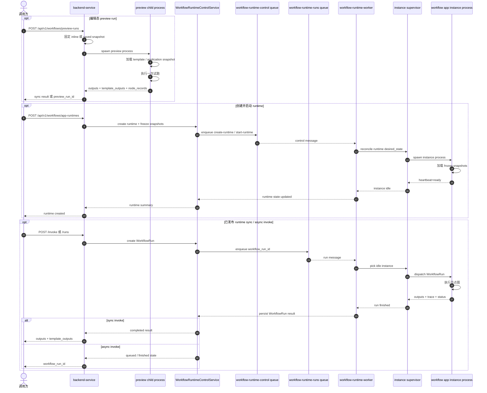

# Workflow 运行时设计

## 文档目的

本文档用于定义 workflow 编辑态试跑和已保存 FlowApplication 稳定运行的最小运行时设计。

本文档只收敛当前建议的资源模型、队列划分、worker 拓扑和 API 草案，不展开实现细节、部署脚本或迁移步骤清单。

本文档面向工业设备现场的深度学习、机器视觉和多模型协作场景，同时为后续接入 VLM、LLM、agent、人格系统和自然语言任务保留运行时边界。

## 当前问题

- 旧 execute 路由已经退出公开接口面，但部分设计文档仍残留旧口径，需要统一收口到 preview-runs、app-runtimes 和 runs。
- 编辑态试跑是高频、短时、易出错的执行面，主要诉求是进程独立、快速失败和互不影响。
- 已保存 FlowApplication 的正式调用更接近长期运行的 runtime 单元，主要诉求是稳定、隔离、健康检查、重启和多应用并存。
- 训练、转换、验证、导出、异步推理已经通过 worker 和队列隔离，workflow 运行面还没有进入同一层级的独立运行时设计。

## 设计结论

- workflow 执行面应拆成编辑态试跑和已发布应用运行两类路径，不继续共用同一条 execute 语义。
- 编辑态试跑默认采用一请求一子进程，不进入长期运行 worker。
- 已发布 FlowApplication 应引入专用 workflow-runtime-worker，由它管理长期运行的 workflow app runtime。
- 每个 workflow app instance 默认独占一个子进程，实例之间不共享 Python 运行时、不共享节点模块状态、不共享执行上下文。
- backend-service 保持控制面职责，负责资源创建、查询、健康观察、同步等待和路由分发，不再直接执行 workflow 图。
- workflow runtime 不替代训练、转换、评估、导出和推理 worker；workflow 内部的 service 节点仍继续调用现有服务边界和任务系统。
- PLC 读写、运动控制、传感器接入、结果上报等能力继续作为 custom node 或 node pack 的实现，不在 workflow runtime 外面再加一层硬件权限控制。
- 如果现场需要仿真、空跑或联调，应使用 simulate 节点、mock 节点或模拟 node pack，而不是由 workflow 统一拦截硬件操作。
- VLM、LLM、agent 和人格能力可以进入 workflow 编排，但应以受控节点或受控子运行时接入，不把当前 DAG 执行器扩成无边界循环代理引擎。

## 当前阶段边界

- 当前设计只覆盖本地单机部署，不展开多机调度或跨主机实例迁移。
- 当前设计不引入通用集群调度器，不做 CPU、RAM、显存和 NUMA 的统一资源编排。
- 当前设计默认一个 workflow app instance 同时只处理一个 run；并发优先通过增加 instance 数量实现。
- 当前设计不要求把所有 preview run 和 workflow run 都映射成 TaskRecord。
- 当前设计不把 workflow runtime 做成新的 deployment runtime 平台；模型部署、训练、转换、评估仍复用现有子系统。

## 适用场景

- 工业设备现场的深度学习任务，包括 detection、classification、segmentation、OCR、anomaly detection、keypoint 和多模型串联。
- OpenCV 和规则视觉任务，包括定位、测量、轮廓分析、规则判定、结果复检和图像后处理。
- VLM 任务，包括图文联合理解、缺陷解释、复杂样本问答和检测结果说明。
- 外部系统联动任务，包括结果上报、任务回执、MES 或上位机回写、协议触发和业务联动。
- 通过 node pack 扩展的 PLC 读写、运动控制、传感器接入、设备代理交互和厂商 SDK 封装。
- 长期演进的 LLM / agent 任务，包括自然语言生成 workflow 草稿、参数自动配置、自动编辑和多步工具调用。

## 节点编辑器方向

- 节点编辑器的交互模型可以向 ComfyUI 的使用方式靠拢，例如节点搜索、拖拽连线、局部试跑和结果预览。
- 但工业场景需要额外保留 node pack 版本、timeout、禁用、回滚和审计能力，不能照搬无约束执行方式。
- 编辑态试跑和已发布应用运行不应混用同一执行面；前者追求快速反馈，后者追求稳定和隔离。

## 工业现场副作用边界

- PLC 写入、运动控制、传感器触发、相机控制和结果上报都属于强副作用节点。
- 这些行为默认由 custom node 或 node pack 自己定义和承担，workflow runtime 只负责进程隔离、超时、trace 和稳定性。
- 如果需要模拟、空跑或联调，应通过 simulate 节点、mock 节点或独立模拟 node pack 实现，而不是由 workflow 再增加一层硬件操作开关。
- 已发布 runtime 不负责判断节点是否应该操作硬件；节点一旦被放入图中，就按该节点自身语义执行。
- 现场硬件接入优先通过 node pack 或外部设备代理实现，不把 PLC、机械臂、相机和传感器 SDK 直接并入核心 runtime。
- 涉及设备写入的节点仍应具备 timeout、disable、审计和防重复提交能力；是否要求 command_id、ack 或回执，由具体 node pack 和现场协议约束定义。

## 两类执行面

### 编辑态试跑

编辑器里的试跑面向模板调试、参数校验、custom node 开发和节点链路联调。

这类执行建议采用下面的规则：

- 每次试跑都在独立子进程里执行。
- 子进程执行完成、失败或超时后立即退出，不保留长期实例。
- 默认同步等待结果，优先返回 outputs、template_outputs、node_records 和错误摘要。
- 失败不触发自动重启，不把试跑进程纳入长期 supervisor。
- 这一路径默认不进入后台队列，避免界面调试被排队延迟放大。

### 已发布应用运行

已保存 FlowApplication 的正式调用面向稳定运行、持续接收请求和多应用并存。

这类执行建议采用下面的规则：

- backend-service 只创建和查询 runtime，不直接执行图。
- workflow-runtime-worker 负责拉起、停止、监控和重启 workflow app instance。
- 每个 runtime 默认至少对应一个独立 instance，每个 instance 对应一个独立子进程。
- 已发布应用运行时必须固定到不可变快照，而不是直接追随可变的 application 保存文件。
- 同步调用和异步调用都落到 WorkflowRun 资源，再由 runtime instance 执行。

## 资源模型

## 资源总览

| 资源 | 作用 | 生命周期 |
| --- | --- | --- |
| WorkflowPreviewRun | 表示一次编辑态隔离试跑 | 短时、可过期 |
| WorkflowExecutionPolicy | 表示 preview 和 runtime 的执行默认项，以及 AI 相关运行时配置 | 可独立版本化 |
| PersonaProfile | 表示 LLM / VLM / agent 节点使用的人格、语气和系统提示模板 | 可独立版本化 |
| ToolPolicy | 表示 LLM / agent 节点可用的工具集合和调用上限 | 可独立版本化 |
| WorkflowAppRuntime | 表示一份已发布应用的长期运行配置和期望状态 | 长期存在 |
| WorkflowAppInstance | 表示某个 runtime 当前实际运行的独立实例 | 跟随 runtime 存活 |
| WorkflowRun | 表示已发布应用的一次正式调用 | 按运行记录保留 |

### WorkflowPreviewRun

WorkflowPreviewRun 用于承接编辑器中的快速试跑。

建议最小字段：

- preview_run_id
- project_id
- source_kind，取值建议为 saved-application 或 inline-snapshot
- application_snapshot_object_key
- template_snapshot_object_key
- created_by
- state，取值建议为 queued、running、succeeded、failed、cancelled、timed_out、expired
- started_at
- finished_at
- timeout_seconds
- outputs
- template_outputs
- node_records
- error_message
- log_excerpt
- retention_until
- metadata

建议语义：

- preview run 默认只保留短期查询窗口，用于界面调试回看。
- preview run 不要求长期稳定重试，也不要求自动重启。
- preview run 的 application 或 template 可以来自尚未正式保存的 inline 快照。

### WorkflowExecutionPolicy

WorkflowExecutionPolicy 用于表达 preview 或 runtime 的执行默认项。

它的目标不是替代 custom node 的节点语义，也不是负责硬件权限控制。

它更适合承接下面这些运行时默认项：

- preview 和 runtime 的默认 timeout
- node_records 和 trace 的保留方式
- agent 的最大步数
- 绑定哪一份 PersonaProfile
- 绑定哪一份 ToolPolicy

建议最小字段：

- execution_policy_id
- display_name
- policy_kind，取值建议为 preview-default 或 runtime-default
- default_timeout_seconds
- trace_level，取值建议为 none、summary、node-summary、full
- retain_node_records_enabled
- retain_trace_enabled
- persona_profile_id，可选
- tool_policy_id，可选
- max_run_timeout_seconds
- max_agent_steps
- metadata

建议语义：

- preview 默认绑定 safe preview execution policy，但它只影响 timeout、trace 和 AI 默认项，不负责拦截硬件节点。
- 已发布 runtime 应显式绑定 policy，并在创建 runtime 时固定 policy 快照，而不是追随可变配置。
- policy 的目标是把 workflow JSON 本身与 AI 运行时默认项解耦，而不是把 PLC、运动控制和传感器操作再包装成一套 workflow 权限系统。

### PersonaProfile

PersonaProfile 用于表达 LLM、VLM 或 agent 节点默认使用的人格、口吻和系统提示模板。

建议最小字段：

- persona_profile_id
- display_name
- role_name
- system_prompt_template
- style_preset
- response_language
- memory_mode，取值建议为 none、session、workflow-run
- metadata

建议语义：

- PersonaProfile 只影响 AI 节点的语言和交互风格，不影响 workflow 图本身的结构。
- 同一份 PersonaProfile 可以被多个 execution policy 或多个 AI 节点复用。

### ToolPolicy

ToolPolicy 用于表达 AI 节点可使用的工具集合和调用上限。

建议最小字段：

- tool_policy_id
- display_name
- enabled_tool_ids
- max_tool_calls_per_run
- parallel_tool_calls_enabled
- metadata

建议语义：

- ToolPolicy 主要服务于未来的 LLM / agent 节点，不用于 PLC 或硬件权限控制。
- 是否真正调用某个硬件或协议，仍由对应 custom node 的实现和节点选择决定。

### WorkflowAppRuntime

WorkflowAppRuntime 表示一份已发布应用的长期运行单元。

建议最小字段：

- workflow_runtime_id
- project_id
- application_id
- display_name
- application_snapshot_object_key
- template_snapshot_object_key
- execution_policy_snapshot_object_key，可选
- activation_mode，取值建议为 on-demand 或 always-on
- desired_state，取值建议为 stopped 或 running
- observed_state，取值建议为 starting、running、degraded、stopped、failed
- min_instance_count
- max_instance_count
- request_timeout_seconds
- idle_shutdown_seconds
- restart_policy
- restart_backoff_seconds
- last_started_at
- last_stopped_at
- last_error
- health_summary
- metadata

这里的关键点是快照固定。

当前 FlowApplication 保存接口没有显式版本号，因此 runtime 创建时不应只保存 application_id，而应把当时引用的 application JSON 和 template JSON 固定为 runtime 自己的快照对象。这样后续继续编辑同名 application 时，不会直接影响已经运行的 runtime。

如果 runtime 需要固定 AI 默认项，例如 persona 或 tool 集合，创建 runtime 时应固定对应的 execution policy 快照。硬件行为仍由节点实现和 node pack 版本决定。

### WorkflowAppInstance

WorkflowAppInstance 表示 runtime 下面一个真正执行请求的独立实例。

建议最小字段：

- instance_id
- workflow_runtime_id
- worker_id
- host_id
- process_id
- state，取值建议为 starting、idle、busy、stopping、stopped、failed、restarting
- current_run_id
- started_at
- heartbeat_at
- restart_count
- last_error
- loaded_snapshot_fingerprint
- runtime_session_summary
- metadata

建议语义：

- 一个 instance 默认一次只处理一个 WorkflowRun。
- 多个 runtime 不共享 instance。
- 一个 runtime 需要并发时，优先增加 instance 数量，而不是在同一进程里并发执行多条图。

### WorkflowRun

WorkflowRun 表示已发布应用的一次正式调用。

建议最小字段：

- workflow_run_id
- workflow_runtime_id
- trigger_source，取值建议为 sync-invoke、async-invoke、schedule、integration
- state，取值建议为 queued、dispatching、running、succeeded、failed、cancelled、timed_out
- created_by
- created_at
- started_at
- finished_at
- assigned_instance_id
- input_payload
- outputs
- template_outputs
- node_records_object_key
- side_effect_summary
- trace_object_key
- progress
- error_message
- result_summary
- metadata

建议语义：

- sync 调用和 async 调用都使用 WorkflowRun 作为统一执行记录。
- 如果节点输出过大，node_records 和详细结果应写文件，只在记录里保留 object key。
- 如果 run 涉及 PLC 写入、运动控制、结果上报或 LLM tool 调用，应记录 side_effect_summary 和 trace。
- WorkflowRun 是 workflow 领域自己的运行记录，不强制复用通用 TaskRecord。

## 队列划分

## 划分结论

- 编辑态 preview run 默认不走后台队列。
- 已发布应用运行至少拆成一条控制队列和一条运行队列。
- workflow runtime 队列与训练、转换、评估、导出、推理队列分开，避免长期 runtime 控制流和重任务执行流互相干扰。
- 当前阶段不单独拆 PLC、运动控制、传感器或结果上报专用队列；这类副作用先通过 instance 隔离、simulate 节点和 node pack 自身约束控制风险。

### preview run

- 默认不进入队列。
- backend-service 直接创建 WorkflowPreviewRun，拉起子进程，同步等待结果或超时。
- 如果后续需要削峰，可再补 preview 专用排队层，但不建议作为第一阶段前提。

### workflow-runtime-control 队列

这条队列只承接 runtime 控制命令。

建议消息类型：

- create-runtime
- start-runtime
- stop-runtime
- restart-runtime
- reconcile-runtime
- scale-runtime
- refresh-runtime-snapshot

设计目的：

- 把运行控制和业务调用分开。
- 让 workflow-runtime-worker 以稳定节奏做状态收敛、拉起和回收。

### workflow-runtime-runs 队列

这条队列只承接已发布应用的异步调用。

建议消息载荷最小字段：

- workflow_runtime_id
- workflow_run_id
- requested_timeout_seconds
- trigger_source
- created_at

设计目的：

- 让 async 调用和控制命令分开。
- 保持一个 runtime 的实例选择、超时处理和失败重试都收口在 workflow-runtime-worker。

## worker 拓扑

最小拓扑建议如下：

```text
backend-service
  -> WorkflowPreviewService
     -> preview child process (one request / one process)
  -> WorkflowRuntimeControlService
     -> WorkflowAppRuntime / WorkflowRun persistence
     -> workflow-runtime-control queue
     -> workflow-runtime-runs queue
     -> sync invoke wait loop

workflow-runtime-worker
  -> control consumer
  -> run dispatcher
  -> instance supervisor table
     -> workflow app instance process A
     -> workflow app instance process B
     -> workflow app instance process C

workflow app instance process
  -> load pinned application snapshot
  -> load pinned template snapshot
  -> load pinned execution policy snapshot
  -> rebuild dataset storage / db session / queue backend / node catalog / runtime registry
  -> execute deep learning / OpenCV / VLM / LLM / integration / field bridge nodes using pinned runtime defaults
  -> execute one WorkflowRun at a time
  -> write run events / outputs / heartbeat / error
```

### workflow-runtime-worker 顺序图



## 为什么要单独的 workflow-runtime-worker

- 现有 backend-worker 主要处理 claim-next、执行完成、回写状态这一类后台任务。
- workflow app runtime 的核心职责是长期存活、实例监督、健康检查、重启和按实例分发调用，不是一次性任务消费。
- 如果把 runtime supervisor 直接塞进现有 backend-worker 进程，会把长期实例管理和训练、转换、评估这类重任务生命周期混在一起。
- workflow runtime 需要自己的启动、停止、重启和健康语义，更接近 deployment supervisor，而不是普通 task consumer。

因此建议新增独立进程入口 workflow-runtime-worker，而不是只在现有 backend-worker 里再挂一个 consumer kind。

## 实例执行规则

- 一个 WorkflowAppRuntime 默认 min_instance_count=0 或 1，由 activation_mode 决定。
- on-demand 模式允许空闲回收实例，首次请求时再拉起。
- always-on 模式保持至少 min_instance_count 个实例常驻。
- 一个 instance 默认串行执行一条 run，避免在同一 Python 进程里叠加多个 workflow 上下文。
- instance 失败只影响当前 runtime，不影响其他 runtime，也不影响 backend-service。
- instance 重启由 workflow-runtime-worker 负责，preview run 不参与这套重启机制。

## 节点能力范围

workflow runtime 不应把节点能力固定在单一视觉链路上，而应覆盖下面几组能力：

- 模型节点：深度学习 detection、segmentation、OCR、anomaly detection、多模型串联和未来的 VLM、LLM 推理。
- 视觉与规则节点：OpenCV、几何测量、轮廓分析、规则判定、结果过滤和结果复检。
- 集成节点：HTTP、WebSocket、ZeroMQ、结果上报、业务系统回调和协议交互。
- 现场桥接节点：PLC、运动控制、传感器、相机和各类设备代理交互。
- 调度与 AI 节点：prompt 组装、tool routing、plan selection、memory 读写和受控 agent 执行。

这几组节点可以在编辑器里统一编排，但运行时权限、timeout 和隔离级别不应相同。

这几组节点在运行时的差异更适合通过节点实现、simulate 节点、timeout 和进程隔离来处理，而不是在 workflow 再抽一层复杂的硬件权限模型。

## LLM / Agent 演进方向

- VLM 和 LLM 首先应作为受控节点接入 workflow，而不是直接改变当前 FlowApplication 的核心对象边界。
- 多步 agent 执行不应强迫当前 DAG 执行器支持无约束循环；更合适的做法是把 planner、tool router 或 agent session 封装为有步数和超时上限的节点或子运行时。
- 人格系统不建议直接散落在 application JSON 或节点参数里，后续更适合独立为 PersonaProfile、PromptTemplate 和 ToolPolicy 一类可复用资源，再由 execution policy 或节点参数引用。
- 自然语言任务不应直接改写正在运行的 runtime；更稳妥的路径是先生成 workflow 草稿或配置草稿，再走 preview、save、publish 和 runtime invoke 这条受控链路。
- 当 workflow 同时使用 VLM、LLM 和外部工具时，trace、tool 调用结果和最终副作用需要统一审计，不能只保留最终 outputs。

## 运行时 Contract 草案

这三类对象都属于 workflow runtime 控制面资源，不进入 WorkflowGraphTemplate 或 FlowApplication 本身。

对应的独立 API 草案文档见：

- [docs/api/workflow-preview-runs.md](../api/workflow-preview-runs.md)
- [docs/api/workflow-app-runtimes.md](../api/workflow-app-runtimes.md)
- [docs/api/workflow-runs.md](../api/workflow-runs.md)
- [docs/api/workflow-execution-policies.md](../api/workflow-execution-policies.md)
- [docs/api/workflow-persona-profiles.md](../api/workflow-persona-profiles.md)
- [docs/api/workflow-tool-policies.md](../api/workflow-tool-policies.md)

### WorkflowExecutionPolicy JSON 草案

```json
{
  "format_id": "amvision.workflow-execution-policy.v1",
  "execution_policy_id": "preview-default",
  "display_name": "Preview Default",
  "policy_kind": "preview-default",
  "default_timeout_seconds": 30,
  "trace_level": "node-summary",
  "retain_node_records_enabled": true,
  "retain_trace_enabled": true,
  "persona_profile_id": null,
  "tool_policy_id": null,
  "max_run_timeout_seconds": 30,
  "max_agent_steps": 0,
  "metadata": {
    "notes": "用于节点编辑器里的快速试跑"
  }
}
```

### PersonaProfile JSON 草案

```json
{
  "format_id": "amvision.persona-profile.v1",
  "persona_profile_id": "quality-inspector-v1",
  "display_name": "Quality Inspector",
  "role_name": "工业质检助手",
  "system_prompt_template": "对检测结果做简洁、直接、面向现场的说明。",
  "style_preset": "concise-industrial",
  "response_language": "zh-CN",
  "memory_mode": "session",
  "metadata": {
    "domain": "industrial-vision"
  }
}
```

### ToolPolicy JSON 草案

```json
{
  "format_id": "amvision.tool-policy.v1",
  "tool_policy_id": "vision-agent-tools-v1",
  "display_name": "Vision Agent Tools",
  "enabled_tool_ids": [
    "workflow.read-run-trace",
    "workflow.search-node-catalog",
    "workflow.create-workflow-draft"
  ],
  "max_tool_calls_per_run": 8,
  "parallel_tool_calls_enabled": false,
  "metadata": {
    "notes": "服务于受控 AI 节点，不参与硬件权限判断"
  }
}
```

## API 草案

## 设计原则

- 编辑态和正式运行态 API 分开。
- runtime 管理 API 和 run 调用 API 分开。
- 当前公开执行面已经拆成 WorkflowPreviewRun、WorkflowAppRuntime 和 WorkflowRun，不再保留 execute 兼容入口。

WorkflowPreviewRun、WorkflowAppRuntime、WorkflowRun、WorkflowExecutionPolicy、PersonaProfile 和 ToolPolicy 已经拆成独立 API 草案页，不再和当前 [docs/api/workflows.md](../api/workflows.md) 混写。

### 执行策略 API

这组接口用于管理 WorkflowExecutionPolicy。

#### POST /api/v1/workflows/execution-policies

用途：创建一条可复用的 workflow 执行策略。

建议请求字段：

- execution_policy_id
- display_name
- policy_kind
- default_timeout_seconds
- trace_level
- retain_node_records_enabled
- retain_trace_enabled
- persona_profile_id，可选
- tool_policy_id，可选
- max_run_timeout_seconds
- max_agent_steps
- metadata

建议响应字段：

- execution_policy_id
- display_name
- policy_kind
- default_timeout_seconds
- trace_level
- retain_node_records_enabled
- retain_trace_enabled
- persona_profile_id
- tool_policy_id
- max_run_timeout_seconds
- max_agent_steps
- metadata

#### GET /api/v1/workflows/execution-policies

用途：按 Project 列出可用执行策略。

#### GET /api/v1/workflows/execution-policies/{execution_policy_id}

用途：查询单条执行策略详情，包括 timeout、trace 和 AI 工具默认项。

### PersonaProfile API

这组接口用于管理 PersonaProfile。

#### POST /api/v1/workflows/persona-profiles

用途：创建一条可复用的人格配置。

建议请求字段：

- persona_profile_id
- display_name
- role_name
- system_prompt_template
- style_preset
- response_language
- memory_mode
- metadata

建议响应字段：

- persona_profile_id
- display_name
- role_name
- system_prompt_template
- style_preset
- response_language
- memory_mode
- metadata

#### GET /api/v1/workflows/persona-profiles

用途：列出可用 PersonaProfile。

#### GET /api/v1/workflows/persona-profiles/{persona_profile_id}

用途：查询单条 PersonaProfile 详情。

### ToolPolicy API

这组接口用于管理 ToolPolicy。

#### POST /api/v1/workflows/tool-policies

用途：创建一条可复用的工具策略。

建议请求字段：

- tool_policy_id
- display_name
- enabled_tool_ids
- max_tool_calls_per_run
- parallel_tool_calls_enabled
- metadata

建议响应字段：

- tool_policy_id
- display_name
- enabled_tool_ids
- max_tool_calls_per_run
- parallel_tool_calls_enabled
- metadata

#### GET /api/v1/workflows/tool-policies

用途：列出可用 ToolPolicy。

#### GET /api/v1/workflows/tool-policies/{tool_policy_id}

用途：查询单条 ToolPolicy 详情。

### 编辑态试跑 API

#### POST /api/v1/workflows/preview-runs

用途：创建一次编辑态隔离试跑。

建议请求字段：

- project_id
- application，可选，允许 inline application 快照
- template，可选，允许 inline template 快照
- application_ref，可选，引用已保存 application
- execution_policy_id，可选；未提供时默认使用 preview-default policy
- input_bindings
- execution_metadata
- timeout_seconds
- wait_mode，取值建议为 sync 或 async

建议响应：

- wait_mode=sync 时直接返回 WorkflowPreviewRun 结果摘要、outputs、template_outputs、node_records
- wait_mode=async 时返回 preview_run_id、state 和查询链接

#### GET /api/v1/workflows/preview-runs/{preview_run_id}

用途：查询单条 preview run 状态、错误摘要和输出摘要。

#### GET /api/v1/workflows/preview-runs/{preview_run_id}/events

用途：查询 preview run 的执行事件和日志片段。

#### POST /api/v1/workflows/preview-runs/{preview_run_id}/cancel

用途：取消尚未结束的 preview run，并终止对应子进程。

### 已发布应用运行管理 API

#### POST /api/v1/workflows/app-runtimes

用途：基于已保存 FlowApplication 创建一个长期运行的 WorkflowAppRuntime。

建议请求字段：

- project_id
- application_id
- display_name
- activation_mode
- execution_policy_id
- min_instance_count
- max_instance_count
- request_timeout_seconds
- idle_shutdown_seconds
- restart_policy
- metadata

建议行为：

- 读取当前 application 和 template
- 固定为 runtime 快照
- 创建 WorkflowAppRuntime 记录
- 视 desired_state 是否为 running 决定是否发出 create-runtime 或 start-runtime 控制命令

#### GET /api/v1/workflows/app-runtimes

用途：列出某个 Project 下的 WorkflowAppRuntime 摘要。

#### GET /api/v1/workflows/app-runtimes/{workflow_runtime_id}

用途：查询单个 runtime 的快照来源、期望状态、观察状态和健康摘要。

#### POST /api/v1/workflows/app-runtimes/{workflow_runtime_id}/start

用途：把 runtime 的 desired_state 切到 running，并触发 supervisor 拉起实例。

#### POST /api/v1/workflows/app-runtimes/{workflow_runtime_id}/stop

用途：把 runtime 的 desired_state 切到 stopped，并停止全部实例。

#### POST /api/v1/workflows/app-runtimes/{workflow_runtime_id}/restart

用途：重启全部实例并刷新 runtime 健康状态。

#### GET /api/v1/workflows/app-runtimes/{workflow_runtime_id}/health

用途：返回 runtime 的当前健康摘要、实例列表、重启计数和最近错误。

#### GET /api/v1/workflows/app-runtimes/{workflow_runtime_id}/instances

用途：返回 runtime 下面所有 instance 的观测状态。

### 已发布应用调用 API

#### POST /api/v1/workflows/app-runtimes/{workflow_runtime_id}/invoke

用途：发起一次同步调用。

建议行为：

- backend-service 创建 WorkflowRun
- 如果没有可用 instance，则按 activation_mode 决定等待拉起或直接返回不可用
- 把 run 交给 workflow-runtime-worker
- 在 request_timeout_seconds 内等待 run 结束
- 成功时直接返回 outputs 和 template_outputs
- 超时时返回 timed_out，并触发实例侧取消或回收

#### POST /api/v1/workflows/app-runtimes/{workflow_runtime_id}/runs

用途：发起一次异步调用。

建议响应：

- workflow_run_id
- state=queued
- queue_name=workflow-runtime-runs

#### GET /api/v1/workflows/runs/{workflow_run_id}

用途：查询单条 WorkflowRun 状态、错误摘要、实例归属和结果摘要。

#### GET /api/v1/workflows/runs/{workflow_run_id}/events

用途：查询单条 WorkflowRun 的事件流和节点级日志片段。

#### POST /api/v1/workflows/runs/{workflow_run_id}/cancel

用途：取消尚未结束的 WorkflowRun，并通知对应 instance 停止当前执行。

## 与旧 execute 路由的关系

- 旧 POST /api/v1/workflows/projects/{project_id}/applications/{application_id}/execute 已经删除，不再作为公开接口。
- 编辑态试跑当前统一走 WorkflowPreviewRun 资源。
- 已发布应用的正式调用当前统一走 WorkflowAppRuntime 和 WorkflowRun 资源。
- 后续 restart、instances、async runs 和 execution policy 也继续挂在 runtime 资源下扩展，不再回到 execute 语义。

## 与现有任务系统的关系

- WorkflowPreviewRun 和 WorkflowRun 不强制落到 TaskRecord。
- workflow 内部如果调用训练、转换、评估、导出、异步推理节点，仍应提交到现有 task-system 和对应 worker pool。
- workflow-runtime-worker 管理的是 workflow app instance 和 WorkflowRun，不接管模型训练、转换或 deployment 的现有调度责任。
- execution policy、persona profile 和 tool policy 这类资源可以独立建模，但不应让 workflow runtime 接管现有模型训练、部署和推理对象的生命周期，也不应把 PLC 或硬件控制再包成一层复杂权限系统。

## 第一阶段建议落点

如果只做最小可执行闭环，建议优先完成下面四件事：

1. 定义最小 WorkflowExecutionPolicy，并把 preview 默认收口到 preview-default policy。
2. 把编辑态试跑切到一请求一子进程。
3. 新增 WorkflowAppRuntime、WorkflowRun 和 WorkflowAppInstance 三类资源。
4. 新增独立进程入口 workflow-runtime-worker，先实现 start、stop、health 和单实例运行。
5. 让已发布应用的正式调用走 runtime 资源，并继续在这组资源上增量扩展 restart、instances、async runs 和 execution policy。
6. 把 PLC 写入、运动控制、结果上报和未来的 LLM tool 调用统一纳入 trace 与审计。