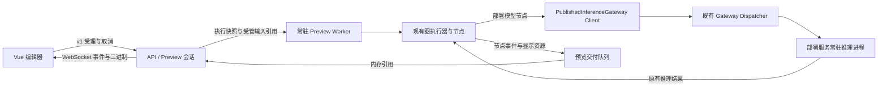

# Preview 调用边界、内存释放与性能修复方案

日期：2026-09-10。状态：核心代码及短测完成；用户已重启开发 HTTP，最终浏览器完整接收为 5.25 秒、5.92 秒。缺少历史同步同条件基线，性能回归及长期验收不能宣布通过，详见 [验证记录](preview-streaming-verification.md)。

本方案修正 `eef9c011` 的预览设计及实现。与旧 Preview 设计、实施清单中关于部署模型本地加载、结果保留和完成时机的描述冲突时，以本文为准。API 仍为 v1；实现时同步替换合约、调用方、测试及文档，不增加 v2、双实现或回退开关。

## 1. 目标与证据边界

目标是恢复项目既定分层，在节点实时反馈、长时间执行和临时数据不落盘的前提下，消除预览引入的额外模型实例、无效等待与过长内存占用。正式 Runtime/Trigger 的协议、同步执行、共享内存槽位规则及模型算法不随预览改造改变。

用户反馈同一流程由约 1 秒多变为 7～8 秒，视为需要定位的性能回归。尚未取得同条件的前后分段测量，不将其全部归因于异步、模型加载或 PNG 编码，也不以当前慢版本作为合格基线。

S0 规划阶段只读检查浏览器页面及代码，当时没有触发新运行。页面已有结果中，两次 Classification Batch 显示 159.7 ms、144.5 ms；输入为 57.1 MB BMP，经 Base64 输入，Decode 节点显示 318.0 ms。以上是页面保留记录，不是本轮基准；并行父节点和子节点的耗时不可简单相加。

| 已确认事实 | 实现位置 | 修复方向 |
| --- | --- | --- |
| Preview Worker 创建自己的部署模型运行时池，首次使用加载模型 | `preview/worker.py`、`preview/models.py` | 删除预览专用模型加载网关，调用部署服务 |
| 每张显示图先完整 PNG 编码，再缩略图编码；两者共用一个执行器 | `preview/display.py` | 页面统一 JPEG，缩略图优先，全尺寸预览交付独立，业务原图不变 |
| Worker 在 `displays.close()` 排空编码后才发送业务终态 | `preview/worker.py` | 图执行完成与显示交付完成分离 |
| 小值也执行测量、复制、序列化及 reserve/release 跨进程往返 | `preview/values.py`、`preview/bridge.py` | 有界本地预算与轻量事件，减少逐项 RPC |
| display.ack 只确认分块，传输结束仅解除 borrow | `api/ws/v1/preview_sessions.py` | 新增完整接管确认，回收交付所有权 |
| 会话持续引用当前显示及大值，Worker 主要在整图结束清图片 | `preview/session.py`、`preview/worker.py`、`graph_executor.py` | 数据最后使用者释放；客户端保留已接收结果 |

上一版设计中的“为了不使用文件 mmap，在 Preview Worker 内调用模型运行时”本身是错误决策，不能仅视为某个函数实现不当。

## 2. 必须保持的架构

- 异步指 API 受理后不等待整图完成。Worker 内仍按节点依赖调用原有同步函数；不把每个节点改为独立任务，不引入额外数据库任务链。
- 已部署模型的加载、预热、实例数、健康、启停和设备资源由部署服务管理。Preview 不能创建替代实例池、改变设备、精度、阈值或前后处理。
- 节点原有 `Auto Start Process` 语义保留：允许时只能通过部署管理启动正式部署进程；不允许时返回未运行。不能一律禁止自动启动，也不能在 Preview 内自行加载。
- 复用 `PublishedInferenceGatewayClient`、`PublishedInferenceGatewayDispatcher` 和现有平台网关装配。每个 Preview Worker 有隔离的请求关联及关闭边界；Dispatcher 不占用 HTTP 事件循环。
- 部署模型节点与显式 checkpoint/load-model 节点必须分别清点。不得为了删除错误网关而误删其他节点原有、明确声明的模型资源能力。
- 批量调用保持批次顺序和原实例调度；SAHI 的切片、合并等业务语义保持不变。

### 共享内存边界

Preview 上传和显示交付仍可使用有界 OS SharedMemory。它仅解决 Worker 与 API 之间的数据交接，不承担部署模型实例或正式推理数据面的管理。此次不再为了统一名称而重写一套 Broker，也不把所有预览显示长期放进正式推理槽位。

Preview 调用部署服务时复用既有 LocalBuffer 输入适配、借用及释放机制；请求队列仅传控制信息和引用。必须核对 `deployment_model.py` 的单张、write_many、异常和 SAHI 路径，避免恢复网关后把整批图片 Base64/bytes 反复放入消息队列。

既有 LocalBuffer 使用文件支持 mmap。恢复正式推理调用不能同时宣称“整条链路完全不涉及文件映射”。无预览落盘约束是：不新增 Preview JSONL、快照文件、结果缓存文件或临时图片交换文件；正式部署 IPC 沿用已有 mmap 边界。不能为追求“无文件”而再次绕过部署服务。

预览传入部署的数据只在实际调用期间占用必要 LocalBuffer 资源，不能由浏览器接收确认决定其释放。现有 Broker 若缺少预览专属配额，先以 Preview 侧并发/在途字节受理上限约束增量；不得声称该限制等价于正式槽位硬预留。正式链路并发验收不达标时，本项不得通过，也不得暗改 Broker 调度算法掩盖问题。

## 3. 业务执行与显示交付解耦

建立两个独立状态：业务 `accepted/running/succeeded/failed/cancelled/timed_out`；交付 `pending/ready/received/released/unavailable`。

- 图完成及业务输出确定后立即报告业务终态，不等待浏览器 ACK 或无关显示编码。
- 业务输出中如含显示资源，使用稳定资源 ID 和 pending 状态，不要求此时已有完整编码 Blob；后续资源事件使其 ready。节点返回业务内容不因显示编码失败而改变。
- `run.finished` 后允许同一 run 的显示资源事件继续到达。前端、会话管理器和去重逻辑必须支持，旧 run 的迟到事件不能覆盖新 run。
- 将编码及传输资源从图调用栈转移给交付管理器；业务结束不等于可以立即销毁交付仍借用的内存，也不等于可以无限受理下一轮。
- Worker 与交付队列分别有容量。CPU、队列或字节资源不足时在受理边界明确反馈，不使用等待显示完成的隐式串行路径。
- 慢客户端不阻塞节点计算。控制终态可靠送达或通过快照恢复；进度和被替代的缩略图允许按同一 invocation/revision 合并，不能丢最后结果。

显示编码规则（用户已确定）：页面图片统一使用 JPEG，包括画布缩略图、Gallery、debug panel 和 Viewer 全尺寸预览；不再生成 PNG 显示副本。初始 JPEG quality 取 90，在实现中集中定义，不增加各节点重复配置。已有符合尺寸及显示要求的 JPEG 字节优先复用；其他编码或矩阵源先生成 JPEG 缩略图，再独立完成全尺寸 JPEG 预览。同一不可变资源按 ID/代次去重，不为去重在热路径重复计算整图 hash。全尺寸编码不得阻塞首张缩略图；媒体类型、描述符、前端默认值及测试同步改为 image/jpeg。

JPEG 是有损显示副本，不要求其解码像素与原图逐像素相等。业务原图保持原始像素、尺寸和坐标，模型、测量、保存节点和节点间传递不使用 JPEG 显示副本替代。Viewer 全尺寸预览保持源宽高，ROI 编辑坐标仍映射到业务原图；像素值读取等需要精确数据的能力必须读取业务原始数据，不能读取 JPEG 解码像素作为测量依据。mask/alpha 保留独立业务数据，显示时使用独立叠加层或合成后 JPEG，不把 JPEG 当作无损 mask 传输。节点显式保存的格式维持原配置。

全尺寸 JPEG 预览可以作为后台交付的一部分，不要求用户先打开 Viewer；在字节预算内使浏览器尽早接管，避免后端为“未来可能打开”长期持有。大值同理，完整值转移到浏览器后本地分页；未完整接收之前才使用受管后端读取。浏览器侧也必须有容量边界。

## 4. 最后使用者释放

资源可回收条件是所有业务持有、显示编码持有和跨进程借用均为零。节点结束只是一个持有者结束，不代表所有持有者都结束。

| 所有者 | 获得时机 | 释放时机 |
| --- | --- | --- |
| 图输入 | 输入被受理/交接 | 最后实际消费者及必要输出引用结束 |
| 节点输出 | 节点产出并登记引用 | 所有下游依赖、变量、循环和最终输出引用结束 |
| 编码任务 | 创建不可变显示快照或借用 | 编码完成、失败或被替代且没有使用者 |
| 部署调用 | 推理请求取得 BufferRef | 已确认读取完成/调用终结并符合既有借用协议 |
| WebSocket 传输 | 开始读取一个 Blob | 完整交付结束或连接退出，解除读取 pin |
| 后端交付记录 | 结果待发送 | 所需接收者完整接管或其有限恢复租约结束 |
| 浏览器结果库 | 完整 Blob/JSON 校验及接管 | 结果替换、清除、会话离开或容量策略淘汰 |

### 图引用跟踪

- 在执行计划阶段建立消费关系，执行阶段做增减计数，不在每个节点结束后扫描整个图和所有大值。
- 分开输出端口引用与资源本体引用。多个端口、ROI 中的 source_image、列表中的重复 image handle 必须归并到同一资源身份；删除一个端口不能释放其他端口仍使用的图片。
- Parallel 在分支分派前取得引用，在 join、失败和取消路径归还；未执行的 Selection 分支注销预留消费。
- ForEach 按 invocation/scope 管理每轮资源；循环累积输出保留必要引用，不能把所有中间图保留到整个循环结束。
- Set/Get Variable、最终输出、嵌套 payload、自定义节点存活范围均纳入所有权；不依赖名称含 image 的启发式判断。
- 运行时动态对象或自定义节点未声明内部持有时，采取作用域保留并明确能力边界；不能猜测不再使用就释放。受信任节点需通过资源 lease 接口持有跨调用引用。
- 清理必须同时处理输出字典、registry entries、解码缓存/视图和别名引用。仅调用 registry.release 不足以证明物理资源已释放。
- 第一阶段只在 Preview 执行上下文启用生命周期管理，复用一个图执行器。正式 Runtime/Trigger 不增加逐节点扫描、RPC、额外锁或编码。通用节点不感知 WebSocket。

### 浏览器完整接管协议

保留 `display.ack` 的分块流控含义；v1 `resource.received` 使用已鉴权的会话连接、blob_id 和完整传输后颁发的 receipt。Blob ID 跨运行不复用，凭证绑定会话，不再重复传递可伪造的节点/版本字段；过期资源确认幂等。不能凭 node_id 或任意共享内存名称删除资源。

1. 前端接收完整帧，校验顺序、长度、类型及描述符已有校验信息。
2. 将 Blob 或完整 JSON 纳入有界结果库；此时数据独立于后端共享内存。图片解码可以异步进行，解码失败要显示错误，不能用半图替换旧图。
3. 发送幂等接管确认。后端只撤销该接收者/版本的交付持有，不删除业务或其他传输的引用。
4. pin 为零后销毁后端共享内存；销毁映射无需逐字节清零。Windows 下附加句柄全部关闭才能完成实际映射释放。
5. 快照标记 received/released，不再承诺被释放 Blob 可以重新读取。前端同页重连复用结果库，重复确认安全；ACK 丢失可重发，不重跑工作流。

多连接按接收者管理有限租约，断线宽限保持显式策略。新连接加入时，已经释放且该浏览器没有副本的资源明确不可用，不为新连接恢复历史结果而长期保留原图。硬刷新后的临时预览结果不保证恢复；已保存的应用草稿不受影响。

浏览器容量不足不能谎报接收成功，后端也不能无限等待。过期或容量拒绝显示明确原因；已打开 Viewer 的本地资源固定持有，换图或关闭后解除。大 JSON 不得以摘要代替完整值后立即确认释放。

取消、超时、Worker 异常退出：已有显示可保留为本地结果，执行借用只能在消费者完成或进程确认退出后归还。终态与释放幂等；不终止共享部署进程来清理某次 Preview。

## 5. 性能定位与优化次序

诊断计时按 Preview 显式启用，复用网关已有 timings；默认不在正式节点热路径增加细粒度日志。跨进程/浏览器分别记录本地持续时间和消息关联，不直接相减不同计时域。

| 指标 | 起止与用途 |
| --- | --- |
| 点击到受理 | 含输入上传、校验、快照；不能与纯节点执行混比 |
| Worker 准备 | spawn/复用、目录刷新、依赖检查；冷暖分别统计 |
| 图执行 | 第一个业务节点开始至业务结果确定 |
| 部署调用 | 输入转换、LocalBuffer 写入、网关等待、推理、释放分别计时 |
| 显示准备 | 排队、矩阵复制、缩略图/原图编码和发布 |
| 前端可见 | 事件接收、完整 Blob 接管、解码、实际呈现 |
| 资源 | 块数、字节、pins、队列和映射句柄；RSS/显存另列 |

优先恢复部署调用，然后减少显示编码等待和小值同步 RPC。全局预算可在 run/Worker 受理时分配有限额度，内部本地扣减并在越界前拒绝；释放/补充按批次汇报。已预留额度与实际使用不能重复计费或超额，并行线程需原子扣减。不能简单删除容量保护来换速度。

目录与节点包按版本/刷新信号更新，保留代码变更可见性；不每次无条件执行重型扫描，也不恢复导致页面空白的路由缓存或重新引入动画。

## 6. 实施顺序与逐步门禁

| 步骤 | 具体修改 | 完成证据 |
| --- | --- | --- |
| S0 固定对照与契约 | 固定应用快照、图片 hash、输入端口、部署实例、保存/调试配置、线程和设备；加入分段计时；标记旧设计错误 | 同一计时口径，原约 1 秒版本作为目标参照；当前慢版本只作诊断样本 |
| S1 恢复部署调用 | 改 preview worker/pool 的网关与 LocalBuffer 装配；删除 preview/models.py 及其专用实例池测试/配置；核对单张、批量、SAHI | Preview 不触发部署模型 load_runtime_session；部署 PID/实例被复用；Auto Start、忙、不可用行为正确 |
| S2 拆分执行与交付 | 改 worker/display/session/events 及 v1 前端状态；结果资源可 pending；终态之后仍接收本轮显示 | 人工阻塞编码/客户端时图仍完成；迟到事件不覆盖新 run；保存节点仍完成后才算业务成功 |
| S3 缩短显示关键路径 | 页面统一 JPEG、缩略图优先、兼容编码复用、资源去重、本地额度、轻量值事件 | 首图延迟和 RPC 次数下降；业务原图像素、全尺寸预览宽高、坐标及完整值不变；队列/预算不越界 |
| S4 浏览器接管与释放 | 完整结果库、resource.received、后端持有/传输分离、重连快照、Viewer 生命周期 | 完整接收后对应后端块降为零；断线、重复 ACK、旧版本 ACK、多连接不早释、不误删 |
| S5 执行中资源回收 | Preview 作用域消费计划、资源别名与 lease、分支/循环/变量/最终输出回收 | 用途结束后下一长节点尚在运行时内存已下降；嵌套引用与自定义节点不悬空；正式路径无额外跟踪 |
| S6 完整回归与清理 | 按节点能力遍历所有受影响入口；删除已替代代码、更新文档和合约；真实短测 | 单测、前端构建、真实图、正式并发门禁分别通过，失败结论不覆盖 |

每一步先进行代码与所有权核对，再做针对性测试，通过后继续；已通过测试仅在后续修改涉及该路径时重跑。不把新增状态、错误码或特殊分支无限堆进旧函数。

## 7. 功能与资源验证矩阵

- 模型：detection/classification/segmentation/pose/obb 单张、批量、SAHI 及自定义网关调用。合约覆盖不等于真实模型精度覆盖。
- 图：串行、Parallel、Selection、ForEach、空批次、异常、取消、超时、目标节点预览、动态变量、共享 ROI/source_image 和最终输出。
- 显示：Image、Gallery、Value、Table、Frame Window、debug panel、mask/overlay、原图 Viewer、ROI/坐标交互；业务输出不可被缩略图或摘要污染。
- 接管：ACK 丢失/重复/乱序、替换后旧 ACK、半图断线、重连、页面清除、多订阅者、预算不足、图片解码失败、大值分页。
- 回收：用分配/持有/借用计数证明对应块归零；异常结束确认进程退出与借用归还。RSS 未立即回落不能单独认定泄漏，块数归零也不能代替对 registry/队列引用的检查。
- 长流程：短测试中的可控等待覆盖长节点静默、慢发送、跨越数据租约的合法借用；业务期限不因为三分钟验收而缩短。
- 文件行为：隔离观测 Preview 未新增临时交换文件；节点明确保存的文件继续验证。正式 LocalBuffer mmap 单独归类，如实报告。

## 8. 真实环境验收

使用现有应用 `workflow-app-20260831130620`、真实 3570 图片及已部署 YOLO11 分类模型。先核对当前快照和保存目标，测试使用隔离快照/输出目录，不改用户草稿与现场文件。冷启动、已热部署及 Worker 复用分别记录；不能通过关闭调试图、换小图、换输入端口或关闭保存来冒充同图性能恢复。

第一轮真实运行验证限制约三分钟：少量热运行检查同输入结果和关键耗时，再做一次有明确持续时间的长节点/慢接收及并发调用检查。样本量不足时不报告具有统计意义的 P99，不据此宣称长期稳定性通过。

验收必须同时检查业务耗时、第一张图可见、全部所需结果可用及资源回收。不能仅提前发送 succeeded 就宣布恢复 1 秒。原同步实现只有历史口述数据时，应标记目标待重建；可隔离使用对应旧提交/已存证据作对照，不在当前工作区整提交回滚。

建议性能门禁在 S0 固定：同条件热运行的图执行 P50/P95 相对原实现不出现显著回归（初始工程预算取 max(原值的 10%, 100 ms)）；点击到同等完整可用结果也需单独比较，建议额外预算 max(原值的 20%, 200 ms)。这是待测门禁，不是既有测量结论；不能把 7～8 秒当成正常基线或放宽门禁直至通过。

正式 Runtime/Trigger 需在 Preview 关闭与并发开启时比较已有同步链路、超时、资源容量与结果。复用同一部署必然共享计算资源，不能承诺零竞争；通过预览侧有限并发和在途预算控制影响。既有正式性能门禁不得放宽，历史 SHM P99 比 ZeroMQ 高约 17.46% 的失败结论不因本次修复而自动转为通过。

## 9. 本轮交付范围

本轮完成调用链和显示开销静态核对、当前页面只读检查及修复设计。截图显示已有 Value Preview 内容和 Preview succeeded，不能证明当前总耗时或交付回收正确；未重复执行流程，也未进行代码修复、真实性能或精度验收。

实现时需更新 `preview-streaming-design.md`、`preview-streaming-implementation.md`、`preview-streaming-verification.md` 和 `docs/api/workflow-preview-sessions.md`，以最新事实取代旧的完成结论。conda 开发环境、同目录 Python、Windows x64 和本地离线 Vue 3 保持原部署边界。
