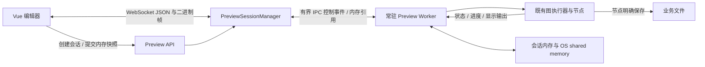

# Workflow 编辑态 Preview 实时执行方案

日期：2026-09-10。状态：已实现 v1 内存会话与逐节点流式显示；验证范围及限制见 [验证记录](preview-streaming-verification.md)。

具体实施顺序、固定接口、资源默认值、文件范围和每步门禁见 [Preview 实时执行代码实施清单](preview-streaming-implementation.md)。下文的初步建议由该清单细化；实施不得自行保留旧写路径或缩减核心节点支持范围。

## 目标与边界

Preview 是编辑器的临时调试会话。节点开始后立即显示执行状态，节点完成后立即显示可展示结果，长节点可报告自身进度。不等整图结束，不通过保存文件、查询数据库和重读完整响应更新画布。

默认不持久化 Preview 输入、执行快照、节点事件、结果、显示图片或恢复数据。应用保存、发布版本、模型文件以及节点明确要求保存的业务文件维持原职责。普通服务日志可以保留有界错误摘要，不记录图片、完整输入输出或可重放事件流。

正式 Runtime/Trigger 的同步高性能调用保持原有协议、执行、结果和错误语义；已有异步能力也不改变。Preview 的事件、订阅、显示编码和临时结果管理不进入正式执行数据面。预览与正式运行共享硬件资源，因此仍需限制 Preview 并发和内存；架构隔离不等于不存在 CPU/GPU 竞争。

## 参考源码核对

本地参考只用于理解设计，不导入运行时、不复制其公开协议作为本项目协议。

| 来源 | 核对位置 | 事实与采用方式 |
| --- | --- | --- |
| ComfyUI | `projectsrc/ComfyUI/execution.py`：`executing`、`executed`；`server.py`：`send_sync`、`send_image_with_metadata`、`publish_loop` | 后台执行通过事件队列向 WebSocket 交付节点状态和二进制预览图；采用事件驱动和业务输出/UI 输出分离思路 |
| ComfyUI 前端 | `projectsrc/ComfyUI_frontend/src/scripts/api.ts` | 解析 JSON 事件和二进制 Blob，分发节点和图片事件；用户指定的 `projectsrc/ComfyUI/_frontend` 不存在，实际目录为上述同级目录 |
| ComfyUI 图片节点 | `projectsrc/ComfyUI/nodes.py`：`SaveImage`、`PreviewImage` | 标准 PreviewImage 继承保存实现并写 temp，不能据此声称 ComfyUI 所有预览都不落盘 |
| Dify | `projectsrc/dify/api/libs/helper.py`、`web/service/base.ts` | 工作流执行主要经 SSE（`text/event-stream`）推送 `node_started`、`node_finished` 等；不是所有实时功能都使用 WebSocket |
| Dify 持久化 | `projectsrc/dify/api/core/app/workflow/layers/persistence.py` | 节点开始、完成可写执行 Repository；采用事件与持久化职责分离，不采用其持久化执行体系作为本地编辑预览前提 |

官方说明：[ComfyUI 通信路由](https://docs.comfy.org/development/comfyui-server/comms_routes)、[Dify 流式响应](https://docs.dify.ai/en/api-reference/guides/streaming)。协议选择服务于使用场景；本项目包含二进制图片和双向原图请求，选用 WebSocket，不同时维护 SSE 预览实现。

## 当前实现应移除的绕行

1. `runtime_service.py` 为每次 Preview 写应用、模板快照和数据库记录，再由子进程从磁盘读取。
2. `preview_run_manager.py` 追加 `events.jsonl`；`preview_process.py` flush 后再发送 `preview-event`，IPC 已存在却仍依赖文件恢复。
3. `useWorkflowResourceStream.ts` 已连接 WebSocket，但 Preview 仍每两秒轮询，节点事件又触发 REST 快照请求。
4. `PreviewResultStore` 写 manifest、逐节点 JSON 和输入副本；运行成功另写业务输出与完整响应。前端到终态才读取这些结果。
5. 图片上传、Image Preview、debug panel、Frame Window/视频显示仍可能单独生成临时文件。只删 `PreviewResultStore` 无法实现无磁盘预览。

上一轮修复恢复了显示正确性，但选择了持久化结果恢复的方向，对临时实时调试而言增加了不必要的复杂度。本轮设计保留已验证的身份隔离、原图坐标、取消、节点包一致刷新与单节点范围修复，替换结果交付方式。

## 分层与唯一数据流

职责限制：

- `PreviewSessionManager`：账号/项目/编辑器会话身份、容量受理、状态归并、短期重连、内存预算与释放。没有数据库 Unit of Work、JSONL 或 ObjectStore 结果目录；进程池满载立即拒绝，不新增业务排队。
- `PreviewWorker`：内存快照执行、既有模型/节点资源复用、节点观察事件、显示结果内存保留。执行器线程不得等待浏览器发送完成。
- `Preview WebSocket`：鉴权、事件和 Blob 传输、订阅与按需请求；不执行业务算法、不编码大图。
- 前端 `useWorkflowPreviewSession`：事件归并、节点状态、显示引用、连接状态；每节点增量更新，不重建整张图、不查询完整 Run 替代事件。

实现组织建议：`backend/service/application/workflows/preview/` 下仅设置 `session.py`、`worker.py`、`events.py`、`buffers.py` 四个职责文件；REST/WS 路由放在既有 API 分层。复用进程池管理和通用 payload 校验，不新增通用消息中间件、Redis、独立微服务或另一套模型运行时。

## 会话与协议

项目仍处于开发阶段，Preview 统一在 v1 下按最新内存会话合约实现：REST 使用 `/api/v1/workflows/preview-sessions`，WS 使用 `/ws/v1/workflows/preview-sessions/{session_id}`，格式为 `amvision.workflow-preview-session.v1`。前后端、测试与文档同步替换；不增加新 API 版本，不保留旧 Preview Run 接口、历史读取适配、双写或回退实现。

建议 REST 只承担创建会话、受理执行、取消和释放；所有节点状态、结果、进度、原图请求响应及恢复快照走 WebSocket。连接流程为创建会话 → 完成 WS 订阅 → 上传输入 → 提交执行。快速节点也不会因订阅晚到丢失，断线期间已受理结果由内存状态快照补齐。

- 身份：服务端绑定 principal/project/application/editor_session；run_id 区分每次执行，document_revision 标识提交快照，epoch 区分服务进程代次。
- 事件最小公共字段：version、session_id、run_id、seq、type；节点事件追加 node_id、invocation_id、scope_path。并行、ForEach、Selection、重试不能只靠 node_id 识别一次调用。
- 事件集合：run.accepted/started/finished；node.started/progress/finished；display.updated；session.snapshot/expired；display.unavailable。节点终态用 status 区分 succeeded/failed/cancelled/skipped。
- run.finished 的业务终态与图片交付状态分开；结果就绪即可显示，不等待终态。部分显示失败只标记对应显示，不伪造业务失败或成功。
- 受理请求携带 request_id；短期会话内去重，断线后不自动重新执行可能带文件保存或外部协议副作用的图。
- 并行事件在会话归并入口生成有序序号，前端按 run+seq 去重；节点不同 invocation 不互相覆盖。全局单序号只要求传输顺序，不伪造并行因果顺序。
- 会话与 WS 均复用现有身份验证，订阅和内存图片访问校验所有者及项目范围；不把任意内存名称或磁盘路径暴露为浏览器读取能力。

不支持进度报告的节点只显示“执行中”和耗时；不能用定时器制造百分比。支持迭代/批量的节点可报告 completed/total/phase，未知总量不显示百分比。全图显示完成调用数和当前执行节点集合，动态循环不使用固定节点数伪造总进度。

## 无磁盘输入与结果

### 输入

浏览器上传图片以二进制分块写入有界内存输入对象，完成后校验大小、类型和摘要，再交给 Worker。不得继续通过可能自动 spool 到磁盘的 multipart `UploadFile` 实现“无磁盘输入”。结构化快照采用有大小上限的 JSON 传入 IPC；输入大图使用已有内存引用，不把 Base64 大字符串写快照或在消息队列反复 pickle。

已保存的数据集图片、模型、应用定义可以从原文件读取，禁止为交接另复制一份临时文件。节点只接受真实文件路径时，在受理前报告该节点的输入不兼容，或要求选择现有文件；不得暗中创建临时文件。对必须使用临时工作目录的自定义节点同样显式列出能力，不能声称平台能禁止任意自定义 Python 自行写文件。

### 节点计算与显示

业务图仍传递原有图像、Tensor 和 value；图像资源经 Preview 注入的内存 reader/writer 解析。显示通道只观察结果；不将 JPEG 缩略图反向用作模型输入或测量原图，不改变模型阈值、前后处理或数值精度。

每个节点完成后推送状态和有界端口摘要；Image/Value/Table/Gallery/Frame Window 及启用 debug panel 的节点立即推送显示。任意普通节点的完整输出按选择端口请求，在内存仍有效时读取；不为了“全部实时”发送所有中间 Tensor 或巨型数组。

显示适配器接收已有 body 契约，生成 v1 显示描述：node/port/invocation/revision、kind、metadata、blob_id。小值保留 0、false、null、空字符串，表格和大数组按页请求。大结果显示明确的总量、截断或不可用状态，不能把摘要显示为完整结果。

Image Preview、`debug_image_panel.py`、Frame Window、视频显示辅助层改为调用 Preview 专用内存显示 sink。显式保存节点继续写业务文件；普通显示节点的 storage-ref 选项不再决定编辑态临时文件落盘，在独立 Preview transport policy 下交给内存 sink。正式 Runtime 的显示 body 保持其现有业务语义；编辑态使用最新会话合约，前端移除不适用于编辑态的输出存储提示和处理分支。

### 图片和 IPC

执行进程生成有界缩略图；JSON 帧仅传 metadata，二进制帧传编码 bytes，不使用图片 Base64 JSON。内存原图保留原始尺寸、坐标变换、overlays 和 interaction，打开查看器才请求原图或指定区域。测量/取参继续按原图坐标，不因缩略图缩放改变参数。

Worker 与 API 不共享 Python 对象，WebSocket 不能替代这段进程间交接。复用现有本地 IPC 的控制队列；图片固定采用会话拥有的 OS shared memory 传引用，采用 Python `multiprocessing.shared_memory` 实现跨平台的创建/附加/释放，Worker 内部中间图保持普通内存对象。控制队列不传整张图片，不新增可配置的多协议切换框架。

现有 LocalBuffer 是文件支持的映射：`mmap_buffer_arena.py` 创建 `images.mmap`，客户端打开文件后映射。不能把它当作无文件内存实现。Preview 的内存资源适配器独立于正式 Broker arena；复用资源所有权原则，不复用文件载体，也不修改正式 Trigger 的 mmap 协议。Preview 私有内存引用在最新 v1 合约中显式定义；不得混入正式 Runtime/Trigger 的 transport 分支。

所有读取/写入 LocalBuffer 的核心节点、debug helper、图像转换和模型入口必须走注入的资源访问边界，不能漏掉内部节点重新写入旧 arena 的路径。Preview 中需要推理的节点在常驻 Preview Worker 内复用现有 `ModelRuntime` 与模型会话管理器，按同一部署快照、后端、精度和前后处理配置执行；不得另写模型算法。当前调用 published inference gateway 的节点（包括部署模型、批量和 SAHI）须通过 Preview 专用 gateway 适配接入同一模型实现；迁移中的明确不支持提示不能作为核心节点最终验收通过的替代。不能静默绕回文件 arena 并宣布无磁盘验收通过。额外模型副本的 GPU/CPU 内存计入独立模型缓存和受理限制，避免挤占正式推理。此项需要逐入口实现与等价性验证，不能仅凭显示测试判定完成。

同一图片不在 Worker、Hub、每个订阅者各永久保存一份。Hub 保存描述与可释放引用，广播共享只读 bytes/引用；借用期间 pin，编码或发送完成释放。源输入 lease、业务执行 lease、显示 lease 分开计数，Viewer 未关闭不允许淘汰其正在使用的版本；超限应明确拒绝新的 pin，不能无限保留。Windows 内存映射可能受操作系统分页管理，本方案承诺应用不创建预览交换文件，不承诺禁用操作系统分页。

## 有界生命周期、背压与恢复

默认策略建议：每编辑器会话一次执行；并发总量沿用 Preview 池上限。页面保持会话订阅；完成后保留最新结果供查看，新运行先保留带“上一轮结果”标识的旧图，在新图就绪后替换并释放。显式清除、页面关闭或会话退出释放；连接意外断开保留 60 秒重连宽限，之后取消孤立执行并回收。具体默认值属于待测试的配置，不是本轮测得的最优值。

运行期间不因节点没有 progress 而认定服务失活。长处理受显式业务 timeout 控制；连接心跳由 API 独立发送。浏览器离线超过宽限与业务超时是两种不同状态，不继续无限占有孤立资源。

所有缓存按总字节和条数计量，至少覆盖上传、快照、显示编码、原图 pin、事件队列、WS 待发送和前端 Blob。预览内存对象按最近一次完整版本保留，循环不累计无限历史。预算不足时优先回收未 pin 的旧显示，再返回明确 capacity/unavailable；输入和执行业务必需内存不足则在受理或分配处失败，不写盘降级，不改变图计算结果。

分开控制事件与大图片发送任务。node.progress 可合并为最新值，未发出的同节点旧缩略图可被新版本替代。node.started/finished、错误、取消及终态不能静默丢弃；控制积压超过上限时断开慢客户端，重连发送当前内存快照，不保存无限事件历史。慢客户端不能阻塞模型执行或其他客户端。

同一 WS 上大图按有界消息分块（初始建议 256 KiB），发送器在块之间优先处理控制事件；使用单发送协程避免帧错配。前端只在完整 Blob 到齐且版本匹配后替换，半张图片不展示。浏览器逐项解码并释放旧 ObjectURL；以帧合并画布更新，不为每条进度事件重排整图。

断线恢复只恢复仍在内存中的状态和最新显示。超过宽限、Worker 崩溃、服务重启、旧 epoch 或已淘汰结果返回“预览会话已失效，请重新执行”；页面已持有的图片可明确标为旧结果，原图请求不能悄悄读历史磁盘。放弃跨服务重启恢复全部临时结果，是本方案刻意的产品语义。

## 页面交互与现状证据

本轮只读捕获现有编辑器，未点击预览、保存或重载。现场有未保存修改；左上角 `running` 与右侧 `Preview succeeded` 同时出现，DOM 显示前者来自既有 Runtime 状态。应分别标明“Runtime：运行中”和“预览：已完成”，不要混为一次执行的状态。截图不能证明实时延迟或键盘无障碍已通过。

新交互只增加必要状态，不增加页面切换动画：

1. 受理：顶部显示预览准备中/执行中、取消按钮；容量满明确拒绝，节点仅重置本轮状态，旧图标明上一轮。
2. 节点执行：节点标题区显示执行中、耗时和可用的真实进度；并行分支可同时执行。状态不只用颜色表达。
3. 节点完成：当场替换对应图片/值；选中节点的属性面板同步输入输出摘要，不强制切换用户选中节点。
4. 单节点重跑：Viewer 保留至新图就绪，用户主动关闭后不再打开；ROI/圆/线/掩码等交互提交携带文档版本。
5. 错误/取消：保留已完成显示，标识未执行/中断节点；连接异常使用局部提示，不弹“视觉服务异常”全页遮罩。
6. 断线恢复：显示重连状态，成功后用同 run 的快照补齐；失效时明确提供重新执行，绝不自动重放业务。

截图文件：`C:/Users/tanga/.codex/visualizations/2026/09/09/01a0847b-1b57-7ef1-8e5d-2f1b4fa3fafa/preview-audit-20260910/07-streaming-design-current.png`。仅完成当前已结束页面的视觉核对；上述运行中交互为设计，实施后必须实测。

## 实施顺序与每步门禁

| 步骤 | 实现范围 | 完成后验证 |
| --- | --- | --- |
| 1 | 固化 v1 session/event/blob 合约和资源所有权；列全 Preview 专有写盘入口及调用方 | 身份/序号/并行 invocation/失效/预算契约测试；正式 Runtime、Trigger 公共合约差异为零 |
| 2 | 内存会话及进程请求替换磁盘快照、Preview 数据库记录与 JSONL | 无图片纯值图：禁用 Preview 持久化写入仍可完成；断线、取消、崩溃后资源释放 |
| 3 | Worker 节点事件经有界 IPC 进入 WS，前端逐节点归并 | 前节点完成、后节点延时期间，前节点结果已显示；不出现逐事件 GET、终态批量载入或周期轮询 |
| 4 | 输入分块内存接收；显示 sink 覆盖图片、调试图、原图、表格、图库和帧窗口 | 大 BMP 无 multipart spool；禁用中间文件写入仍显示；显式保存节点只写指定目标 |
| 5 | 原图 pin、慢客户端背压、断线快照、并行/循环与 Viewer 状态 | 无限增长压力输入被有界处理；旧图不覆盖新图、关闭不重开、事件/半图不串运行 |
| 6 | 编辑器切换到 v1，删除新执行链中的 `PreviewResultStore`、磁盘 manifest/outputs/response、JSONL/快照读取、终态 `loadPreviewDisplayResult` 与 Preview 轮询分支 | 无不可达新旧双写代码；保留正式 Runtime 共用显示行为的回归测试 |
| 7 | 真实流程和图片的约 3 分钟验收，以及发行 Python 验证 | 节点状态与显示时延、最终业务值、原图取参、取消、HTTP 可用、内存及 lease 释放同时有证据 |

步骤 3/4 先完成一条 Image→Value/Display→Delay 的纵向流程，再扩展所有显示契约，避免先改全部节点后才发现通信边界错误。已有 `12c3ba27` 的并行单节点范围修复、节点目录刷新、原图坐标和异常测试继续保留，不整体回滚。

直接删除被替换的 Preview Run 创建、查询、事件回放、文件读取及删除接口，以及对应 DTO、Repository、持久化模型、前端服务、旧测试和失效文档；不保留 410 过渡路由、历史只读视图或兼容开关。Preview 专有数据库结构通过一次性 Alembic 迁移移除，共用结构只删除 Preview 专有部分；既有开发环境按迁移升级，全新环境按最新结构初始化。旧临时资产清理单独核对范围，不能删除明确保存的业务文件、应用版本或正式 Runtime/Trigger 记录。迁移脚本不参与执行链，不建立长期旧数据恢复能力。具体执行门禁见实施清单 S09。

## 验证要求

- 正确性：0/false/null/空字符串、长数组、表格、图库、41 类显示契约；任意普通节点的端口摘要；串行、Parallel、ForEach、Selection、失败、取消、节点超时和进程退出。
- 无磁盘：热身后拦截并记录 Preview 专有写路径、临时文件 API 与 ObjectStore 调用，确认无快照/JSONL/显示/上传中间文件；同时允许模型读取、业务指定保存、正常服务日志。自定义节点显式落盘行为单独归属。
- 实时：记录 node.finished→浏览器节点内容就绪的时延，图片记录 blob 发布→解码显示的时延；在后续节点等待时观测，不能只检查最终截图。初始本地目标可设普通状态/小值 P95≤100 ms、缩略图 P95≤250 ms，须报告原始数据和机器条件，不作为已证明指标。
- 稳定性：限速客户端、断线、刷新重连、快速连续运行、图片超额、服务重启；查看控制队列字节、进程数、RSS/Private Bytes、GPU 占用、lease 和 Blob 数量。3 分钟只能验证有界回收和故障路径，不能宣称长期工业稳定性。
- 正式链路：源代码调用图确认不依赖 PreviewSession；代表性 Runtime/Trigger 测试及同条件输出比较。既有共享内存 P99 +17.46% 失败单独保留，不能用 Preview 或 HTTP 指标替代。
- 环境：Vue 3 类型检查/构建，conda 与发行 Python 3.12.13 的 spawn、取消和内存引用测试；真实模型限现有 YOLO11 分类与 3570 图片，不扩展为其他模型精度结论。

本次仅新增设计文档和页面只读截图；不修改运行代码、不提交执行、不改变用户未保存文档。
