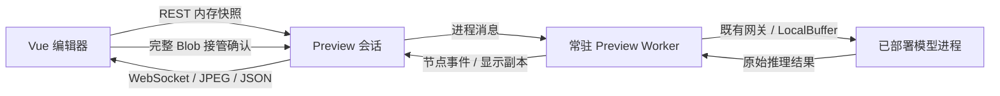

# Workflow 编辑态 Preview 实时执行方案

日期：2026-09-10。以下描述当前 v1 实现；验证结果及未通过的门禁见 [验证记录](preview-streaming-verification.md)。

## 目标与边界

编辑器预览是临时调试会话。API 只处理受理、权限、状态和传输；常驻 Preview Worker 执行图，逐节点发送开始、进度、结果和失败事件。长节点不阻塞 HTTP，不因进度静默被误判为服务故障。

输入、执行快照、显示和大值使用内存及 OS SharedMemory，不新增 Preview 数据库、JSONL、临时图片或磁盘交换。已有模型/业务文件可以读取，节点明确保存仍写业务目标。

模型节点通过 PublishedInferenceGatewayClient 调用平台已有部署网关，再由部署进程推理。已删除 PreviewModelGateway 和 Preview 专用 DeploymentRuntimePool。显式 checkpoint/model-session 节点保留原有模型作用域，不将部署模型当作本地 checkpoint 加载。

Runtime/Trigger 保留原同步数据面、协议、共享内存槽位规则和推理算法；Preview 生命周期只由 Preview 上下文启用。

## 分层

ComfyUI 的节点事件、显示与业务输出分离思路作为参考；Dify 工作流采用流式事件，不能笼统认为二者都使用 WebSocket。参考仓库不成为项目运行依赖。

## 执行与交付

- 一个执行器服务 Preview 与正式流程，Preview 通过观察器和生命周期管理器扩展。
- 图执行结束发送 run.finished；显示编码仍可继续，最终由 run.outputs 标记 ready/unavailable。
- 页面缩略图、Gallery、debug panel、全尺寸 Viewer 使用 JPEG；默认质量 90，缩略图最大边长 1920。已有 JPEG 可复用。业务矩阵、mask、ROI 坐标和模型输入保持原语义。
- 编码任务持有自己的矩阵副本，业务消费者无需等浏览器 ACK。队列、矩阵字节和描述符均有上限，超限明确失败。
- 大 JSON 完整传输到浏览器后本地分页，已删除依赖服务端长期保留大值的分页读取分支。

## 资源所有权

PreviewOutputScope 索引直接下游、图输出和循环/并行汇合消费者。输出别名、ROI source_image 和容器嵌套引用按 image_handle 计数；最后使用者归还后删除 registry 图片和对应解码缓存。输入校验字典、请求字典和图输入容器也在消费后解除引用。

子图返回值先移交父作用域，再清理子图；根输出保留到 Worker 交付。变量和无法确认持有关系的扩展节点保守保留到作用域结束。第三方节点私有对象或外部副作用不能仅靠端口引用计数完全管理。

浏览器完整接收、校验并建立 Blob 后发送 resource.received。分块 display.ack 仅用于流控。全部当前订阅者接管后撤销服务端交付持有，已有借用 pin 归零后销毁。Worker 仅在清理完成后归还池容量；强制退出后由父进程补偿关闭网关及 Broker 客户端通道。

同页重连复用浏览器 Blob，硬刷新不保证恢复临时结果。快照明确标注服务端资源是否可读；不为历史恢复重新执行业务或写盘。浏览器容量不足只拒绝相应资源，不能反复重连或谎报接管成功。

恢复身份仅保留到本次业务及显示交付完成。页面重载恢复活动会话时，已释放且本地无副本的历史资源不会进入下载队列，也不会合并为重复错误；页面保留可恢复的值与执行进度，显示一次释放说明。最终结果再次引用这些资源时继续明确标记不可用，不能反复下载已知失效的 Blob。

## 性能与部署

Worker 报告准备、图执行和显示排空持续时间。浏览器报告点击到业务完成、完整资源接收及当前显示反馈完成的耗时，后者仍不等于显示器扫描完成。所有指标使用各自本地时钟。

服务启动器默认关闭 WebSocket DEFLATE，避免原始大图/JPEG 二次压缩造成额外 CPU 开销；手工 Uvicorn 命令必须同步参数。当前运行进程需重启才能生效。

使用 Vue 3、现有 REST/WS、conda Python 3.12+ 及发行同目录 Python，不增加 Redis、外网 CDN 或额外前端框架。部署仍为单 API 进程与有界 Preview Worker 池。

协议和容量见 [Preview Session v1](../../api/workflow-preview-sessions.md)，详细生命周期约束见 [修复方案](preview-boundary-lifetime-repair.md)。
