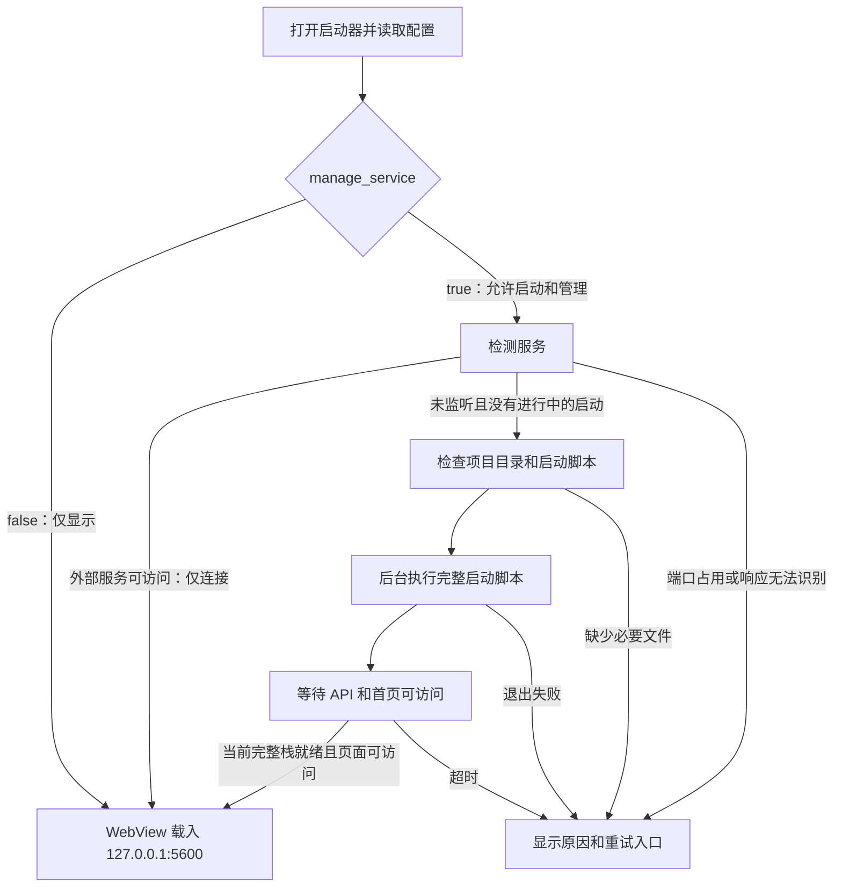

# amvar launcher 桌面启动器设计

状态：设计方案，尚未实现。范围修订日期：2026-09-08。

## 目标和范围

在仓库根目录新增 `launcher/`，与 `backend/`、`frontend/` 同级，开发一个嵌入现有 Web UI 的桌面应用。固定首页为 `http://127.0.0.1:5600`。配置 `manage_service` 默认 true：服务未运行时启动发行版完整服务，并管理本次由启动器启动的服务；已运行的外部服务只连接、不接管。配置为 false 时只载入网页，不启动或停止任何视觉服务。

首版目标为 Windows 10 1903 及之后版本、Windows 11，架构为 x64。使用最新稳定版 .NET 10，不开展旧版 Windows 专项兼容调查，不因历史系统版本增加前置门禁或降低框架版本。后续目标为 Windows ARM64、Ubuntu x64/ARM64、macOS x64/ARM64；所有程序和原生依赖均为 64 位，不提供 x86 构建。

应用显示名称统一为 **amvar launcher**，用于窗口、托盘提示和关于窗口。桌面层管理窗口、托盘、服务启动与停止、本地配置和日志入口。业务页面继续使用现有 Vue 3 前端，通过 REST、WebSocket 与后端协作。桌面层不重新实现 Workflow 编辑器、任务监控、节点执行、模型运行时或共享内存协议，也不调用 Python 业务模块。

## 已核对的项目事实

| 项目现状 | 设计含义 |
| --- | --- |
| 根 `global.json` 使用 .NET 10，当前机器 `dotnet --version` 为 `10.0.400` | 新项目沿用现有 SDK 策略，不调整仓库内旧 SDK 工程 |
| `runtimes/launchers/full/start-amvision-full.bat` 是发行根脚本模板 | 桌面程序调用组装后的根脚本；不能把模板所在目录当成完整发行目录 |
| full Supervisor 已处理迁移、主 LocalBuffer、daemon、service、Worker 的启动和回收 | C# 不复制这套启动顺序及恢复策略 |
| 发行包有 `stop-amvision-full.bat`，按完整进程身份请求停止 | 托盘“退出”调用该脚本，不按端口或单独 PID 杀进程 |
| `GET /api/v1/system/health` 返回 `status`、`request_id`、`local_buffer_broker` | 可判断 API 是否响应；不代表全部 Worker、Deployment 或模型已健康 |
| health 没有产品 ID、安装目录或完整发行栈 ready 字段 | 不编造这些响应字段，不把连通性检查当成安装实例身份证明 |
| 后端按工作目录挂载 `frontend/index.html` 或 `frontend/web-ui/dist/index.html` | 启动工作目录必须正确；没有静态前端时，API 正常也无法显示业务首页 |
| full `runtime-state.json` 在启动过程中就会写入，之后持续更新 | 文件存在不等于全部启动完成；启动器不依赖解析控制台中文文本判断 ready |
| 当前首次写入 runtime state 在迁移和 service 启动之后；停止请求主要在完整启动后的监督循环读取 | 启动早期退出存在缺口，必须补齐，不能把停止脚本返回 0 直接当成已经回收全部进程 |
| 当前正式发行 profile 为 Windows x64 | 其余平台需同时补齐 Python、launcher、原生依赖和 release profile，不能仅改变 .NET RID 就宣称整个平台支持 |

事实来源：[full 启动脚本](../../runtimes/launchers/full/start_amvision_full.py)、[停止脚本](../../runtimes/launchers/full/stop_amvision_full.py)、[health 路由](../../backend/service/api/rest/v1/routes/system/health.py)、[静态前端挂载](../../backend/service/api/app.py)、[生产启动](../deployment/production-environment.md)。本轮只读探测确认当前机器的 health 与首页均返回 HTTP 200，首页类型为 HTML；这不是桌面程序验收结果。

## 技术基线

| 部分 | 选择 |
| --- | --- |
| 语言与框架 | C#、`net10.0`、实施时最新稳定版 .NET 10 SDK/运行时 |
| 桌面 UI | Avalonia、Avalonia.Desktop、Avalonia.Themes.Fluent，当前稳定版 `12.1.2` |
| WebView | 官方 `Avalonia.Controls.WebView`，当前稳定版 `12.1.0`，使用 `NativeWebView` |
| JSON | `Newtonsoft.Json 13.0.4`，配置及 HTTP JSON 解析统一使用该库 |
| 工程组织 | Core、Infrastructure、Desktop 三个生产工程；桌面 UI 使用 MVVM |
| 发布 | 指定 RID，self-contained；首版不启用 Native AOT、裁剪或单文件打包 |

版本分别依据 [.NET 支持策略](https://dotnet.microsoft.com/en-us/platform/support/policy)、[Avalonia 包](https://www.nuget.org/packages/Avalonia/12.1.2)、[WebView 包](https://www.nuget.org/packages/Avalonia.Controls.WebView/12.1.0)、[Newtonsoft.Json 包](https://www.nuget.org/packages/Newtonsoft.Json/13.0.4)核对。实施时复核最新稳定版并锁定精确版本及依赖，不使用 preview 或浮动版本。

官方 WebView 当前为 MIT 开源组件，不要求把商业 XPF 引入项目。Windows 使用 WebView2，macOS 使用 WKWebView，Linux 使用 WPE/WebKitGTK。框架具备平台适配不等于本项目已完成对应设备验收。[官方仓库](https://github.com/AvaloniaUI/Avalonia.Controls.WebView)、[平台支持](https://docs.avaloniaui.net/controls/web/nativewebview)。

## 源码组织

完整目录、项目引用、模块职责、class 模型和状态迁移表统一见 [启动器工程架构](../architecture/desktop-launcher.md)。首先创建三个工程及测试工程的可构建骨架，再定义模型、接口、状态机并验证，然后接入外部能力和界面。

Core 管理规则与用例，Infrastructure 负责 JSON/HTTP/磁盘/进程，Desktop 负责 Avalonia 视图和组装。窗口与 ViewModel 不直接读文件、解析 JSON 或运行启动脚本；配置文档经具名 class 反序列化和校验后映射为核心模型。测试位于根 `tests/launcher/`，文件使用 `test_` 前缀。当前仍只有 README 入口，没有已创建的 C# 工程。

## 启动流程



1. 先创建托盘和主窗口，显示 XAML 启动页面及“正在连接服务”，异步读取配置、初始化 WebView 环境，不阻塞 UI 线程。`manage_service=false` 时直接导航固定首页，跳过下列服务启动/归属检查，不要求 Python、full 脚本、manifest 或 runtime state；网页失败只显示连接错误和重新载入入口，不转为自动启动。下列第 2–6 步适用于 `manage_service=true`。
2. 请求 health，校验 HTTP 状态和现有 JSON 结构；再确认 `/` 返回 HTML。失败响应和重定向不自动当成就绪。
3. 已运行的服务可直接载入固定首页；存在当前 full Supervisor 的启动中状态时继续显示等待页。本次启动的完整栈必须等待脚本明确报告 running，再核对 API 和首页。API 可访问但页面缺失时，提示前端资源缺失，不重复启动服务。
4. 仅在端口没有服务监听、当前没有启动任务时调用脚本。端口能连接却返回无关内容、超时或无法识别时，显示连接问题，不自动启动第二套服务或结束已有进程。
5. 启动前核对项目目录中的根脚本、bundled Python、发行 manifest 和前端资源；缺失时显示具体文件及“设置”“重试”入口。运行时与 schema 的完整校验仍交给现有脚本。
6. 启动后按约 1 秒间隔探测，每次请求超时默认 2 秒，等待窗口默认 300 秒。等待超时不等于脚本已退出；提供“继续等待”和日志入口。重试先检查已有启动进程，不能重复执行脚本。
7. 页面导航完成与后端可连接分开处理：WebView 初始化失败、导航失败或前端资源失败，都显示对应原因。后端连接状态文案为“已连接”，不宣称“全部组件健康”。

首版使用固定本机地址 `http://127.0.0.1:5600`。health 检查只做连通性和响应结构识别，不能可靠判断该地址对应哪个安装目录。服务管理范围必须同时满足配置开启、本次启动器会话实际创建发行 full 启动任务、完整进程身份核对通过。同目录预先运行的 full 栈、第三方软件启动的视觉服务、手工 Uvicorn/conda 后端都不接管；启动器崩溃后重新打开也不凭磁盘记录接管遗留栈。界面区分“已连接·可管理”和“已连接·仅查看”。进程归属判据见工程架构，来源不明的服务不能按端口强杀。修改端口涉及前端 runtime config，首版不增加只改桌面 URL 的端口设置。

第三方软件负责启动视觉服务时，将 `manage_service` 设为 false；服务尚未启动或后来断开时，启动器仅提供重新连接，不运行启动脚本。开发时前后端均由终端手动启动，启动器不启动 conda 后端或 Vite。固定 5600 页面需要该地址实际提供前端；手工 Vite 的 5601 不由启动器自动代理或改址。

## 进程生命周期

- Windows 使用隐藏进程执行目标根目录 `start-amvision-full.bat`，工作目录明确设为该根目录；通过 Windows 适配器处理 `.bat` 的 `cmd.exe /d /s /c` 调用及路径引号，不依赖调用者当前目录。
- 发行默认使用随包 Python；不激活 conda、不启动 Vite，也不继承开发用 `AMVISION_PYTHON_EXECUTABLE` 覆盖来替换随包解释器。
- 同一用户、同一项目目录的桌面窗口只保留一个实例，重复打开时激活原窗口。启动协调串行执行“探测→启动”；实际服务仍由现有 Supervisor 锁约束，桌面单实例不能替代后端锁。
- **Windows 关闭主窗口默认隐藏到系统托盘；托盘“退出”只停止本次由启动器启动的发行完整服务，再结束启动器。仅查看会话退出不停止外部服务。**
- 主窗口只隐藏，不销毁 WebView，不清空网页中的未保存编辑。启动和日志任务由应用级服务持有，不依赖窗口是否可见；隐藏时不停止读取进程输出，避免管道堵塞。
- 不使用跟随窗口销毁而强杀服务的 Job Object。受管理会话正常退出通过 stop 脚本完成本次完整栈回收，不只停止 backend-service，也不单独遍历和结束模型进程。
- 首版提供托盘常驻和显式退出，不提供自动重启服务、系统服务安装或开机自启。运行中断连显示状态与重新连接入口，不自动循环拉起整套后端。
- 源码开发可连接已经运行的 5600；自动启动默认面向完整发行目录。开发时可在设置中选择 `release/<profile-id>/`，不把 conda 开发启动与发行启动混为一条路径。

## Windows 托盘与退出

托盘图标在应用启动后创建，主窗口显示时也保留。右键菜单固定从上到下为：

1. **显示窗口**：显示、恢复并激活已有主窗口，保留之前的普通/最大化状态和网页内容。
2. **关于**：打开或激活唯一的 Avalonia 关于窗口；主窗口隐藏时也可独立打开。
3. 分隔线之后最底部为 **退出**：受管理会话先停止本次启动的完整服务，再结束启动器；仅查看会话直接结束启动器。

左键点击托盘图标同样显示窗口。使用应用级 `TrayIcon` 与 `NativeMenu`，菜单遵循 Windows 原生外观、键盘与焦点行为，不额外制作仿网页弹出面板。[Avalonia 托盘文档](https://docs.avaloniaui.net/controls/navigation/trayicon)。

应用生命周期使用显式退出模式（`ShutdownMode.OnExplicitShutdown`）。主窗口的关闭按钮、Alt+F4、任务栏关闭统一进入隐藏逻辑；普通最小化按钮仍最小化到任务栏。关于和设置窗口关闭只关闭各自窗口，不隐藏或结束主应用。托盘创建失败时不能把窗口隐藏成无法找回的进程，应保留窗口，在错误状态中提供同一套退出动作。

点击“退出”不再弹通用确认框，直接进入“正在退出”状态：取消后续启动/重连/导航，禁止重复提交退出，可管理会话异步运行所管理目录的 `stop-amvision-full.bat` 并传入预期身份与 graceful-only 选项，在确认对应完整进程树退出后保存有效窗口配置、释放 WebView 和托盘，再显式关闭应用。仅查看会话跳过停止脚本，直接释放启动器资源。退出中的托盘菜单仍保持原有顺序，“显示窗口”“关于”可查看状态，“退出”暂时禁用；窗口处于隐藏状态时通过托盘提示表达正在退出。新增脚本选项目前尚未实现，契约见工程架构。

停止失败、身份不匹配或仍有当前栈残留时，不能显示“已退出”后留下服务。保留托盘，恢复主窗口显示具体原因、日志与重试入口。不把停止脚本返回 0 或 5600 端口消失当成唯一成功条件；需要同时核对启动任务已结束、对应 Supervisor/组件身份已经退出。已确认服务原本就不存在时正常退出。

### 启动期间退出的必要补充

现有 `_run_database_migration()` 先于首次 runtime state 写入；`stop_amvision_full.py` 在状态文件不存在时返回 0，启动脚本仍可能继续拉起服务。现有停止请求也没有覆盖所有启动等待循环。这是本轮源码核对发现的实际缺口。

实施时在已有 Python full Supervisor 内补齐，而不是由 C# 重写服务编排：

- 完成进程身份初始化后、启动迁移前就写入 root state；尚无组件时允许列表为空。
- 启动阶段边界、预热和就绪等待循环均检查已有、绑定 root 身份的停止请求。迁移按安全边界结束或取消后进入统一清理，收到退出意图后不能继续启动后续组件。
- 桌面退出还要覆盖脚本进程刚创建但 root state 尚未可读的短窗口：等到可提交停止请求或脚本已退出，再判定完成，不立即退出桌面程序。
- 增加独立、原子写入的本地 `logs/full-stack/launcher-status.json`，格式 ID 为 `amvision.launcher-status.v1`，包含 `root_process`、`state`（starting/running/stopping/failed）与可选错误摘要。仅在 daemon、service、全部 Worker 就绪后写入 running；用于就绪判断时只接受与当前 root state 完整身份一致且进程存活的状态，拒绝旧文件误报。属于本次会话的 failed 记录可用于显示错误，不作为进程存活证明。

该状态文件是待实现的本机脚本适配，不是已有 HTTP API；无需改动现有 runtime state/stop request 的格式 ID。它只提供真实阶段和启动完成信号，不估算模型预热百分比。关机、注销和系统强制结束不等价于可无限等待的正常退出，需要单独验证操作系统允许的清理时间，不能承诺强杀后仍能执行异步收尾。

## 自定义窗口与使用方式

主窗口默认 1280×800，最小 1024×720。隐藏系统自带标题栏及其按钮，用 Avalonia XAML 实现约 40 DIP 高的自定义标题栏：左侧项目图标与 `amvar launcher`，中间留作拖动区域，右侧依次为最小化、最大化/还原、关闭到托盘。按钮建议宽 46 DIP、高 40 DIP，支持工具提示和键盘焦点；关闭按钮提示“隐藏到托盘”。主内容区位于标题栏下方，WebView 不覆盖标题栏或窗口调整大小的命中区域。

首版按 Avalonia 12 的 `WindowDecorations`、`ExtendClientAreaToDecorationsHint` 和 `WindowDecorationProperties.ElementRole` 实现窗口装饰，不照搬旧版已移除的属性。保留标题栏拖动、双击最大化、边缘缩放、系统贴靠、Alt+Space 和多屏 DPI 行为；Windows 11 最大化按钮的 Snap Layout 交互列为实机验收项，不用拖拽计算模拟全部窗口行为。[Avalonia Windows 窗口文档](https://docs.avaloniaui.net/docs/platform-specific-guides/windows)。

窗口边框、按钮悬停和圆角沿用项目中性灰与主色，默认使用实色背景，不为“现代”效果增加模糊和大面积渐变。最大化后适配屏幕工作区，不能遮挡任务栏。桌面层保留紧凑的首页、后退、前进、刷新、连接状态和设置入口，主区域完整显示 Web UI；日志入口放在设置和错误状态中。

设置和关于使用独立的 XAML 窗口，与主窗口共享标题栏样式；辅助窗口只保留关闭按钮，不提供最大化。它们不依赖 NativeWebView 的覆盖层。主题默认跟随系统，桌面外壳使用项目的中性色和主色；网页继续遵守自身主题设置，不通过脚本强行改写。

WebView 只创建一次，调整窗口、打开设置或短暂断连不重新创建浏览器实例，也不自动刷新当前 Workflow 编辑图。主动刷新继续使用网页既有行为。快捷键优先交给网页，不能拦截节点复制/粘贴、文本编辑、画布缩放和右键菜单。

文件选择、multipart 上传、Blob/JSON 下载、中文输入法、剪贴板、WebSocket 和浏览器存储属于首版 WebView 必验项。登录状态保存在专属 WebView 用户数据目录；不导入系统浏览器的登录数据，不把密码或 token 写进启动器 JSON。

本机站内导航留在 WebView；用户主动打开的外部 HTTP/HTTPS 链接交给系统浏览器，不额外提供任意网页地址栏。下载与 Blob URL 按下载流程处理，不误判为外链。首版不暴露通用 JavaScript→C# 文件或命令执行桥。

## 关于窗口

参照当前设置导航的“关于”页面，使用 C# ViewModel 与 Avalonia XAML 原生实现，不嵌入设置页，也不要求后端已经启动或完成登录。本轮在浏览器核对了该页面的浅色背景、两列信息布局、右上角版本和链接样式，代码来源为 [SettingsDiagnosticsPage.vue](../../frontend/web-ui/src/modules/settings/pages/SettingsDiagnosticsPage.vue)。

关于窗口建议宽 560 DIP、高度随内容约 380–440 DIP，内边距 24 DIP。顶部“关于”与右侧启动器版本，内容保留同样的标签/值层级；窗口较小时改为单列。具体信息为：

| 内容 | 数据来源 |
| --- | --- |
| 应用名称 | 固定显示 `amvar launcher` |
| 版本 | 启动器自己的构建版本；不直接显示后端版本作为启动器版本 |
| 构建时间 | 编译/发布时写入启动器元数据的 UTC 时间，显示时转换为本地时间并标明时区 |
| Git commit | 启动器构建对应的仓库提交，缺失显示“未提供” |
| 许可证 | 当前项目的 `PolyForm Noncommercial License 1.0.0`，与现有关于页一致；链接到随包项目许可证 |
| GitHub 仓库 | `https://github.com/ammm56/amvision`，显示 `github.com/ammm56/amvision` |
| amvar 官网 | `https://www.amvar.io`，显示 `amvar.io` |

原设置页里的 Frontend build、Backend version 和运行模式仍属于视觉服务诊断，不作为启动器自身版本信息。应用关于主体使用上述启动器字段，避免离线时出现大量无关空字段。框架的 MIT 许可不能替代本项目许可证名称；发行同时保留第三方声明。

构建信息由 MSBuild/发布步骤生成并嵌入只读 JSON 资源，使用 Newtonsoft.Json 读取；配置文件不能覆写构建时间。构建时间不能用程序启动时间、当前时间或 EXE 最后修改时间代替。当前网页构建时间显示为空，不将这个空值沿用为桌面发行信息。具体版本号由实施时的版本策略确定，不在设计中编造一个已发布版本。

外部链接由用户点击后使用系统浏览器打开；许可证在原生只读文本窗口查看。关于窗口关闭/Esc 只关闭自身，托盘继续存在；从托盘再次打开时激活原有窗口，避免重复实例。

## XAML 启动动画页面

启动页面是主窗口中的原生 `StartupView.axaml`，与 WebView 共用内容区域，标题栏和托盘始终可用。中心内容宽约 360–420 DIP：项目现有图标、`amvar launcher`、一行状态、细条循环进度动画、已等待时间；日志入口在其下方。使用现有品牌资源和中性色，不引入视频、GIF 或网页加载页。

动画采用 `ProgressBar IsIndeterminate="True"`，配合轻量的 Opacity/Transform 过渡。动画只表达仍在工作，不显示伪造的 0–100% 或按时间自动走完的进度。旋转/流动节奏约 1.2–1.6 秒；页面内状态切换统一为约 180ms，无弹跳和大位移。[Avalonia 不确定进度条](https://docs.avaloniaui.net/controls/feedback/progressbar)。

| 真实状态 | 页面表现 |
| --- | --- |
| 首次探测 | “正在连接视觉服务…” |
| 已执行启动脚本 | “正在启动视觉服务…”；补充“首次启动可能需要较长时间”，持续显示已等待时间 |
| 完整栈就绪，开始网页导航 | “正在载入工作台…” |
| WebView 导航成功并验证前端内容已呈现 | 显示原有 Web UI，结束启动动画 |
| 超出等待窗口但脚本仍存活 | 明确显示等待时间较长，提供继续等待和查看日志；不重复启动 |
| 启动/导航失败 | 停止循环动画，显示具体原因、重试和日志入口 |
| 托盘退出 | 受管理会话显示“正在停止视觉服务…”；仅查看会话显示“正在退出…”；冻结后续启动与导航 |

“正在启动”不进一步假装知道迁移、模型预热的实时百分比。详细信息来自实际日志；只有将来有明确的结构化阶段数据才扩展阶段名称。

WebView 初始化和导航完成不等于 Vue 首屏已经显示。工程架构已定义待实现的 Vue 挂载就绪标记和 30 秒首屏等待上限；登录页面也算就绪，不等待用户登录。NativeWebView 可能存在原生窗口层级限制，XAML 加载页与 WebView 采用显隐交接，不依赖透明 XAML 覆盖住原生网页控件。过渡在 XAML 状态页内部完成；网页可见后不再叠加遮罩。已运行服务直接进入载入流程，不人为延长动画展示时间。

窗口隐藏到托盘后继续已有的启动或网页载入任务，暂停不可见的视觉动画；后台就绪后不强行抢焦点或自动显示窗口。用户点“显示窗口”时显示当前真实阶段或已经载入的网页。遵守系统减少动画偏好，失败/隐藏/退出时停止无用的动画定时器和事件订阅。

## JSON 配置

可提交默认示例为 `config/launcher.example.json`；使用时读取目标程序根目录的 `config/launcher.json`。首次启动可用默认值创建配置。所有相对路径相对程序所在的项目根目录解析，不能相对进程当前工作目录解析。

```json
{
  "schema_version": 1,
  "manage_service": true,
  "project_root": ".",
  "startup_timeout_seconds": 300,
  "theme": "system",
  "window": {
    "width": 1280,
    "height": 800,
    "maximized": false
  }
}
```

地址、平台脚本名和健康检查路径是首版固定约定，不增加自由命令字符串配置。`manage_service` 为布尔值，缺省 true；设置窗口使用“启动并管理视觉服务”开关。false 表示仅显示网页，不能拆成互相冲突的自动启动和自动停止两个开关。`project_root` 用于从开发程序选择完整发行目录；仅查看模式不以完整发行资产校验阻止网页载入。

`manage_service` 与 `project_root` 改动均在下次启动应用生效，设置中明确显示这一点。本次会话的管理权限和目标保持不变：true 改 false 后本轮退出仍收尾自己已启动的栈，false 改 true 不接管外部服务。关闭到托盘和托盘退出是首版固定行为，不增加互相冲突的关闭模式设置。

Newtonsoft.Json 使用显式 DTO 和 `TypeNameHandling.None`；UTF-8 写入，同目录临时文件完成后原子替换。缺少字段使用默认值；未知配置版本停止覆盖并显示原因。损坏文件保留，不在启动时静默覆盖；当前界面可展示默认值及错误，保存时才写入经校验的配置。写入失败明确显示“未保存”，不假装成功。

自动保存窗口状态同样遵守配置保存资格：损坏或不支持版本下展示的默认值，不能在隐藏、退出或自动重试时覆盖原文件。默认值只用于界面恢复，修复并主动保存后才恢复自动写入，详见工程架构。

窗口尺寸恢复时按当前屏幕可用区域约束。WebView 用户数据位于 `data/launcher/webview/`，桌面诊断日志位于 `logs/launcher/`；两者相对桌面程序所在根目录，与 `project_root` 设置分开。发行目录需可写，符合当前本地解压部署方式；只读目录显示路径权限问题，首版不静默切换另一份用户配置。

## 发布目录与平台边界

“发布到项目根目录”指可执行文件在所管理项目的最外层，方便双击。源码仍在 `launcher/`，不是把 C# 文件放到后端或前端中。

```text
<项目使用根目录>/
├─ amvar.launcher.exe            Windows x64 入口，显示名称 amvar launcher
├─ <dotnet publish 运行依赖>      同批发布，不要求系统安装 .NET
├─ start-amvision-full.bat
├─ stop-amvision-full.bat
├─ start_amvision_full.py
├─ app/                          发行 backend 源码
├─ frontend/                     发行静态 Web UI
├─ python/                       bundled Python
├─ launchers/ / manifests/       既有运行脚本和 manifest
├─ tools/webview2/win-x64/       随包 Fixed Version WebView2
├─ config/launcher.json
├─ data/launcher/webview/
└─ logs/launcher/
```

先发布到 `launcher/` 内的构建输出目录，再由发布脚本按文件清单复制到指定项目根目录。正式发行由 `assemble-release` 集成这些构建产物，目标为 `release/<profile-id>/`；不直接手工修改 release 里的业务代码，不用发布清理命令删除项目根目录。

桌面资源作为显式选择的发行组件，组装与布局校验需一起覆盖启动器文件清单、RID 和 WebView2 目录。纯后端、无桌面的 edge 发行仍可不包含启动器，不能把显示环境或 WebView2 变成 backend 的运行前提。覆盖发布保留已有 `config/launcher.json`、WebView 用户数据和业务数据，只更新属于本次构建的程序文件与默认示例。

Windows 首版指定 `win-x64`、`SelfContained=true`、`PublishTrimmed=false`、`PublishAot=false`。先用常规多文件发布验证 Newtonsoft.Json、Avalonia 和原生 WebView 依赖，随后再评估是否需要单文件优化。self-contained 只包含 .NET，不包含 Python 和 WebView2，后两者仍需独立组装。[.NET 发布说明](https://learn.microsoft.com/en-us/dotnet/core/deploying/)。

离线 Windows 发行默认随包携带 Fixed Version WebView2，并在初始化前指定目录；开发态可使用已安装的 Evergreen Runtime。固定版体积较大，需要随发行升级，不能依赖目标机联网下载。Win10 的固定版权限条件及 UNC 路径限制按官方说明验证，不关闭浏览器沙箱绕过失败。[WebView2 分发说明](https://learn.microsoft.com/en-us/microsoft-edge/webview2/concepts/distribution)。

| 目标 | RID | WebView 与发行工作 |
| --- | --- | --- |
| Windows 10 1903+ / Windows 11 x64 首版 | `win-x64` | WebView2 x64；复用现有 Python/full-stack 发行包，在可用 Windows x64 环境验证功能与离线部署 |
| Windows ARM64 | `win-arm64` | WebView2 ARM64；另行准备和验证 Python、模型及原生依赖 |
| Ubuntu x64/ARM64 | `linux-x64` / `linux-arm64` | WebKitGTK/WPE 系统依赖；完整 `.sh` 发行链路、显示会话及架构实测 |
| macOS x64/ARM64 | `osx-x64` / `osx-arm64` | WKWebView；`.app`、签名、公证与 Python/运行脚本适配 |

macOS 使用标准 `.app` 放在项目使用根目录，项目根定位为 bundle 外的项目目录，不使用 `Contents/MacOS` 作为后端工作目录。Ubuntu 后续需分别验收目标 LTS 版本的 X11/Wayland；具体操作系统最低版本在对应平台实施时按 .NET、Avalonia、WebView 和后端依赖的共同支持范围确定，不在本轮标记为已支持。

Windows 版本兼容不作为本轮独立工作项：按最新稳定版 .NET 10 与选定稳定框架实现，不做旧系统专用适配，不要求 Windows 1903 专项验收环境。仍须验证启动器自身的 WebView、窗口、托盘、文件交互和服务启停，以及随包运行时和离线发布。记录实际测试环境与结果，不将框架支持说明等同于本项目全部功能已经通过测试。

## 产品验收

工程结构由 [启动器工程架构](../architecture/desktop-launcher.md) 定义，逐步实施和验证由 [详细实施步骤](../architecture/desktop-launcher-implementation.md) 维护。最终产品需要同时满足：

- 原生窗口和托盘行为符合本文，关于离线可用；隐藏再显示不丢网页编辑。
- `manage_service=false` 时，服务存在、不存在、连接失败和重试均不调用启动/停止脚本；没有 Python/full 资产也能载入外部服务页面。
- `manage_service=true` 时，外部服务已运行则只连接；未运行时只启动一次；同目录第三方 full 栈也不接管；不把循环动画当成真实完成进度。
- 本次创建脚本与第三方启动竞态时，只有确认属于本次启动任务的栈才允许停止；修改配置不改变当前会话的管理权限。
- 启动早期、迁移、预热、网页运行和托盘隐藏期间的退出均能回收本次启动器创建的完整栈；停止失败不假报成功。
- 登录、Workflow 编辑、复制粘贴、文件导入/导出、下载、中文输入与 WebSocket 在实际 WebView 中通过。
- 离线 Windows x64 发行可从根目录启动，配置与构建信息准确，覆盖发布保留本地配置和业务数据。

完整发行验收使用独立测试包与测试数据，不停止当前开发服务，也不修改真实 Workflow。

需要通过实测再确定的事项：WebView 上传/下载和快捷键行为、固定版 WebView2 与控件环境设置的兼容性、自定义窗口的 Snap Layout、加载页到原生网页的交接、Windows Explorer 重启后的托盘恢复，以及启动期间退出与系统会话结束时的清理。它们均未完成桌面验收；如验证不符，应在进入下一步前修改适配和本文，不能通过加载普通网页就宣称整套应用兼容。
