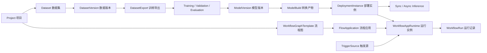

# 产品与设计总纲

## 1. 产品定位

AMVision 是本地优先的工业视觉服务平台。它负责管理视觉数据、训练和评估模型、转换模型、部署推理服务、调试推理结果、编排视觉流程，并通过 HTTP、WebSocket、ZeroMQ 等协议与上位机、MES、PLC 网关或设备代理系统协作。

平台不是相机或 PLC 的直接控制系统，不是通用 SaaS 管理后台，也不是单一模型训练工具。界面需要同时表达三类对象：

- 可追溯资源：Project、Dataset、DatasetVersion、DatasetExport、Model、ModelVersion、ModelBuild。
- 有开始和结束的任务：导入、导出、训练、验证、评估、转换、异步推理。
- 长期运行实例：DeploymentInstance、WorkflowAppRuntime、TriggerSource。

设计必须让三类对象在视觉上和操作语义上保持清楚，避免把长期运行服务错误表现为普通后台任务。

## 2. 主要用户

### 2.1 视觉算法工程师

关注数据格式、数据版本、模型系列、训练参数、指标曲线、checkpoint、评估结果、模型转换和运行时兼容性。需要快速比较、定位失败原因和复现实验。

### 2.2 现场实施与调试工程师

关注部署实例、设备、运行时、精度、输入输出契约、同步或异步接口、预热、健康状态、时延、吞吐、日志和结果回传。需要在弱网或离线环境中稳定操作。

### 2.3 流程工程师

关注节点目录、端口类型、参数、流程模板、应用版本、运行实例、触发源、运行记录和错误定位。需要在大画布上完成节点编排、试跑、发布和观察。

### 2.4 运维与管理员

关注服务状态、worker、Python 运行时、GPU/NPU、磁盘、权限、项目和节点包。需要明确区分可恢复警告、阻断错误和危险操作。

## 3. 核心体验目标

### 3.1 一眼知道当前所在层级

页面必须持续显示当前 Project、资源类型、资源名称或任务 ID。列表、详情和运行实例之间应通过面包屑或明确返回路径连接。

### 3.2 一眼区分资源、任务与运行实例

- 资源使用中性图标、版本号和来源关系。
- 任务使用进度、队列、阶段、开始时间和结束时间。
- 运行实例使用健康灯、运行时长、心跳、端点、设备和启动/停止操作。

### 3.3 状态不只依靠颜色

所有状态同时使用文字、图标和必要的结构差异。运行中显示动态进度或心跳，失败显示错误摘要和下一步操作，已完成显示产物入口。

### 3.4 复杂能力逐层展开

首屏只显示当前决策需要的信息。高级参数、原始 JSON、日志、元数据和审计信息放入可展开区域、标签页或右侧检查器。

### 3.5 视觉结果优先

推理、数据集样本、评估和流程试跑页面要为图片、mask、keypoints、OBB、边界框和测量叠加保留足够空间。结果画布不是表单附件，而是核心工作区。

## 4. “人工、洁净、未来感”的可执行定义

### 4.1 人工

- 使用准确、直接、克制的中文界面文案。
- 保留清楚的手工控制：选择、确认、试跑、发布、回滚、停止。
- 展示来源、版本、操作者和时间，体现工程过程可以被人理解和追溯。
- 允许局部不完美的真实工业图像、标注叠加、日志和数据，而不是使用品牌化空洞插画。
- 使用少量带有触感的细节：精细分隔线、实心按钮、紧凑表格、微弱纸张或金属灰层次，但不使用拟物皮革、夸张阴影。

### 4.2 洁净

- 12 列网格、稳定对齐、清晰的主次区域。
- 主要页面最大内容宽度按业务决定；表格和工作台可全宽，表单内容控制在可读宽度。
- 避免每个信息块都套卡片。优先使用区域标题、细分隔线和表格。
- 颜色数量受控，品牌绿只用于主要操作、选择态、运行正常和视觉锚点。
- 文案短而准确，字段名和字段值严格对齐。

### 4.3 未来感

- 来自实时状态点、微型趋势图、精密图像叠加、节点连线、结构化数据和快速反馈。
- 使用深墨色与冷白双主题，搭配克制的翡翠绿。
- 可以使用极轻的网格、扫描线或坐标刻度作为功能性背景，只出现在图像画布、流程画布和运行监视区。
- 动效短、明确、有物理感：状态切换、面板展开、节点连接、进度更新。
- 禁止大面积霓虹光晕、彩虹渐变、悬浮玻璃球、太空背景、无意义 HUD 装饰。

## 5. 产品信息层级

## 6. 支持能力边界

### 6.1 模型与任务

| 模型 | classification | detection | segmentation | pose | obb |
| --- | --- | --- | --- | --- | --- |
| YOLOX | - | 支持 | - | - | - |
| YOLOv8 | 支持 | 支持 | 支持 | 支持 | 支持 |
| YOLO11 | 支持 | 支持 | 支持 | 支持 | 支持 |
| YOLO26 | 支持 | 支持 | 支持 | 支持 | 支持 |
| RF-DETR | - | 支持 | 支持 | - | - |

界面不得提供不支持的组合。模型、任务、数据格式和导出格式之间应使用后端能力目录动态约束，不在设计中表现为任意组合的自由选择器。

### 6.2 数据集格式

| 任务 | 导入格式 | 导出格式 |
| --- | --- | --- |
| classification | ImageNet | ImageNet classification |
| detection | COCO、VOC、YOLO | COCO、VOC、YOLO detection |
| segmentation | COCO、YOLO | COCO instance segmentation、YOLO instance segmentation |
| pose | COCO、YOLO | COCO keypoints、YOLO pose |
| obb | DOTA、YOLO | DOTA OBB、YOLO OBB |

### 6.3 转换和运行时

- 转换目标：ONNX、ONNX optimized、OpenVINO IR、TensorRT engine。
- 运行时：PyTorch、ONNX Runtime、OpenVINO、TensorRT。
- 设备：CPU、CUDA、OpenVINO AUTO/CPU/GPU/NPU，具体选项由所选产物和设备能力动态决定。
- 推理：同步调试和异步任务两条路径。

## 7. 全局页面框架

### 7.1 工作台外壳

- 左侧固定导航，宽度约 `232px`；可收窄为仅图标模式。
- 顶部上下文栏显示当前项目、全局搜索、连接状态、任务活动和用户菜单。
- 主内容区使用浅色主题为默认；流程编辑器和图像推理可切换深色沉浸工作区。
- 页面标题区包含标题、短说明、资源状态和一到两个主操作。
- 详情页允许右侧检查器，宽度 `320–400px`。

### 7.2 导航分组

- 工作空间：项目、任务。
- 数据与模型：数据集、模型、部署、推理。
- 自动化：流程图、流程应用、触发源、自定义节点。
- 系统：设置与诊断。

## 8. 设计边界

- 不设计内建标注平台首页；数据标注通过外部工具协作，平台只展示样本和标注结果。
- 不设计相机、PLC 或传感器的核心驱动配置中心；直连能力仅作为受控 custom node 配置出现。
- 不设计营销首页、订阅套餐、团队协作社交流或通用 SaaS 数据大屏。
- 不把所有复杂表单塞进一个页面；创建流程使用侧滑面板、分步对话框或独立向导。
- 不把日志和 JSON 当成主视觉；它们是必要的工程细节，放在辅助层。

## 9. 生成工具共同约束

- 界面语言默认简体中文，模型名、格式名、runtime、API、ID 保留英文。
- 使用真实业务示例，如 `VOC2012 Detection`、`YOLO11-s Detection`、`OpenVINO IR`、`TensorRT FP16`。
- 设计应可由 Vue 3、常规 CSS、SVG、Canvas 和 Vue Flow/LiteGraph 类组件实现。
- 不生成无法实现的三维全息界面、漂浮粒子或持续视频背景。
- 图标使用统一的简洁线性图标系统，避免混用彩色插画图标。
- 所有表格必须有筛选、排序、状态、空状态和分页意识。
- 所有任务页必须考虑 queued、running、succeeded、failed、cancelled 状态。
- 所有运行实例页必须考虑 stopped、starting、healthy、degraded、failed 状态。

