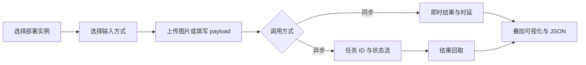

# 信息架构与业务路径

## 1. 导航结构

```text
AMVision
├─ 工作空间
│  ├─ 项目
│  └─ 任务中心
├─ 数据与模型
│  ├─ 数据集
│  ├─ 模型
│  ├─ 部署
│  └─ 推理
├─ 自动化
│  ├─ 流程图
│  ├─ 流程应用
│  ├─ 触发源
│  └─ 自定义节点
└─ 系统
   └─ 设置与诊断
```

左侧导航不直接展开每个资源详情。详情通过列表行、资源关系链接、全局搜索或最近访问进入。

## 2. 页面地图

| 编号 | 页面 | 状态 | 推荐路径 | 主要对象 |
| --- | --- | --- | --- | --- |
| S01 | 启动检查 | 系统状态 | `/` | 服务、会话、网络 |
| S02 | 登录 | 现有 | `/login` | UserSession |
| S03 | 离线/无权限/未找到 | 系统状态 | `/offline` 等 | 系统状态 |
| P01 | 项目列表 | 现有增强 | `/projects` | Project |
| P02 | 项目概览 | 规划 | `/projects/:projectId` | Project 汇总 |
| T01 | 任务中心 | 现有增强 | `/tasks` | TaskRecord |
| T02 | 通用任务详情 | 现有增强 | `/tasks/:taskId` | TaskRecord、TaskEvent |
| D01 | 数据集工作台 | 现有增强 | `/datasets` | Dataset、Import、Export |
| D02 | 导入数据集向导 | 规划为独立体验 | `/datasets/import/new` | DatasetImport |
| D03 | 导入详情 | 现有增强 | `/datasets/imports/:id` | DatasetImport |
| D04 | 数据版本详情 | 规划 | `/datasets/versions/:id` | DatasetVersion |
| D05 | 创建导出 | 规划为独立体验 | `/datasets/exports/new` | DatasetExport |
| D06 | 导出详情 | 现有增强 | `/datasets/exports/:id` | DatasetExport |
| M01 | 模型工作台 | 现有增强 | `/models` | Model、Training、Conversion |
| M02 | 创建训练任务 | 现有能力重组 | `/models/training/new` | TrainingTask |
| M03 | 训练详情 | 现有增强 | `/models/:taskType/training-tasks/:id` | TrainingTask |
| M04 | 验证与评估中心 | 规划 | `/models/evaluations` | ValidationSession、EvaluationTask |
| M05 | 评估详情 | 规划 | `/models/evaluations/:id` | Metrics、Predictions |
| M06 | 模型版本详情 | 规划 | `/models/versions/:id` | ModelVersion |
| M07 | 创建转换任务 | 现有能力重组 | `/models/conversions/new` | ConversionTask |
| M08 | 转换详情 | 现有增强 | `/models/:taskType/conversion-tasks/:id` | ConversionTask、ModelBuild |
| R01 | 部署工作台 | 现有增强 | `/deployments` | DeploymentInstance |
| R02 | 部署实例详情 | 规划 | `/deployments/:id` | Runtime、Endpoint、Events |
| I01 | 推理实验室 | 现有增强 | `/inference` | Sync/Async Inference |
| W01 | 流程应用列表 | 现有增强 | `/workflows/apps` | FlowApplication、Runtime |
| W02 | 流程应用详情 | 现有增强 | `/workflows/apps/:id` | App、Runtime、Run、Trigger |
| W03 | 流程编辑器 | 现有增强 | `/workflows/graph/new` 等 | GraphTemplate、Node |
| X01 | 触发源 | 现有增强 | `/integrations/trigger-sources` | TriggerSource |
| N01 | 自定义节点目录 | 现有增强 | `/custom-nodes` | NodePack、NodeDefinition |
| C01 | 设置与诊断 | 现有增强 | `/settings` | Runtime、Service、Device、Access |

“规划”页面用于完整表达后端资源链和未来前端入口，不代表当前路由已经存在。设计稿应在文件名和评审记录中保留状态标记。

## 3. 端到端主路径

### 3.1 数据到部署


每一步都应保留“来源”和“下一步”入口。例如导出详情页显示来源 DatasetVersion，并提供“用此导出创建训练任务”；训练完成页提供“查看模型版本”和“创建转换”。

### 3.2 流程发布与外部触发


### 3.3 现场推理调试



## 4. 关键对象关系的页面表达

| 来源对象 | 目标对象 | 页面表达 |
| --- | --- | --- |
| Dataset | DatasetVersion | 数据集行展示当前版本数；详情展示版本时间线 |
| DatasetVersion | DatasetExport | 版本详情显示兼容导出格式和已有导出 |
| DatasetExport | TrainingTask | 导出详情提供创建训练任务主操作 |
| TrainingTask | ModelVersion | 训练详情的产物区显示 best/latest 和登记结果 |
| ModelVersion | ModelBuild | 模型版本详情显示转换矩阵 |
| ModelBuild | DeploymentInstance | 构建产物行显示部署数量和创建部署入口 |
| DeploymentInstance | Inference | 部署详情与推理实验室互相链接 |
| WorkflowGraphTemplate | FlowApplication | 编辑器发布后进入应用详情 |
| FlowApplication | WorkflowAppRuntime | 应用详情管理一个或多个运行实例 |
| WorkflowAppRuntime | TriggerSource | 当前运行实例上下文内添加触发源 |
| WorkflowAppRuntime | WorkflowRun | 显示最近运行、回执、耗时和错误节点 |

## 5. 全局上下文

### 5.1 项目上下文

左侧导航上方或顶部栏提供 Project 切换器。切换项目后，数据集、模型、部署、流程和触发源自动进入相同 Project 范围。任务中心可默认过滤当前 Project，并允许切换到“全部项目”。

### 5.2 全局任务活动

顶部栏显示小型任务活动入口：运行中数量、失败数量、最近任务。点击进入任务中心。不要用持续弹窗打断训练或导出。

### 5.3 连接与服务状态

顶部栏显示后端连接状态。健康时为低调绿色点；重连时显示文字“正在重连”；离线时显示固定横幅和只读模式说明。

### 5.4 全局搜索

支持按名称或 ID 搜索 Project、Dataset、Model、Deployment、Workflow App 和 Task。搜索结果按资源类型分组，显示状态、所属项目和更新时间。

## 6. 列表到详情的通用路径

1. 列表页保留快速筛选、搜索、状态统计和主创建操作。
2. 单击行进入详情；行尾只保留高频次级操作。
3. 详情页顶部显示名称、类型、状态、ID、版本和操作。
4. 详情首屏先显示摘要和关系，再显示日志、JSON、文件等技术信息。
5. 删除、停止、回滚等操作必须有影响说明和确认。

## 7. 创建流程模式

### 7.1 简单创建

Project、TriggerSource 的简单类型可使用右侧抽屉。抽屉保留页面上下文，宽度 `440–560px`。

### 7.2 多步向导

数据集导入、训练、转换和部署使用三到五步向导。步骤栏始终可见，最后一步提供配置摘要和兼容性检查。

### 7.3 大型编辑

Workflow 使用全屏工作台，不放在对话框中。图像 ROI、mask、点框提示编辑也使用大画布或全屏覆盖层。

## 8. 首次使用路径

1. 启动检查自动检测 API、会话和本地服务。
2. 进入默认项目或创建 Project。
3. 数据集页上传 zip，选择任务与格式，完成导入。
4. 从 DatasetVersion 创建适配模型的 DatasetExport。
5. 模型页创建训练任务，观察指标并完成评估。
6. 选择 ModelVersion 转换为目标 runtime 产物。
7. 创建 DeploymentInstance，预热并在推理实验室验证。
8. 在流程编辑器中引用部署实例，试跑并发布应用。
9. 创建运行实例和 TriggerSource，验证外部调用回执。

## 9. 异常恢复路径

- 导入失败：回到校验报告，下载问题清单，替换 zip 后创建新导入，不覆盖旧记录。
- 训练失败：保留已完成 epoch、日志和 latest checkpoint；明确区分重新开始、warm start 和 resume。
- 转换失败：保留源 ModelVersion，允许调整目标 runtime 参数后重试。
- 部署失败：显示设备、runtime、产物兼容性和子进程错误；不自动改用另一 runtime。
- 流程运行失败：定位到错误节点、输入摘要和 run ID；长期 Runtime 保持独立健康状态。
- WebSocket 中断：界面显示重连状态，最终结果以 REST 快照为准。

