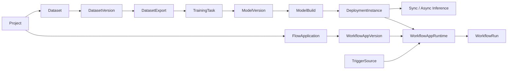

# 信息架构与业务路径

## 导航结构

```text
AMVision
├─ 工作空间
│  ├─ 项目
│  └─ 任务
├─ 数据与模型
│  ├─ 数据集
│  ├─ 模型
│  ├─ 部署
│  └─ 推理
├─ 自动化
│  ├─ 流程图
│  ├─ 流程应用
│  ├─ 触发源
│  └─ 自定义节点
└─ 系统
   └─ 设置与诊断
```

左侧导航只包含当前可访问的工作台。详情通过列表行、资源链接或当前上下文进入，不在导航中重复展开。

## 当前路由

| 页面 | 路径 | 主要对象 |
| --- | --- | --- |
| 启动检查 | `/` | API、会话、版本和连接状态 |
| 登录 | `/login` | 本地 UserSession |
| 离线 / 无权限 / 未找到 | `/offline`、`/forbidden`、fallback | 系统状态 |
| 项目 | `/projects` | Project |
| 任务 | `/tasks`、`/tasks/:taskId` | TaskRecord、TaskEvent |
| 数据集 | `/datasets` | Dataset、DatasetVersion、Import、Export |
| 导入详情 | `/datasets/imports/:datasetImportId` | DatasetImport |
| 导出详情 | `/datasets/exports/:datasetExportId` | DatasetExport |
| 模型 | `/models` | Model、ModelVersion、ModelBuild、训练与转换 |
| 训练详情 | `/models/:taskType/training-tasks/:taskId` | TrainingTask |
| 转换详情 | `/models/:taskType/conversion-tasks/:taskId` | ConversionTask |
| 部署 | `/deployments` | DeploymentInstance |
| 推理 | `/inference` | 同步推理、异步推理 |
| 流程应用 | `/workflows/apps`、`/workflows/apps/:applicationId` | FlowApplication、AppVersion、Runtime、Run |
| 流程编辑器 | `/workflows/graph/new`、`/workflows/graph/apps/:applicationId` | GraphTemplate、Node、PreviewRun |
| 触发源 | `/integrations/trigger-sources` | TriggerSource |
| 自定义节点 | `/custom-nodes` | NodePack、NodeDefinition |
| 设置与诊断 | `/settings` | Service、Runtime、Device、Access |

旧的 Template / Application 编辑路径只做重定向，不是独立页面。实际路由以 `frontend/web-ui/src/**/routes.ts` 为准。

## 对象层级



界面必须区分三种生命周期：

- 资源：版本化、可追溯，可被其他对象引用。
- 有限任务：从 `queued` 进入终态，完成后保留产物和事件。
- 常驻实例：具有 desired / observed 状态、健康、心跳和启动停止控制，不使用任务的 succeeded 语义。

## 端到端路径

### 数据、模型与部署

```text
Project
  -> 上传数据集 zip
  -> DatasetImport / DatasetVersion
  -> DatasetExport
  -> TrainingTask / Validation / Evaluation
  -> ModelVersion
  -> ConversionTask / ModelBuild
  -> DeploymentInstance
  -> 同步或异步推理
```

每个详情区域显示来源、版本、兼容性、产物和下一步入口。模型、任务、格式、运行时和设备选项由后端 capability 与 schema 约束，不在前端硬编码虚假组合。

### Workflow 发布与调用

```text
流程编辑器
  -> PreviewRun
  -> 发布不可变 WorkflowAppVersion
  -> 创建或切换稳定 WorkflowAppRuntime
  -> 绑定 TriggerSource
  -> HTTP / WebSocket / ZeroMQ / Modbus / directory adapter
  -> WorkflowRun / 同步响应
```

编辑草稿不会改变已运行 Runtime。Runtime 通过 revision 与 generation 选择不可变 AppVersion，Trigger 继续绑定稳定 Runtime id。

## 全局上下文

- Project 是数据、模型、Workflow 和任务的主命名空间。
- 当前 Project 在工作台外壳持续可见；切换 Project 后重新加载当前页面数据。
- Project id、resource id、版本号和运行 generation 使用等宽或 tabular number 表达，支持复制。
- 无 Project 时，业务页面显示明确空状态，不自动创建虚构资源。
- 页面状态来自 REST 快照；WebSocket 用于增量通知、进度和重连恢复，不代替权威查询。

## 页面组织规则

- 列表负责检索、筛选、分页、状态和进入详情，不承载完整配置表单。
- 详情负责对象关系、当前状态、事件、产物和控制动作。
- 工作台型页面可以在同一路由内组织列表、创建面板和详情抽屉；不得因此伪造不存在的独立路由。
- 原始 JSON、日志、契约指纹和低频诊断放在次级面板，主视图先展示工程决策需要的信息。
- 写操作必须显示前置条件、影响范围、处理中状态和失败后的恢复动作。

## 事实边界

本文件只登记当前路由和稳定对象关系。新的页面先落 Vue Router、权限门禁和浏览器测试，再加入页面地图；长期产品方向记录在 ADR 或任务系统，不写入当前页面清单。
