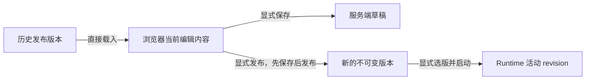

# Workflow 编辑器发布与历史版本载入设计

状态：已实现；当前实现与验收边界。核对日期：2026-09-08。

本文只定义编辑器中的发布信息、历史版本列表和历史内容载入。历史版本载入复用 [Workflow 文档导入、导出与统一载入器](workflow-document-import-export.md)，不建设历史专用只读画布、恢复任务或第二套文档模型。

## 1. 当前已实现事实

| 范围 | 当前行为 | 依据 |
| --- | --- | --- |
| 编辑器发布 | 发布对话框填写发布说明；确认后先保存 Application + Template，再按保存响应的 draft_fingerprint 发布 | [WorkflowEditorPage.vue](../../../frontend/web-ui/src/workflows/workflow-editor/pages/WorkflowEditorPage.vue)、[WorkflowPublishDialog.vue](../../../frontend/web-ui/src/workflows/workflow-editor/components/WorkflowPublishDialog.vue) |
| 版本服务 | 已有发布、分页列表、详情、命名、删除、公开契约比较、归档和取消归档接口；详情回读并校验 manifest、文件摘要和内容指纹 | [applications.py](../../../backend/service/api/rest/v1/routes/workflows/applications.py)、[app_version_service.py](../../../backend/service/application/workflows/app_version_service.py) |
| 应用详情 | 已显示版本表，并提供比较、归档和取消归档等管理操作 | [WorkflowAppDetailPage.vue](../../../frontend/web-ui/src/workflows/workflow-editor/pages/WorkflowAppDetailPage.vue) |
| 编辑器历史入口 | 发布旁历史按钮打开右侧专用面板；分页读取 published/archived，点击直接载入编辑内容 | [WorkflowGraphToolbar.vue](../../../frontend/web-ui/src/workflows/workflow-editor/components/WorkflowGraphToolbar.vue) |
| Runtime 选版 | Runtime 版本选择已有 stopped、Trigger、expected_generation 和 desired/active revision 边界 | [runtime-version-selection.ts](../../../frontend/web-ui/src/workflows/workflow-editor/runtime-version-selection.ts) |

现有 `POST .../versions/{workflow_app_version_id}/restore` 表示把 archived 版本恢复为 published，即取消归档；它不把历史内容写入当前草稿，也不是本文的编辑器载入动作。

每个成功发布版本保存完整的 `application.json`（FlowApplication）和 `template.json`（WorkflowGraphTemplate），以及 `contract.json`、`dependencies.json`、`manifest.json`。它们是完整快照，不是相对前一版本的差量。版本详情 GET 已返回其中的 application/template；直接交给统一载入器即可，不需要先导出文件、重新导入文件或创建恢复任务。节点使用的图片和模型文件不包含在这两份 JSON 内，路径和资源引用仍是节点参数。

## 2. 已决范围

1. 编辑器右上角增加“历史版本”入口，打开右侧历史栏。
2. 历史栏列出 published/archived 版本；不把 publishing/failed 当作普通可载入版本展示。
3. 点击指定版本后读取现有版本详情，直接把该版本的 Application 与 Template 载入当前编辑画布。
4. 载入立即替换浏览器当前编辑内容，不保留旧编辑内容的独立副本，也不增加覆盖确认框。
5. 载入不自动保存、发布、取消归档、停止 Trigger 或切换 Runtime。
6. 载入后显示“已载入 vN，尚未保存”；未保存刷新时重新读取服务端草稿。
7. 保存更新当前 Workflow App 草稿；发布沿用现有去重规则，成功新建的版本使用递增编号，不保证每次点击发布都生成新版本。

初版不实现：

- 历史版本专用只读画布
- 当前草稿与历史快照双数据源切换
- “返回当前草稿”模式
- 自动草稿备份或恢复任务
- 图差异、分支、合并和全历史搜索
- 历史专用 NodeDefinition 响应或加载模式
- 载入后自动保存、自动发布或自动 Runtime 切版

## 3. 页面与操作

右上角主要操作按预览、保存、发布排列；“版本”位于属性面板按钮之后的最右侧。历史使用独立的 `WorkflowVersionHistoryPanel`，宽度 320px，比属性面板的 360px 窄；位于画布内右侧，没有遮罩、Teleport 抽屉或模态焦点限制。历史栏与属性面板互斥，主题与画布一致。两个专用面板共用外层切换容器，宽度在 320px/360px 之间平滑变化；打开和关闭沿用统一淡入、位移动效，内容短暂淡入，不让两个面板叠加或先露出空画布。缩放和小地图固定在画布右下角，位置不随面板切换改变；同一 App 切回版本栏保留已读列表后刷新。

顶部“当前草稿”表示浏览器当前编辑内容及其保存状态，不保存另一份草稿副本。发布版本按 `version_number` 倒序，以圆点和连接线组成垂直时间线：

- 稳定发布编号 `VN`（如 V1、V2），自定义 display_version 与编号同时显示；最新 published 版本标记“最新”
- published/archived 状态
- completed_at；缺失时使用 created_at
- created_by 保留在时间的悬停提示中；不把用户 id 作为作者姓名显示
- release_notes

版本行之间保留 8px 间隔；背景、连接线、圆点依次分层，悬停背景不会覆盖相邻行的连接线。菜单只显示“载入、命名、导出、删除”，不重复版本编号或文件格式。列表沿用现有 offset/limit 分页和响应头，不把首批 25 条误认为完整历史。新版本发布成功后重新读取第一页，并按 workflow_app_version_id 去重。

点击可载入版本行时：

1. 当前行显示加载状态，列表在本次读取完成前禁止再次选择，避免响应乱序。
2. 调用现有版本详情 GET。
3. 详情读取、指纹校验或内容解析失败时保留当前画布并显示错误。
4. 读取成功后，把 application/template 交给统一载入器。
5. 载入后保持历史面板可用，当前画布处于普通编辑状态，并提示“已载入 vN，尚未保存”。

archived 版本可以直接载入编辑，不必先取消归档。归档/取消归档仍是版本可用状态管理，与载入编辑内容分开命名和调用。

### 版本行菜单

菜单内容传送到 body，使用专属全局类设置背景、层级和条目样式。Reka 将 Vue scoped 属性放在 Popper 包装层，不能依赖菜单内容自身带有该属性；验收必须检查实际可见菜单和鼠标点击结果，不能仅检查组件事件。

- 载入：与点击编号相同，直接替换编辑内容，没有备份、覆盖确认或自动保存。
- 命名：使用与发布一致的 ConfirmDialog，标题为“版本”，填写“标题”和“版本说明”。标题为 1 至 128 个字符，说明最多 4096 个字符；保存通过 PATCH 同时更新 display_version/release_notes，取消不修改记录。编号、指纹、发布 JSON 不变；失败保留输入并在对话框中显示错误。
- 导出：读取所选版本的完整快照，按 `amvision.workflow-app-document.v1` 导出 Application + Template；不导出当前未保存编辑内容，不打包图片或模型文件。
- 删除：版本行内显示明确的删除按钮和取消按钮。DELETE 成功后刷新第一页；存在 Runtime revision（包括历史 revision）或 Run 引用时返回 409，显示原因并保留版本。

删除与归档不同：无 Runtime revision/Run 引用时，版本数据库行和快照目录会一起物理删除；公开列表、详情、载入、命名和取消归档均返回 404，也不能创建 Runtime。Application 仍存在时，独立序号文件保留最大已分配编号，后续发布不复用已删除编号；删除整个 Workflow 后重建同一 id 才从 v1 开始。不提供版本取消删除功能。删除与 Runtime 创建/切版通过 Application lifecycle 和版本行 fence 串行化。

## 4. 统一载入语义

```text
版本列表
  -> 版本详情 GET
  -> application + template
  -> 当前目标身份处理
  -> replaceWorkflowEditorDocument(...)
  -> 当前编辑画布
```

历史载入与本地 JSON 导入共用以下规则：

- 先完成读取、校验和新编辑状态构造，再一次替换当前画布
- 保留当前 Project、application_id、template_id/template_version 和保存目标
- 载入历史中的名称、说明、图、绑定、节点组、说明节点、布局和 App Mode 配置
- 深复制全部嵌套 JSON，不能修改版本详情响应缓存或不可变快照
- 不读取图片、模型或本地文件来决定是否允许载入
- 不执行节点，不产生保存、发布、Runtime 或 Trigger 请求
- 清除旧 Preview 输入、结果、临时对象 URL、选择和失效的属性面板状态

版本详情中的 contract、dependencies 和 manifest 继续用于发布追溯和完整性校验，不写进当前待保存的 Application/Template，也不扩展成本次载入的数据模型。

## 5. 保存、发布和 Runtime 边界



例如，最近发布为 v8，Runtime 正在运行 v6。载入 v4 后：

- 编辑画布显示 v4 内容并处于尚未保存状态
- 服务端草稿仍是载入前最后保存内容
- v4、v6、v8 发布快照均不改变
- Runtime 继续运行 v6
- 只有显式保存才更新草稿
- 再次发布通过校验和内容去重后才创建新的递增版本；相同内容可返回已有版本的冲突提示

发布成功不自动停止 Trigger、切换 Runtime 或启动 Runtime。Runtime 回滚继续使用现有版本选择和 generation 校验，不复用“载入历史内容”的前端动作。

## 6. 发布反馈保留项

发布流程区分保存和发布结果：

| 实际结果 | 页面反馈 |
| --- | --- |
| 本地校验或保存失败 | 未执行发布，并显示保存或校验错误；连接中断时提示结果待确认 |
| 保存成功、发布失败 | 草稿已保存，发布失败 |
| 保存成功、发布成功 | 已发布 vN，并刷新历史列表 |
| 写入结果因连接中断无法确认 | 明确显示结果待确认，不自动重发写请求 |

重复内容发布继续沿用现有内容去重。`allow_duplicate_content` 只有显式选择时启用，不因历史载入自动打开。

## 7. 实现组成

1. [Workflow JSON 导入/导出](workflow-document-import-export.md) 和历史版本共用 `replaceWorkflowEditorDocument`。
2. 正常“编辑图”入口、新建空图和保存回读使用同一载入器，回读保留输入和选择。
3. `useWorkflowVersionHistory` 处理分页、去重、请求顺序与详情读取。
4. `WorkflowVersionHistoryPanel` 使用独立窄面板和垂直时间线；行尾菜单支持载入、命名、导出和删除。
5. 发布使用保存结果中的 draft_fingerprint，分开反馈保存与发布结果，并刷新历史第一页。

历史功能不新增数据库表、Alembic 迁移、版本恢复 API、恢复后台任务、图片检查接口或 Runtime/Trigger 协议。

## 8. 验收基线

1. 历史入口可访问，列表只把 published/archived 作为可载入版本，分页和去重正确。
2. 点击版本后直接显示该版本工作流，不进入历史专用画布。
3. 当前存在未保存编辑时，选择版本立即替换浏览器编辑内容，不备份、不确认、不写服务端。
4. 详情读取、摘要校验、解析或载入失败时，原画布完整保留。
5. 历史中的节点、边、参数、bindings、Template 输入输出、groups、notes、布局和 App Mode 按统一导入规则载入。
6. 当前 Project、Application/Template 保存目标、版本列表、latestVersion 和 Runtime 集合不被版本详情覆盖。
7. 载入后清除旧 Preview 和临时资源，迟到回调不能污染新内容。
8. 未保存刷新恢复服务端草稿；显式保存后刷新保留载入内容。
9. 载入后发布沿用内容去重；成功新建时编号递增，不覆盖源历史版本，相同内容冲突不被误报为成功新建。
10. archived 版本无需取消归档即可载入；取消归档接口不会被误作内容载入。
11. 载入不发送 Runtime/Trigger 控制请求，不修改其版本和状态；本次编辑器改动不进入推理/触发数据链路，不要求为载入功能新增全链性能门禁。
12. 中文、英文、日语、韩语、亮色/暗色、键盘焦点和错误反馈与现有组件一致。

## 9. 验证记录（2026-09-07）

- 后续交互复核：前端全量 449 项测试（114 个文件）、vue-tsc 和生产构建通过。新增应用模式对话框与保存并发测试位于根目录 `tests/frontend/workflows/`；覆盖取消不修改配置、无效输出和超长标题阻止提交、Tab 焦点循环、重复保存及迟到反馈。浏览器确认应用模式恢复 760px 宽度和横向输出行，首次聚焦标题、Tab 循环及 Escape 关闭正常。

- 本轮前端全量 443 项测试、版本 API 5 项测试、生产构建和 vue-tsc 通过；版本 API 测试覆盖新增说明修改、清空、旧请求保留说明及不可变快照校验。前端本轮 5 个测试文件统一位于 `tests/frontend/workflows/test_*.ts`，其中 32 项覆盖 JSON 往返、历史读取、菜单操作与四种语言；后端新增测试为 `tests/test_workflow_app_version_history.py`。
- 后端验证命名不改变发布 JSON/指纹、删除后不能读回或取消归档、相同内容重新发布保留递增编号，以及 Runtime revision、保留 Run 和并发创建时的引用保护。
- 浏览器在独立验收 App `workflow-app-20260907100303` 中完成：将 #2 命名为“完整图基线”；从文本图编辑页导出 #2 的完整数值图；直接载入 #2 并显示尚未保存；删除已归档 #1 后当前未保存图不变；修改参数并发布后新版本为 #3。
- 验收页面的历史面板宽度为 320px，属性面板为 360px，分别实现并互斥显示。亮色、暗色、时间线、鼠标选择删除、命名对话框、Escape 关闭菜单、画布操作和小地图位置已核对。菜单沿用 Reka 默认焦点管理，历史面板本身没有遮罩或模态焦点限制。
- 指定版本 JSON 已通过 Edge 实际下载并检查格式和内容；没有把浏览器当前草稿当作导出源。测试没有修改业务 App，也没有切换 Runtime 或 Trigger。
- 本轮修复菜单 scoped 样式未匹配导致的遮挡；在同一验收 App 中以鼠标完成命名、载入、导出，创建并删除临时 #4 后仍保留 #3/#2，最后把草稿还原为 #3 并保存。面板实测 320px，行间距实测 8px；窗口底部右键菜单完整显示，历史导出 #3 与当前编辑内容导出 #2 的节点参数分别核对一致，浏览器无错误日志。
- 导入右键入口成功触发 filechooser；Edge 扩展缺少文件 URL 访问权限，自动设置本地文件返回 Not allowed，本轮未完成浏览器文件导入端到端复核。文件选择转发、取消、重复选择及文档解析由自动测试覆盖。
- 本轮对话框真实修改、保存和回读标题及版本说明后，还原验收数据；版本/属性面板实测宽度分别为 320px/360px，切换时底部缩放与小地图坐标不变。悬停行的连接线层级为 1、圆点为 2，截图确认背景不遮挡时间线；右键顺序和简洁文案经浏览器核对，无错误日志。
- 上轮 Windows 电脑控制工具因无法可靠识别当前浏览器 URL 而停止，后续使用绑定明确页面 URL 的浏览器工具完成交互检查。原生 Windows 控制没有完成独立复核。
- 2026-09-08 删除语义收敛为物理删除：被 Runtime revision/Run 引用的单版本保持 409；其他单版本删除数据库行和快照目录。整个 Workflow 在没有 Runtime 和活动 Preview 时删除全部版本、终态 Run/Preview、Application 目录、Prompt Mask 与独占 Template，共享 Template 保留；重建同一 id 从 v1 开始。

历史不支持图差异、分支、草稿备份和自动切版；这些仍属于已排除范围。已发布快照中的文件引用不会因载入而恢复二进制资产。
