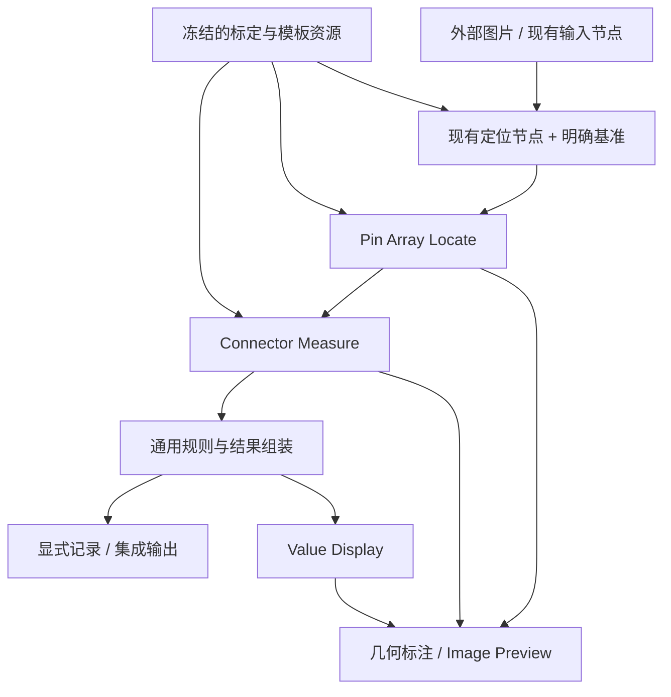
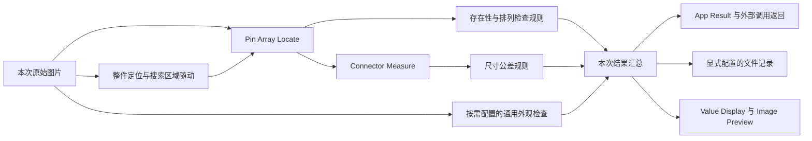

# 二维连接器检查与测量实施基线

状态：设计提案，未实现。依据 [ADR-0014](../decisions/ADR-0014-connector-inspection-2d.md) 组织；现有代码核对基于 `f5682650`。本文是本功能唯一的详细设计与实施步骤，参数名称为拟定名称，不能当作当前 Catalog/API 已公开字段。

开发资源已另行准备：[连接器开发图片与参考资源](connector-development-assets.md)包含公开图纸、实拍照片、56 张尺寸受控的合成图、几何真值和可重复生成/校验脚本，可用于 S00A–S03。节点功能仍未实现；这些工程数据不表示 S00B 的实物参考量值已取得。

外部资料及可确认的使用方式见 [ViSCO 功能核对](../reference/vision/visco-connector-inspection.md)和[工业二维检查资料与能力边界](../reference/vision/industrial-2d-measurement.md)。本文件描述 AMVision 自身方案，不声称复现 ViSCO 私有算法或达到相同计量性能。通用节点、行业扩展和产品配置的隔离是明确需求；本次细化不改变现有节点的公开身份。

## 1. 目标与范围

在现有 Workflow Node App 中，通过可复用节点、图像交互编辑器和流程模板实现二维连接器检查。首个交付闭环包含：定位、基准、PIN 身份、边缘、尺寸、有效性、公差判定、可解释显示及既有 Runtime/Trigger 调用。

| 阶段范围 | 功能 |
| --- | --- |
| 首个可验证闭环 | 单排、单类型 PIN；指定截面宽度、相邻中心距、缺 PIN；一个固定测量平面。 |
| 首轮完整能力 | 单/双排、交错、类型交替、设计留空；Pitch、Total Pitch、Gap、Width、Length、Offset、Angle；按具体定义启用。 |
| 后续能力 | 轮廓毛刺/缺损、壳体外观、多个良品参考；先复用通用工具，再决定是否值得增加行业配置封装。 |
| 本轮不做 | 3D 高度/共面度、完整 GD&T、多视角重建、拼接计量、独立业务页面、相机/PLC 核心驱动。 |

每个检查项都要回答“对象是谁、基准是什么、实际计算什么、何时无效、用什么参考验收”。没有合适成像条件的尺寸，不能通过增加算法选项宣称可测。

首轮一次输入只处理一个明确的工件实例。定位发现多个同样可信的工件时输出歧义，不默认挑选第一个；批量工件迭代不在首个闭环范围内。PIN 数量与图像中工件实例数量分开定义。

## 2. 当前基础与需要补齐的内容

| 当前代码入口 | 已有能力 | 本轮不能直接假定的能力 |
| --- | --- | --- |
| [Caliper Edge](../../custom_nodes/opencv_nodes/categories/measurement/backend/nodes/caliper_edge.py) | 带状采样、梯度峰、亚像素峰值细化 | 多扫描线的稳健几何估计、真实 PIN 计量精度。 |
| [工业量测节点](../../custom_nodes/opencv_nodes/categories/measurement/backend/nodes/industrial_measurement.py) | 灰度剖面、边缘对、多卡尺边缘点、L2 直线拟合及残差 | 边缘对和多卡尺取点仍使用选中的采样索引；不能从注释中的“亚像素”推定存在峰位细化。优先复用，补齐连续边缘位置、稳健拟合和候选复杂度验证。 |
| [工业定位](../../custom_nodes/opencv_nodes/categories/matching/backend/nodes/industrial_localization.py) | 形状/特征定位 | Shape Locate 当前只返回最佳匹配，低于阈值会抛出异常；尚无完整的未找到/多工件歧义结果分支。有限角度/尺度搜索不等于 ViSCO 的专有匹配，也不等于计量基准。 |
| [Variation Model](../../custom_nodes/opencv_nodes/categories/defect/backend/nodes/variation_model.py) | 已有 Variation Model Build / Variation Inspect | 多良品参考不是从零新增；需要验证连接器成像下的配准、正常变化与缺陷分离，不能称其等效 DefFinder。 |
| [几何操作](../../custom_nodes/opencv_nodes/categories/geometry/backend/nodes/industrial_geometry.py) | 几何测量、像素/平面坐标应用 | 应用已有变换不等于完成平面标定和独立精度验证。 |
| [现有 payload 契约](../../custom_nodes/opencv_nodes/shared/workflow/payload_contracts.json) | points、lines、measurements、localizations、planar-transform、calibration 等 | 尚无固定 PIN 身份和完整计量有效性契约。优先复用，明确缺口后增加。 |
| [图像访问](../../custom_nodes/opencv_nodes/shared/backend/runtime/images.py)、[运行支持](../../backend/nodes/runtime_support.py) | 原始矩阵、图像引用、内存结果；存在 uint16/float32 类型支持 | 每个灰度解码路径是否保留位深需要测试，不能由类型支持推定算法全链保真。 |
| [节点参数 UI](../../frontend/web-ui/src/workflows/workflow-editor/components/WorkflowNodeParameterWidgets.vue) | Schema 表单及若干专用部件 | 完整的包级专属编辑器注册、PIN 排列/检查项图像联动仍需补齐。 |
| [图像组件](../../frontend/web-ui/src/shared/ui/image-viewer) | 缩放、平移、几何标注和编辑 | 测量坐标映射、编号表、剖面图与草稿事务。 |
| [发布依赖](../../backend/service/application/workflows/app_version_service.py) | 节点定义/包快照和特定稳定资源 ID 收集 | `_collect_stable_resource_references` 不自动识别任意标定/模板文件，更不等于文件内容已冻结。 |
| [Workflow 文档导入导出](../design/frontend/workflow-document-import-export.md) | 编辑器 JSON 定义和资源引用的便携文档 | 当前不包含二进制资产；本轮不能将现有 JSON 导出说成完整资源打包。 |
| [Preview 执行](../../backend/service/application/workflows/preview/execution.py) | 现有内存预览执行服务 | 本轮不得重新引入另一个模型加载器或磁盘结果交换路径。 |

当前连接器专用包、专属编辑器与真实计量验收尚未存在。此前治具/塑盒、CUDA/TensorRT、共享内存的验证是平台基础证据，不是连接器功能验收。

## 3. 分层与节点职责



图中的基准、资源和规则表示职责，不代表需要为每个内部步骤增加一个节点。是否复用现有节点、扩充现有契约或新增节点，在 S01 用最小示例固定。

| 层 | 归属与责任 |
| --- | --- |
| 通用计算 | `custom_nodes/opencv_nodes/shared/backend/` 内新增受支持的测量函数边界；输入数组/结构体，输出几何与诊断，不访问 HTTP、数据库或节点 handler。 |
| 通用节点 | 仍归 `opencv.nodes`，负责参数/端口校验、执行控制、图像借用和函数调用。Core 只承接通用规则、数据、显示与文件能力。 |
| 行业节点 | 拟新增 `custom_nodes/connector_nodes/`，包 ID `connector.nodes`；只组织 PIN 身份、排列关联和按 PIN/壳体命名特征展开的尺寸定义。通用距离、拟合、判定和表格渲染不归行业包。显式声明 OpenCV 包依赖。 |
| 编辑界面 | Vue 3 图编辑器内的受信任编辑器注册 + 共享图像组件；编辑参数和资源草稿，不负责计算真值。 |
| 执行与集成 | 复用 App Version、Runtime、Trigger、Deployment、现有协议和 SDK；行业包不创建运行时服务。 |

包结构跟随已有 manifest、backend entry、category、catalog source/build 和 tests 模式。manifest 必须包含版本、能力、依赖、timeout、禁用约束。只依赖导出的共享算法接口，禁止依赖其他包的私有节点实现细节。提取共享函数时保留已有调用语义；语义修复单独版本化、单独回归。

### 3.1 Pin Array Locate

将前期草案中的 `Pin Array Inspect` 收紧命名为 `Pin Array Locate`，明确本节点提供观测和特征，不作最终工艺判定。这是未实现方案的修订，不创建旧名称兼容节点。

用途：把图像中的候选与名义 PIN 对应，输出固定身份、观测状态和后续测量所需的特征。

| 项 | 设计 |
| --- | --- |
| 输入 | 原始 `ImageRef`；显式工件姿态/基准；参数内的排列与参考资源引用。 |
| 输出 | 名义 PIN 项及其观测；未归属候选；points/lines 等通用几何；轻量摘要；按需诊断。 |
| 不负责 | 最终整件 OK/NG、生产计数、图片/JSON 自动保存、加载未部署模型。 |
| 类型配置 | PIN 类型定义参考特征、扫描带、极性、局部搜索范围；同类型复用，局部覆盖明确显示。 |
| 排列配置 | 单/双排、交错、类型顺序、名义间距、行距、方向、稳定 ID、设计留空；展开后的表可检查。 |
| 匹配约束 | 搜索窗口、类型与几何约束，一对一分配；歧义必须输出状态，不以排序重编号掩盖。 |

对所需边缘/中心等特征的局部采样属于本节点的显式检测配置；先生成不含行业判断的采样规格，再调用 OpenCV 共享函数，一次准备原图。它不计算最终 Pitch、公差或整件结论。所需特征名单由保存的参数明确给出，不通过查找下游节点隐式改变执行结果。

“没有检测到”先表示 `not_found`，不是自动认定物理缺 PIN；业务规则可按工艺将其判为 NG。“设计留空”表示该位置不应存在 PIN，与缺 PIN 不同。

### 3.2 Connector Measure

用途：根据命名的 PIN 特征、显式基准和标定，展开 PIN 之间及 PIN 与壳体基准之间的尺寸项，调用通用几何函数计算。这个节点不重新搜索图片、不隐式采样、不重新定位；所需特征缺失时输出该项无效。壳体基准可由通用定位/几何节点提供，不要求在连接器包内另造壳体检测器。

| 参数组 | 拟定字段及语义 |
| --- | --- |
| 检查项 | 稳定 `item_id`、标签、启用状态、量的类型；禁用项不能被当作已合格。 |
| 对象 | `pin_ids` / 命名特征；成对、相邻同类、相邻任意类型等选择方式，展开后配对固定。 |
| 定义 | 截面、方向、基准、距离模式、正负号、结果单位。 |
| 有效性 | 引用特征的有效范围和质量；检查几何退化、截面覆盖及方法适用条件。采样数量、拟合残差门槛、候选歧义策略由特征提取节点配置，不在此重复维护。 |
| 诊断 | none / summary / selected；生产默认 summary，不生成所有 PIN 的全量剖面。 |

输出测量值和有效性，不隐藏最终业务规则。公差表由通用规则能力消费；若现有规则节点不能批量处理命名测量项，先扩展通用规则契约，不能在连接器 handler 中复制另一套判定逻辑。

特征提取配置描述采样带和可观测范围；尺寸项描述在该范围内取哪个截面、哪两个特征。点特征只能用于明确的点测量；有限边缘段/曲线必须带观测区间，拟合直线不能当作无限可用。截面超出覆盖范围、交点不唯一或所需原始边缘证据未输出时，该项无效，不能外推、回读图像或悄悄扩大上游 ROI。UI 应定位到相应提取配置，由显式修改后重新执行获得新证据。

### 3.3 数学定义必须固定

下表是拟采用的定义，每个模板只启用有对应特征与成像条件的项。

| 量 | 定义与限制 |
| --- | --- |
| Pitch | 两个指定 PIN 特征点在单位方向 `u` 上的投影差；同类相邻与任意相邻明确区分。 |
| Total Pitch | 两个明确端点的投影差；缺少中间 PIN 不改变端点身份。不是默认累加所有检测点间距。 |
| Width | 指定截面与左右边缘的交点距离；若采用平行拟合线法，必须校验平行性并标注方法。 |
| Gap | 指定截面上两个 PIN 相向边缘之间的距离；不能用中心距冒充间隙。 |
| Length | 指定起止特征沿定义方向的距离；不能把检测框长边直接当针长。 |
| Offset | 实测特征相对名义位置或指定基准的有符号分量；不使用本次 PIN 阵列自由伸缩后的残差代替。 |
| Angle | 指定两条有效方向的夹角，单位 degrees；有向/无向范围固定，退化方向无效。 |
| Tip Deviation | 二维视图中端点相对基准线的偏差；不命名为空间共面度或完整位置度。 |

欧氏距离与方向投影是不同测量模式。图像像素和物理平面中的长度也不能混算。前端小数位仅影响显示，判定使用未舍入的有限数值。

### 3.4 节点归属与复用清单

“通用”分为跨行业基础功能和行业内可复用工具。前者进入现有 Core 或通用技术包；后者进入对应行业包；具体产品规则只属于 Workflow/模板。不能因最初用于连接器而把通用能力改名复制一遍。

| 功能 | 当前入口或拟定入口 | 归属 | 本轮动作 |
| --- | --- | --- | --- |
| 工件定位 | `custom.opencv.shape-locate`、`feature-locate` | `opencv.nodes` | 复用并按样本验证；不新增 Connector Locate。 |
| 坐标创建/组合/逆变换 | `transform-2d-create`、`transform-2d-compose`、`transform-2d-invert` | `opencv.nodes` | 复用；坐标身份/单位不足时补通用契约，不加 PIN 参数。 |
| 图像几何与物理坐标 | `transform-points`、`pixel-to-world`、`world-to-pixel` | `opencv.nodes` | 复用；避免重复变换和用像素冒充毫米。 |
| 镜头标定 | `camera-calibrate`、`calibration-diagnose`、`undistort-points` | `opencv.nodes` | 与平面标定区分；不建立 Connector Calibration。 |
| 控制点平面标定 | 拟定 Planar Calibrate | `opencv.nodes` | 先核对缺口；现有 Homography Estimate 接收特征匹配，Pixel To World 只应用变换，均不等于带物理控制点及验证信息的完整平面标定。 |
| 灰度剖面/边缘/边缘对 | `gray-profile-measure`、`caliper-edge`、`edge-pair-measure` | `opencv.nodes` | 在原工具/共享函数中补强；不新增 Pin Caliper。 |
| 线/圆/椭圆/矩形量测 | `line-measure`、`circle-measure`、`ellipse-measure`、`rectangle-measure` | `opencv.nodes` | 复用并补诊断，不因连接器新增同算法副本。 |
| 几何距离/角度/相交 | `point-distance`、`point-to-line-distance`、`line-angle`、`line-intersection` 等 | `opencv.nodes` | 复用共享计算；行业尺寸通过明确对象和方向组合。 |
| 轮廓、BLOB、外观差异 | `contour-deviation-inspect`、`blob-analysis`、`variation-model-build`、`variation-inspect` | `opencv.nodes` | 保留通用输入/输出；行业模板指定区域，不新增 Connector Blob/Connector Variation。 |
| 单项范围/阈值及最终判定 | `core.rule.range-check`、`threshold-check`、`ok-ng-decision`、`process-decision` | Core | 复用；量测接入时补非有限值、缺值等门禁，不加入 PIN 类型判断。 |
| 多项数值上下限表 | 拟定 Check Limits | Core | 确认既有单项规则无法简洁完成批量数值校验后新增，定义见下文；不能做 Connector Judge。 |
| PIN 身份、名义排列关联 | 拟定 `custom.connector.pin-array-locate` | `connector.nodes` | 首轮新增，跨连接器产品复用；不含某客户/料号规则。 |
| 按 PIN 身份展开行业尺寸 | 拟定 `custom.connector.measure` | `connector.nodes` | 首轮新增，复用通用几何函数；与 `custom.opencv.measure` 的轮廓测量职责不同。 |
| PIN 轮廓批量关联 | 候选 Pin Profile Inspect | `connector.nodes` | 暂不注册；仅当稳定 PIN 对应、名义轮廓分段等行业组织确有复用价值时再立契约。 |
| 绘制/预览/结果展示 | Draw Measurements / Draw Regions、Image Preview / Value Display | 现有 OpenCV/Core | 复用通用几何与显示数据；不做专用连接器预览或颜色系统。 |
| 提取/组装/计数/文件保存/清理 | Extract Value Field、Create Object、Count By Rules、Append JSONL、File Summary 等 | Core | 保持现有通用能力；不增加 Connector Record 或型号专用计数节点。 |
| 型号、针数、公差、NG 定义、输出路径 | Workflow、版本化参数/资源 | 产品配置 | 不生成新节点类型，不写死到包默认值。 |

表中未写 namespace 的既有 OpenCV 名称均属于 `custom.opencv.*`。这是本功能相关子集，不替代运行时 Catalog。Core 已有通用视觉规则仍保留原归属，本轮不按底层依赖是否 OpenCV 发起搬迁。

### 3.5 有条件新增的通用能力

新增必须同时满足：现有节点不能在合理复杂度下完成；输入输出不需要行业词；至少有连接器和另一个无关场景的验证样例。不要先为可能的需求建大而全的新节点。

| 能力 | 明确职责 | 非职责与实现门禁 |
| --- | --- | --- |
| Planar Calibrate | 已知图像点与平面物理点，选择比例/仿射/平面投影模型，输出变换、单位、有效区域、残差和独立验证摘要 | 不控制相机、不测 3D、不从 RANSAC 拟合残差自动宣称真实精度。支持模型各自检查点数、几何退化和覆盖；在连接器与平面孔距样例验证。 |
| Check Limits | 按稳定 item ID 将通用值表与上下限规则关联，输出逐项 valid/passed/reason、摘要及总布尔条件 | 不理解 PIN、插槽、缺陷标签，不输出行业生产数量；不做单位猜测/自动换算。可用于尺寸、温度、重量等。 |

Check Limits 接收通用结构化值表，不依赖 connector payload 或 Python 类。规则包含稳定 ID、启用/必检、上下限及包含端点配置；重复规则 ID 为配置错误，缺测值/无效/非有限值/单位不符不得通过，空的启用必检集合不得得到成功。现有单值 Range Check 继续保留，不悄悄改成另一套返回格式。通用显示/测量项编辑器能复用表格部件，但不共享隐藏业务状态。

暂不计划新的通用 Array Engine、Metrology Runtime 或万能 Measure All 节点。名义数组展开、受限候选匹配、批量采样可先作为共享函数；只有直接编排价值和第二个复用场景成立时才成为独立节点。

### 3.6 连接器包首轮节点规格

| 节点 | 显式输入 | 输出 | 主要配置 | 明确禁止 |
| --- | --- | --- | --- | --- |
| Pin Array Locate | Image、Pose；Layout/参考资源由版本化参数指定。固定工位无位姿补偿时需显式选择固定坐标模式。 | Pins（固定身份及状态）、Features（命名几何及质量）、通用几何/观测摘要、按需诊断 | 行/列、类型、设计留空、方向、搜索窗、特征采样规则、一对一关联约束 | 自动继承上一帧位姿；改变编号补洞；计算整件 OK/NG；保存文件。 |
| Connector Measure | Pins、Features、明确基准；物理测量使用参数中的不可变 Calibration 资源引用。 | Measurements、通用标注和数值摘要 | 行业检查项、指定特征、PIN 配对、方向、截面及单位 | 回读原图再次检测；检测不到时放宽阈值重试；业务公差和生产计数。 |

Pose、基准和 Calibration 在 S01 映射到已存在的坐标/变换契约；仅缺失的字段才新增。Pins 是连接器包拥有的领域 payload，通用 geometry/measurements 归其现有通用契约。Features 以通用几何 ID 为引用，PIN 到特征的对应由行业包解释；通用绘制/规则/存储节点不得 import connector 类型。对外调用输出可以由 Workflow 显式组装，SDK 不新增特定料号方法。

Connector Measure 必须检查输入来自同一次图像/运行和兼容的 Layout/Frame 版本，身份不匹配作为契约错误停止执行，不能把两次检测结果拼成一个尺寸。同次有效输入中缺少某个特征，只使依赖该特征的检查项无效，不抹掉其他已计算项。

首轮 Calibration 只采用一个配置入口：参数中的资源 ID、版本和内容 hash，不同时提供会覆盖该参数的动态输入端口。pixel 模式明确不应用物理标定；要求物理单位但没有引用时校验失败。Pose 是逐次工件位姿，与静态 Calibration 分开；不能从 Pose 猜测物理比例。通用标定工具先建立资源，再由节点选择，发布后冻结。

Pins 与 Features 属于同一次提取产生的不可变结果，携带同一个 `observation_id`，并校验运行/输入身份、Layout 版本、坐标身份和特征 ID 引用。外部基准几何也必须对应本次输入；静态名义基准则显式引用资源及到本次图像的变换。不同观察结果混接是契约错误，立即停止本节点，不能降为一个可被忽略的普通无效尺寸。

布局、特征采样、标定、检查项和公差表分别只有一个配置所有者：Layout/采样在 Pin Array Locate，标定在通用资源，尺寸定义在 Connector Measure，公差在通用规则节点。下游可以只读引用，不能维护内容相同却可独立编辑的副本。

### 3.7 包依赖、分类和界面归属

```text
产品 Workflow / 模板
    ├─ Core：数据、规则、记录、显示
    ├─ opencv.nodes：通用定位、几何、量测、标定、检查
    └─ connector.nodes：PIN 身份与连接器尺寸组织
           └─ opencv.nodes 的公开共享算法接口
```

依赖只能向通用层流动；Core/OpenCV 不得依赖 connector。关闭/卸载 connector 后，原有通用 Workflow 和 Catalog 仍须正常工作。节点自身的传递依赖、版本和原生库必须纳入启动检查与发布清单；行业包不能自行调整通用包的进程全局状态。

拟定分类遵守现有 `<namespace>.<root>.<child>` 规则：`connector.inspection.array` 放 Pin Array Locate，`connector.measurement.dimension` 放 Connector Measure。Catalog 中显示在独立 Connector 包；搜索结果可标识包来源，不能把同一 node type 重复注册到 OpenCV 分类。候选能力不注册空壳节点。

推荐目录按现有 `categories` 布局：`custom_nodes/connector_nodes/categories/array/` 与 `categories/measurement/`，各有 backend 实现与 workflow catalog source；shared 只包含 PIN/Layout 领域契约及适配器，不复制 OpenCV 算法。生产计数、治具/塑盒分类名称和产品路径不出现在此目录。

连接器专属 UI 的源码可随包放在 `custom_nodes/connector_nodes/frontend/`，由前端受信任的构建注册表显式导入；共享图像、剖面和表格部件仍在前端共享层。此为待实现构建约定，当前 manifest 的 backend entry 不会自动安装 Vue 组件。首轮含新 UI 的包随匹配前端发行，单独导入 Python 包不承诺动态加载任意前端代码。无编辑器的运行环境仍可执行已验证配置；UI 只允许只读查看并说明缺少编辑支持。

### 3.8 防止功能混用的验收

1. 现有节点 ID、类别、端口、参数含义与已发布 Workflow 不因行业包出现而变化；必要的通用修复另列差异和回归。
2. 依赖检查禁止 Core/OpenCV 引用 connector 模块；通用契约中不新增强制 pin_id、connector_id 或产品常量。
3. 不启用 connector 时，原有定位/测量/分类/记录/显示链路继续可用；启用后不得覆盖旧节点 ID。
4. 同一连接器包至少用两个不同排列/针数的配置验证复用；不通过复制 handler 创建第二个产品节点。
5. 新通用能力至少在一个非连接器场景验证；调用方换成孔、槽或尺寸表时不应出现 PIN 假设。
6. 连线显式、资源可追溯；无隐藏下游扫描、自动模型加载、额外记录写入或 UI 自动绑定。

## 4. 数据契约与无效状态

### 4.1 坐标和图像身份

- 几何首先绑定本次输入图像身份、宽高、位深及坐标空间。禁止混用上一张图的标注、当前图像的像素和另一个版本的标定。
- 图像坐标与 OpenCV 采样约定一致：原始图的像素中心坐标，X 向右、Y 向下。ROI、裁剪、旋转、缩放记录明确的正反变换；显示缩放不改变测量值。
- 模板局部坐标、原始图坐标、去畸变图坐标、物理平面坐标分别命名。变换声明方向、单位、适用区域；镜像不得隐式发生。
- 只作定位时允许使用缩小图，但精细边缘返回原图采样。用于测量的插值、灰度转换和滤波方法必须固定并进入验证。
- 有镜头畸变时，不用单个 3×3 矩阵冒充完整畸变映射；明确采用原图点去畸变后映射，或经过验证的校正图采样，禁止重复校正。
- 若只用均匀比例能满足误差预算，则使用最简单的标定模型。缺少有效标定时可以输出 pixel；要求 millimeter 的检查项必须无效，不能静默降级为数值相同的毫米。

物理测量的计算次序是：原图特征点 → 必要的去畸变 → 已标定物理平面 → 明确的物理测量基准 → 距离/角度计算。对于仿射、投影或非线性映射，不能先算像素宽度/角度再乘一个比例系数。拟合需要在定义对应的空间完成，保留必要的采样点/观测范围；不能默认“先拟合再变换”等价于“先变换再拟合”。只有经过验证的均匀比例模型允许等价的长度换算快路径。显示叠加映回原图坐标，不把毫米坐标当像素画。

### 4.2 PIN 身份

每个名义位置保留 `pin_id`、`row_id`、`pin_type`、`expected_present` 和名义几何。名义要求与观测是两个字段：`expected_present` 说明应有 PIN 或设计留空；观测状态区分 `found`、`not_found`、`ambiguous`、`out_of_view`、`not_evaluated`，不再用 `not_expected` 代替实际观测。设计留空也需要检查该区域：观测到候选是“留空位置存在物体”的证据；区域不可见或未检查不能当作已证实为空。实际多余候选独立记录，不插入编号序列。

候选关联先按行、类型、姿态和限定位置窗筛选，再进行确定的一对一分配；允许不分配。近似等价匹配保留歧义。位置门槛、同分排序和容差在契约测试中固定。默认缺失不补测量值，禁止缺一个后所有编号向前移动。

### 4.3 测量项

优先审计并复用 `measurements.v1` 等已有 payload。新增 PIN 结构或有效性字段必须通过 Catalog、验证器、端口兼容性、序列化和前端契约测试后冻结；不能只向任意字典附加未声明字段。API 继续使用 v1；确需不兼容的已公开 payload 变化时按项目规则显式版本化，不借此次功能修改旧字段含义。

已核对的接入缺口必须在 S01 关闭：

- 当前 `measurements.v1` 的通用条目使用 `measurement_id`、`measurement_kind`、`coordinate_space`、`unit`、`values`；不是下例的扁平项。顶层可选 unit 枚举没有 degrees，而条目 unit 是字符串；混合长度和角度不能靠顶层单位解释，也不能将 degrees 写入当前不接受它的顶层字段。
- [Draw Measurements](../../custom_nodes/opencv_nodes/categories/render/backend/nodes/draw_measurements.py) 当前接收 `value.v1`，读取 `point_a_xy`、`distance_pixels` 等特定字段。它不直接消费 `measurements.v1` 或任意测量表。复用必须提供显式的通用标注适配；物理值不得填入 `distance_pixels` 冒充像素。
- [Line Angle](../../custom_nodes/opencv_nodes/categories/measurement/backend/nodes/line_angle.py) 等既有节点存在计算结果舍入。新测量内核保留未舍入数值，不通过调用这些 handler 获取公差判定值；旧节点语义保持独立回归。
- S01 先验证 `measurements.v1` 的增量字段方案和逐项单位是否能完整表达有效性，并实测所有受影响消费者。不能安全兼容时，为新的通用结果定义独立契约；不得同时维护两个含义不同但同名的 payload。该选择须以 Schema 和连线测试结论关闭后才能进入 S02，不能留给不同实现者自行决定。
- Check Limits 只消费规范化的通用数值项（ID、单位、值、有效性、原因）；连接器编号属于来源元数据。值提取/通用转换及 Value Display 的真实接线纳入同一个样例测试，不能仅验证后端字典。

每项语义至少包含：稳定检查项 ID、对象 ID、测量类型、方法、坐标/单位、有限值或 null、有效性、原因、质量诊断、定义/资产版本。下例仅展示拟定的测量项语义，不是当前完整 wire payload：

```json
{
  "item_id": "pitch-a01-a02",
  "kind": "pitch",
  "pin_ids": ["A01", "A02"],
  "coordinate_space": "fixture-plane",
  "unit": "millimeter",
  "value": null,
  "valid": false,
  "reason": "pin_not_found",
  "diagnostics": {"missing_pin_ids": ["A02"]}
}
```

有效项用 `reason: null`；无效项使用稳定机器码，UI 通过语言资源显示直观说明。NaN、Infinity、缺省零、上一帧值都不能作为无效替代值。用户显式组装的生产 JSON 只保存需要的字段，不强制增加固定业务 `format_id`。

### 4.4 执行、有效性、判定分开

| 情况 | 处理 |
| --- | --- |
| 参数错误、资产不匹配、超时、取消 | 节点执行失败/取消，沿用执行框架；不发布成功的计量结果。 |
| 正常执行但未发现边缘/PIN、对比度不足或歧义 | 输出无效项和原因，允许下游展示并按工艺判为 NG。 |
| 有效值超出公差 | 正常执行、有效测量、业务 NG。 |
| 缺少必需输入、坐标/观察身份混接 | 契约错误，节点执行失败。 |
| 输入正常但定位失败、基准不可观测 | 输出受影响项无效，不能沿用历史有效值并显示 OK。 |
| 禁用项 | 明确排除在必检集合之外，不增加 OK 计数。 |

规则默认只有所有启用的必检项均有效且通过时才输出 OK。无有效必检项时不得空集合判真。上下限默认包含端点，可由规则显式配置开闭边界，保存和显示必须一致；任何保护带规则必须由配置明确给出，不能用模型置信度或拟合残差自动计算“测量不确定度”。计数与 NG 标签仍由通用节点配置，不能写死行业名称。

必检集合来自已保存的检查定义，不能从本次成功返回的条目临时推导。模板明确将存在性、设计留空、多余候选、定位有效性和尺寸条件接入通用规则及最终汇总；只连接尺寸通过条件不能代表缺 PIN 等检查也通过。缺失、重复 ID 或必检项没有返回都不得放行。停用一个测量节点后，其仍启用的必检规则必须失败/无效，不能因少了一路输入而把其余条件判为整件 OK。

## 5. 算法方案与性能边界

### 5.1 边缘与几何

1. 在有效 ROI 内建立有方向的扫描带；检查范围、图像类型、采样量和内存预算。
2. 原图按明确间距采样，按配置进行带内聚合和滤波；阈值域和位深转换固定。支持的输入路径逐项测试。
3. 梯度局部极值抑制后生成有上限的候选；不要对所有超阈值采样点无限做两两组合。
4. 根据扫描方向、极性、强度、名义位置及间距选择边缘/边缘对。多个可行结果不能总是强行选择最强。
5. 峰值细化必须检查邻域、曲率和边界；平顶、饱和、弱峰给出无效或明确质量状态。
6. 多扫描线得到独立边缘点；按有效覆盖率和残差作稳健拟合。离群点剔除不能掩盖用于缺陷检查的真实毛刺，原始偏差需可诊断。
7. 按第 4.1 节将几何证据映射到测量所定义的空间，再按截面/方向计算尺寸。拟合和变换退化时停止该项计算。

越界不能依赖 `BORDER_REPLICATE` 人造边缘获得“有效结果”。若允许部分区域参与，必须满足显式覆盖率，结果带有效范围。抽样、拟合的随机部分使用固定配置的种子或确定性方法，确保同图同配方可复现。

定位与计量分开：刚性工件姿态可由稳定壳体/Mark 建立；拟合对象、允许自由度和被检特征名单必须明确。测 Pitch 时不得允许拟合整体尺度来吸收 Pitch 错误；测壳体变形时也不能把壳体全轮廓自由拟合成新基准。

### 5.2 执行与内存

- 原图只读借用，一次调用共享灰度/采样准备结果；派生矩阵按执行上下文管理，结束、异常、取消均释放。复用既有引用所有权，不能由下游节点随意释放上游仍使用的 ImageRef。
- 缓存只保存不可变、可重建的模板/采样计划，以内容 hash、配置版本、图像规格为键，限制条数和总字节；释放时不得影响正在借用的调用。不缓存上一帧结果作为失败回退。
- 包装函数无隐藏全局可变参数，不在节点内修改 OpenCV 的进程全局线程设置，不为每个 PIN 建线程。不新增自动排队、重试或降低测量质量的过载降级。
- 节点并发声明沿用既有策略；只有无状态处理、只读缓存借用及并行回归均通过后才声明 thread-safe，不通过修改默认并发策略绕开锁保护。
- 候选数、PIN 数、扫描线数、采样点总数、诊断点数必须在执行前受限；分块大小同时由临时内存预算限制。S01 必须列出预算字段和保守的工程上限，S02 用最坏配置验证后冻结发行默认值；不能等实机基准完成才补资源限制。超限明确报配置错误，禁止默默丢 PIN。
- 取消/超时在采样分块、PIN 批次和拟合轮次之间检查。单次 OpenCV 原生调用不能假装可立即中断；限制其输入并验证现有受控执行退出边界。
- 默认不编码调试图；浏览器请求的显示图沿用 JPEG，不对正式测量像素做有损压缩。WebSocket 沿用默认关闭 permessage-deflate 的实现。
- 使用模型时只能调用已部署服务；满载是明确容量拒绝，不是未就绪，也不是本节点偷偷创建 Session 的理由。

## 6. 标定、模板与参考图生命周期

### 6.1 资源内容

平面标定保存方法、单位、有效区域、图像规格、参数、参考数据及验证摘要。镜头内参/畸变与平面映射分开记录。PIN 模板保存名义排列、类型配置、基准定义及关联参考图/掩膜。数值补正若启用，保存适用的测量项、原始参考值、映射方式、有效范围和验证结果，禁止任意外推或重复补正。

推荐资源标识由稳定 ID、不可变版本和 SHA-256 组成；文件内容使用现有受管理 ObjectStore，不建连接器业务数据库。元数据优先纳入现有文档/资源存储服务；如果审计表明必须扩展持久化结构，先补 Repository/UoW 和 Alembic 迁移，不能绕过服务写 SQL 或直接散落磁盘路径。

### 6.2 发布与使用

1. 草稿中选择资源版本；编辑产生新版本，不覆盖已引用内容。
2. 发布收集所有直接及传递资源引用，验证内容 hash、所属项目、类型、单位及图像规格，冻结至 App Version 依赖清单。节点包的传递依赖也要冻结：即使图中没有直接使用 OpenCV 节点，connector 调用的 OpenCV 算法版本仍须受约束。
3. 不能仅在 `_collect_stable_resource_references` 增加字段后缀：还要覆盖依赖验证、导出打包、导入校验、删除阻塞和真实 Runtime 启动。
4. Runtime 启动/编译阶段读取并校验资产，建立有界只读计划。正式调用不反复读模板大文件或扫描整个资源库。
5. 运行中的版本保持不变；换版本沿用现有停止、活跃调用检查、generation 切换与回滚流程。
6. 现有 Workflow JSON 导出继续只包含定义与引用。首轮另提供明确的测量资源包导入/导出，由资源清单、hash 和必要文件组成，与 Workflow JSON 成对交付；不把二进制塞进 JSON，也不悄悄变更原格式。导入先验证再提交，检查重复内容、缺件、损坏、路径越界和跨项目引用；目标资源未安装时禁止执行，不能靠同名文件猜测绑定。该能力复用现有服务边界，不扩大成完整平台离线打包系统。
7. 已发布版本引用的资源禁止独立删除；草稿/退役资源按现有引用与清理机制处理。浏览器关闭不删除已保存资源。

资源文件被外部修改、删除或格式错误时，准备/启动明确失败；已经校验并持有的不可变内存计划不在半次执行中切到新内容。下一次重新准备必须重新验证。资源缺失不触发自动重新标定或静默选择其他版本。

## 7. 节点 UI 与使用步骤

### 7.1 界面边界

不新增侧栏业务入口。节点中显示主要参数和结果摘要，“编辑”打开现有图编辑上下文内的专属面板：中央图像、侧边参数、底部可切换的 PIN 表/检查项表/剖面。布局适应工控机，浅色/深色和中英文共用现有设计变量及语言资源。

首轮只增加受信任编辑器 ID 到 Vue 组件的本地注册映射，所有组件随前端构建离线分发。后端 Schema 仍是参数校验依据。运行时不需要浏览器编辑器；浏览器缺少匹配编辑器时显示明确说明并阻止误编辑，不影响后端已验证配置的独立执行。不增加任意 URL 脚本、eval 或外网依赖。

### 7.2 完整操作路径

现场使用分为建配方、生产运行和维护换型。工程人员在图编辑器完成建配方与验证；操作人员主要使用 App Mode 查看、执行已发布流程；外部系统经既有 Trigger/API/SDK 提供图像和取得结果。这是使用职责，不代表本轮新增账户权限系统。

以下为待实现功能的目标使用路径，不是当前界面已经支持的操作教程。相机采集、曝光/光源控制和上下料由外部系统完成；本项目接收图片及必要元数据。

| 建配方步骤 | 现场操作与确认 | 功能／节点归属 | 界面与保存结果 |
| --- | --- | --- | --- |
| 1. 确定检查要求 | 对照图纸确认朝向、PIN 编号、必检项、基准、单位、公差、可见区域和节拍。先判断尺寸是否在同一有效测量平面。 | 产品 Workflow／检查定义；不新增算法节点。 | 配方的检查项表和参考证据；未定的项不显示为已验收。 |
| 2. 固定成像并准备图片 | 外部系统固定镜头、焦距/工作距离、光源和采集规格；导入原始良品图、缺陷图、重复拍摄图及标定图。 | 既有图像输入、受管理参考资源。 | 图像选择器显示宽高、位深和来源；显示图与测量原图明确区分。 |
| 3. 建立或选择标定 | 按第 7.5 节选择 pixel 或物理测量；必要时做镜头标定，再建立测量平面映射，用独立参考距离核验。 | 通用 Camera Calibrate／Calibration Diagnose；拟定 Planar Calibrate 及资源保存能力。 | 通用标定编辑面板：观测图、控制点、单位、有效区域、误差和验证结果；显式保存不可变版本。 |
| 4. 设置整件定位 | 在参考图选择稳定壳体、Mark 或其他定位特征，限定搜索区域和方向；验证不同上料位置。固定坐标模式也须显式选择。 | 通用 Shape Locate／Feature Locate，或既有几何基准工具；不新增 Connector Locate。 | 定位编辑器显示模板区、排除区、搜索区、原点/轴、候选与得分；保存定位资源和搜索参数。 |
| 5. 建立 PIN 排列与特征 | 配置行/列、针数、类型、编号、设计留空；在一个 PIN 上调好边缘/端点，再按类型展开。 | Pin Array Locate 调用 OpenCV 共享采样与匹配。 | PIN 表联动图像，显示名义位置、实际候选、扫描方向和灰度/梯度；保存 Layout 和特征配置。 |
| 6. 设置测量项 | 选择明确 PIN/壳体特征、截面、测量基准、方向和单位；核对尺寸箭头指向的对象。 | Connector Measure；通用几何基准由既有节点提供。 | 测量项表与图像联动，显示值、方法、单位、有效性；缺失特征跳转其配置入口，不隐式补采样。 |
| 7. 设置检查与判定 | 配置存在性、留空、多余候选、尺寸上下限及必检项，再汇总本次结果；按需另接通用外观检查。 | Core 通用规则；批量上下限缺口按 Check Limits 方案；外观归 OpenCV／已部署模型。 | 规则节点持有公差；测量编辑器只读显示其关联规则。逐项结果与最终结果分开。 |
| 8. 验证配方 | 同图核对、不同样本回放、重新上料与独立参考量值对照；检查定位失败、无效、临界及 NG 路径。 | 现有 Preview／受控测试流程；不以单张良品成功替代验收。 | 调试视图分开显示定位、PIN 观测、尺寸、规则和耗时；迟到结果不覆盖新配置。 |
| 9. 配置记录与操作员界面 | 明确哪些值/图需返回、保存和显示；将 Value Display 显式连到需要叠加数据的 Image Preview。 | 既有输出、文件、预览、显示节点。 | 既有应用模式配置选择显示项；查看大图保持同次结果，记录路径与保留策略仍显式配置。 |
| 10. 发布并试运行 | 保存草稿、校验资源/依赖/必检项、发布 App Version，再按已有机制启动或切换 Runtime 与 Trigger。 | 既有发布及执行管理。 | 工程人员核对版本、资源和真实调用；保存／Apply 不自动切换生产版本。 |

建配方允许在步骤 4–8 间迭代，但修改上游资源后须重新验证受影响结果。标定准备可以使用独立的工程 Workflow；其结果保存为资源供生产图引用，不能把 Camera Calibrate 的求解过程放入每次生产调用。

### 7.3 交互细节与防呆

- 表格选择 PIN 后图像定位该 PIN；编号输入、方向翻转、双排镜像都要显示展开结果。屏幕左右变化不自动改变 PIN 身份。
- 鼠标编辑坐标始终换算至图像坐标，缩放/平移后仍准确；旋转 ROI 可输入精确数值。
- 已检测不到的 PIN 仍显示在名义位置并标注状态；多余候选用独立样式；颜色之外保留文字/符号。
- 调试返回携带 request/run、输入身份和配置 revision；迟到响应不能覆盖新参数的结果。关闭面板取消 UI 订阅并释放临时结果。
- 生产默认只输出几何/摘要；选中单项才请求受限剖面，避免数百 PIN 同时绘图占用页面和通信。
- 节点复制/粘贴复制配置和明确资源引用，不共享可变草稿对象；跨项目时验证资源可用性，不借同名文件自动绑定。
- App Mode 只显示启用且明确关联的数据显示节点；双击大图保持同一次运行的叠加与数据。历史结果需标明历史状态，不能在新执行失败时显示为本次 OK。
- 沿用 Image Preview/Value Display 完成首版操作员界面；专用测量表只在证明确有需要后作为通用显示能力增加。
- 针数、搜索窗、扫描带和结果表不全部展开在画布节点里。节点内保留主要参数、状态和编辑入口；精细操作进入图编辑上下文内的可扩展编辑区，关闭后回到原画布位置和选择。
- 修改会影响采样的参数后，旧结果标为待重新执行；不能让 Apply 后的新参数与之前的绿色情况看起来属于同次计算。未准备资源、无有效输入、执行中、取消、无观测和部分无效分别显示。
- Apply 只提交本节点配置与显式资源引用，不自动发布 Runtime。若资源有独立草稿，其确认/取消边界必须显示；Cancel 不得让 Workflow 已保存引用发生改变，也不能删除其他节点引用的资源。

### 7.4 参考图、模板和配方不是同一个对象

| 对象 | 用途 | 配置与生命周期 |
| --- | --- | --- |
| 原始参考图 | 建立配置时观察工件，提供原始像素与已知姿态样例。 | 显式保存的受管理图像资源；不是每次生产输入，也不因画 ROI 而覆盖原图。 |
| 定位模板 | 从参考图指定区域提取匹配所需信息，找当前工件的位置和方向。 | 通用定位工具拥有；保存参考来源、裁剪偏移、模板原点、算法及配置版本。准备后的索引/特征可在有界缓存复用，不需模型训练或 Deployment。 |
| PIN Layout／特征配置 | 名义针数、类型、编号、留空位置及局部采样规则。 | Pin Array Locate 拥有；可以在参考图上建立，但不能由某张良品图的检测结果自动定义图纸标准。 |
| 标定资源 | 镜头模型与测量平面映射、单位、有效区域和验证依据。 | 通用资源管理；与特定检查算法分开，按明确成像条件复用。 |
| 外观参考 | 轮廓、掩膜或良品变化范围，用于显式启用的外观检查。 | 对应 OpenCV 工具拥有；不与定位模板、公差表合并成同一个黑盒。 |
| 配方 | Workflow、节点参数、规则以及所引用的上述资源版本的完整组合。 | 沿用 App 草稿／App Version，不新增平行 Recipe 服务或数据库。 |

模板匹配是首版常用定位方法，不是所有应用的强制第一步。经验证的固定工位可选固定坐标；用几何特征或外部明确位姿定位时可不建图像匹配模板。模式必须保存并显示，不能匹配失败后自动改成固定坐标。

整件定位先给出 PIN 搜索区域的大致位置和方向，再在各区域精细检测、编号和测量。不能先把所有亮点排序当 PIN，再把该排序当定位与编号。局部 PIN 类型配置可以共享采样规则，不要求每根 PIN 保存一张独立图片模板。

当前 Shape Locate 的实际输入是 Image 与 Template Image，输出 template-image-pixels → source-image-pixels 的变换。拟议的版本化定位模板管理、裁剪原点记录和可视编辑需要补齐，不能把现有两个图片端口当成完整模板生命周期。参考图片的 ID、裁剪图的 ID 和完整参考坐标必须明确对应。

现有 Shape Locate 每次只返回一个最佳匹配，不能据此证明图中只有一个工件；诊断中的 `candidate_count` 是角度与尺度组合数，不是找到的工件数量。未找到、匹配歧义和有效姿态的契约及后续分支在 S01 固定，由通用定位能力补齐。无有效姿态时不得继续使用单位矩阵或上次姿态测量；参数错误、资源损坏、超时等执行异常不能通过统一捕获全部转成正常 NG。涉及现有节点失败语义的变更必须显式版本化并验证原流程。

### 7.5 标定和坐标转换的使用边界

| 能力 | 解决的问题 | 何时建立／执行 | 不能替代 |
| --- | --- | --- | --- |
| 镜头／相机内参标定 | 镜头投影和畸变，使图像点能按选定模型解释。 | 安装调试时收集多幅合适观测，镜头/焦距等条件改变后重做或验证。使用已有资源时不重复求解。 | 不自动给出当前产品测量平面的毫米坐标；不决定 PIN 编号。 |
| 测量平面标定 | 建立图像点与指定物理平面坐标的关系。 | 固定测量平面和成像条件下建立并验证；生产时应用该映射。 | 不证明不在该平面内的高度/共面度，也不能靠单张普通产品图猜真实尺寸。 |
| 整件定位／坐标随动 | 找到每次输入中的工件位置、朝向，使名义区域随工件移动。 | 每次检测执行；固定坐标模式明确省略该补偿。 | 不重新估计镜头畸变或物理比例，不能自由伸缩待测 PIN 阵列以消除缺陷。 |
| 测量基准建立 | 按图纸定义原点、测量方向和基准特征。 | 配方保存定义，每次从对应有效几何实例化；静态工位基准需显式说明。 | 模板矩形左上角或匹配旋转中心不自动成为图纸基准。 |

纯 pixel 检查不强制配置毫米标定。要求毫米结果时必须有经验证的像素到物理平面关系；若均匀比例已经满足误差要求，可使用简单比例模型。是否需要单独的畸变步骤由误差预算与验证决定，不强制把所有标定算法串联。普通针孔、鱼眼、远心成像的适用模型不同，不能对所有镜头无条件执行当前针孔 Camera Calibrate。点数达到求解最低要求也不等于标定验收通过。

| 坐标空间 | 典型单位 | 使用方 |
| --- | --- | --- |
| 模板／参考局部坐标 | pixel，或另行声明的模板物理单位 | 名义 PIN、扫描带与定位模板。裁剪模板需要到完整参考图的显式映射。 |
| 本次原始图坐标 | pixel | 原图采样、观测结果、图像显示叠加。 |
| 去畸变图坐标 | 明确声明的 pixel 或归一化坐标 | 标定内部使用；归一化坐标不能直接当原图像素或毫米。 |
| 固定测量平面坐标 | millimeter 等物理单位 | 物理几何和工位平面映射。 |
| 本次工件测量基准 | 与测量平面一致的物理单位；pixel 模式则明确为 pixel | 按图纸计算方向距离、偏位和角度。 |
| 浏览器显示坐标 | 屏幕像素 | 缩放、平移和鼠标操作；不进入测量数值。 |

定位与计量使用两条明确的变换路径：

- 搜索路径：名义区域在参考中的定义 → 本次工件位姿 → 当前原图采样位置。若名义配置采用物理单位，必须通过对应标定映射转换；不能与模板 pixel 直接相加。
- 计量路径：本次原图特征 → 必要的去畸变 → 固定物理平面 → 本次测量基准 → 尺寸值。绘制时将几何位置映回原图，标签使用真实值及单位。

参考图裁剪了左侧 100 pixel 后，裁剪图的 x=20 对应完整参考图 x=120；这个关系应由资源和坐标契约保存。工程人员用图像选择基准、方向和资源，通常不需要手填矩阵。系统在已保存的定义下校验并组合变换，诊断面板可查看来源、目标、单位及版本；这类确定的数学转换可以在共享函数内部完成，不要求画布为每次矩阵乘法再放一个节点。

模板定位的像素旋转角不能直接作为一般投影下的物理角度。正式测量按第 4.1 节处理；只有已验证的模型允许等价简化。默认让 ROI/采样位置随动，在原图上取证，不为“摆正显示”强制重采样整张大图；必须校正图片的算法另行固定插值、变换和验证方法。

### 7.6 每次生产检测的执行与显示



图中是能力关系，不表示 G 的任意算法输出可直接连到汇总端口；各分支先通过明确的通用适配／规则产生条件。定位与测量基准有效性也纳入必检条件。原始图、版本化资源、基准几何和显示图的实际端口连接在 S01/S07 的示例中固定。

Runtime 准备阶段校验并借用已发布资源，按需建立有界只读计划；每次调用只执行本次图像处理、位姿更新、特征提取、测量和显式后续节点。不每次重新创建模板、不重新求标定、不加载另一份推理模型，也不后台覆盖配方。执行完成后按现有所有权释放临时图像与诊断资源。

生产结果分为执行状态、检查项有效性、业务 OK/NG。尺寸超差是正常执行后的 NG；定位歧义、缺边缘等按明确规则输出无效/NG 原因；资源损坏、错帧混接、超时等执行错误不能伪装成成功量测。App Mode 保留本次状态、异常原因和对应图片，历史图不能冒充本次有效结果。

每个被检项具有稳定身份，逐项结果可关联到对应 PIN 和尺寸箭头。操作员默认看到本次结果、失败项及配置选择显示的数值；工程模式可展开候选、剖面、残差和耗时。全量剖面不进入默认生产响应。图片双击后的大图沿用同次结果与叠加，颜色之外保留名称、数值、单位和状态。

### 7.7 界面入口与配置所有者

以下面板为目标功能名，UI 注册和资源接入仍按 S04/S05 实现。均从现有图编辑器及节点参数进入，不新增连接器专用导航页。

| 入口 | 主要交互 | 写入对象 |
| --- | --- | --- |
| 通用标定节点的编辑面板 | 查看观测图、选模型、核对控制点与单位、查看验证误差、保存资源。 | 标定资源新版本；生产节点显式选择版本。 |
| 通用定位节点的编辑面板 | 选原图、模板区、排除区、搜索区域、模板锚点；试查多个位置与方向。 | 定位参数和模板资源，不修改 PIN Layout。 |
| Pin Array Locate 的编辑面板 | 图像、编号/类型/留空表、扫描带和剖面联动；批量展开，局部覆盖可见。 | Layout 与特征采样配置，不修改公差。 |
| Connector Measure 的编辑面板 | 选择特征/基准、设置截面与配对、显示尺寸箭头和逐项有效性。 | 尺寸定义与 Calibration 引用；特征配置及规则只读关联。 |
| 通用规则节点的编辑面板 | 必检项、上下限、边界包含关系、失效策略和汇总。 | 规则配置；不重新检测图像。 |
| 应用模式配置／App Mode | 选择要显示的图像/数据区域；生产查看本次结果，大图复核。 | 发布前的显示配置；运行查看不改变配方。 |

资源选择、几何编辑、表格、剖面和诊断组件为共享能力；连接器 UI 组合它们并加入 PIN 身份语义。不能将功能全塞入 Connector Measure 的表单，也不能要求用户每根 PIN 放一个 Caliper 节点。初版普通参数表可用于工程验证，正式使用体验必须覆盖上述图像与表格联动。

### 7.8 重启、换型与维护

| 变化 | 必须进行的操作 | 不应自动发生 |
| --- | --- | --- |
| 服务正常重启 | 重读并校验相同已发布资源，按已有自动启动规则恢复；现场可用已知参考件复核。 | 重新标定、重新学习模板、将新图覆盖参考图。 |
| 工件仅平移/旋转且仍在已验证工况内 | 每次定位更新区域与基准；范围外给出明确无效。 | 修改静态标定或名义 PIN 编号。 |
| 产品换型／针数或公差改变 | 载入对应 Workflow／模板，核对 Layout、测量项和规则，验证后发布、显式切换 Runtime。相同工位标定仅在适用条件一致时复用。 | 根据图片猜型号并静默套用另一组公差。 |
| 镜头、焦距、相机姿态、测量高度、采集裁剪/缩放等改变 | 核对成像与标定适用条件，重建或重新验证相关映射；模板和特征受影响时同步复核。 | 只因图片文件名或宽高相同就认定原标定仍有效。 |
| 光源、曝光、表面处理明显变化 | 重新检查边缘、定位和外观参数，并用参考量值确认准确度；是否重标定由原因判断。 | 自动放宽阈值、把正常变化直接学习进已发布参考。 |
| 修改模板、标定或规则 | 创建新版本，重新验证依赖结果，发布并按既有在途调用边界切换；可回滚。 | Apply／保存后立刻改变正在执行的版本。 |

相机/光学等物理变化不一定能从图片或元数据自动识别。软件能检查声明的规格、资源身份和兼容性，现场仍须维护成像条件与复核记录；不能声称代码可自动发现所有重新标定需求。

## 8. 逐步实施与完成门禁

每步先核对输入与约束，再实现最小变更，检查差异、跑对应测试、记录证据。门禁不通过先定位，不把未完成内容写成“后续优化”后继续发布。下表全部为未实施，不能据此勾选完成。

| 步骤 | 代码/设计范围 | 验证与通过条件 |
| --- | --- | --- |
| S00A 工程范围 | 固定第 1 节首个闭环、节点归属、数学定义和异常语义；登记现有调用基线与工程合成样例 | 不依赖现场图纸即可启动；明确工程样例不提供现场准确度结论。 |
| S00B 产品证据 | 取得一套原始图、图纸、尺寸定义、PIN 编号、公差、参考量值、工位硬件和节拍 | 每项检查有可见性证据、独立参考方法和数值验收阈值；冻结调参/验收数据划分。在真实调参前完成，与基础开发并行。 |
| S01 契约 | 审计现有 payload/规则；定义 PIN、测量有效性、资源引用、单位、坐标和预算；确定新增通用项及行业项，冻结端口/版本/依赖/分类 | 正反例 Schema、端口连线、JSON 编解码；缺 PIN 编号不移动，null/无效不会变成 0/OK；关闭第 8.3 节所有 S01 项，再进入 S02。 |
| S02 通用算法 | OpenCV shared 函数及必要的通用节点改进；经 S01 确认后才实现 Planar Calibrate/Check Limits 等通用缺口 | 合成亚像素图、极性、噪声、旋转、位深、边界、退化拟合；连接器及非连接器用例、原节点回归；采样/候选/内存上限冻结并测超限行为。 |
| S03 最小行业闭环 | connector 包注册及单 PIN 提取、一个宽度项；初版表单，先不做完整编辑器 | 固定像素坐标的工程样例在直接函数、节点 Preview、Runtime 中数值一致；失败清理、重复调用、禁用与缺依赖测试。不以临时磁盘路径代替尚未完成的资源发布。 |
| S04 资源与发布 | ObjectStore/文档服务、依赖收集、hash、导入导出、删除引用；不新建业务数据库 | 旧发布不随草稿变化；资源替换/缺失/损坏拒绝；跨项目、导出再导入、回滚、停止后切版测试。此门禁前仅限开发试验。 |
| S05 专属编辑器 | 节点编辑器注册、图像扫描带、剖面、测量项表、Apply/Cancel/Undo | 缩放/平移坐标正确；迟到预览隔离；草稿不丢失；中英文、亮暗、无外网、真实页面核对。 |
| S06 阵列与完整二维量 | 名义排列、类型复用、一对一候选关联、固定 ID、检查项批量展开 | 单排/双排/交错/留空/缺失/多余/歧义；至少两个不同排列/针数配置；图像位姿变动保持身份；禁用和无效不会漏检判 OK。 |
| S07 模板与应用模式 | 透明的定位→PIN→量测→规则→记录/显示模板；复用已有文件与显示节点 | 业务 OK/NG、值/图一致、显式保存、无额外文件；App Mode 及大图关闭/重连/刷新行为正常。 |
| S08 外观扩展 | 先在模板复用轮廓偏差、BLOB、Variation Model/Inspect、差分、已部署模型；仅行业组织确有缺口时评估 Pin Profile Inspect | 弯曲、毛刺、缺损与正常反光等真实样本；记录误检/漏检；不与尺寸公差混用阈值；没有模板/现有节点对照，不新增行业封装。可独立交付于首轮尺寸能力之后。 |
| S09 系统与现场验收 | 开发态、bundled CPU/NVIDIA 发行、真实 Runtime/Trigger/.NET SDK、混合负载 | 按第 9 节四类门禁提供报告；不改变既有业务流程及高性能链路语义；更新操作文档及已实现状态。 |

工程依赖为 S00A→S01→S02→S03→S04→S05→S06→S07→S09；S00B 可并行收集，但真实调参、准确度结论及现场验收必须以其完成为前提。S08 依赖 S06，按样本成熟度独立完成。S03 的最小闭环用于尽早发现算法/接口错误，不能替代 S04 后的可发布闭环。没有真实数据不阻塞基础代码；没有测量定义和 Schema 测试不能直接并行铺开全部行业功能。

### 8.1 预期文件范围

| 位置 | 操作边界 |
| --- | --- |
| `custom_nodes/opencv_nodes/shared/backend/` | 抽取/新增数组级算法与明确导出接口；具体子目录沿用现有组织。 |
| `custom_nodes/opencv_nodes/categories/measurement/` | 调用共享实现、Catalog 参数/输出、旧工具的单独回归。 |
| `custom_nodes/connector_nodes/`（新） | manifest、backend entry、排列/量测实现、Catalog source；不用产品名称作包名。 |
| `custom_nodes/connector_nodes/frontend/`（拟） | 行业编辑器组合与本地构建入口；通用图像/表格部件仍复用前端共享层，不宣称当前支持动态 UI 安装。 |
| `backend/nodes/`、`backend/contracts/` | 确有通用缺口才扩展规则、payload 校验及编辑器描述；不放行业算法。 |
| `backend/service/application/workflows/` | 资源引用/发布/导入导出边界；通过已有服务处理权限和生命周期。 |
| `frontend/web-ui/src/workflows/workflow-editor/` | 专属编辑器注册、草稿事务、调试调用；不引入平行框架。 |
| `frontend/web-ui/src/shared/ui/image-viewer/` | 复用和必要扩充坐标编辑/叠加功能；保持其他消费者行为。 |
| `tests/` 与前端相邻测试 | 数学、契约、生命周期、版本、交互及回归；生产数据不放入 Git。 |
| `docs/examples/workflows/` | 可复用示例和测试，不引用现有客户 App ID、绝对路径或部署 ID。 |

### 8.2 现有回归入口

算法改动至少核对现有 `test_opencv_basic_batch9_nodes.py`、`test_opencv_industrial_quality_measurement_localization.py`、`test_opencv_industrial_geometry_nodes.py`、`test_opencv_industrial_calibration_nodes.py`、`test_opencv_industrial_inspection_render_nodes.py` 和相关 Catalog 测试。包加载覆盖 `test_node_pack_manifest_contract.py`、`test_custom_node_pack_startup_dependencies.py`。发布扩展覆盖 `test_workflow_app_version_publish_hardening.py` 和 Runtime 版本测试。按实际变更选择，不机械重复全仓长测。

开发使用 `conda activate amvision` 后运行 Python。前端沿用 typecheck、相关单测与 build；发行通过 `assemble-release` 生成，不手工修改 `release/`。测试临时产物位于本任务专属 `.tmp/` 子目录，确认进程结束后清理；长期证据另存受管理的验收目录并在文档登记。

### 8.3 实施前必须关闭的工程细节

这些是具体开发任务，不需要等待完整 ViSCO 手册。完成状态必须由代码和测试确认，当前均未完成；表中架构边界已由本文限定，不能在实现时另选一套运行架构。

| 截止步骤 | 必须交付 | 最小验证 |
| --- | --- | --- |
| S01 | Pins/Features 及观察身份、测量值表的完整 Schema；第 4.3 节兼容性选择；节点端口与通用转换的真实接线 | 有效宽度、混合角度/长度、缺 PIN、留空有物体、错帧、重复 ID、空必检项、局部无效均有正反例。旧消费者不把无效当零。 |
| S01 | 特征类型和有效范围、坐标链、长度/角度模式、单位规则、Calibration 引用结构 | 截面在区间外不外推；像素与物理基准不混用；仿射/投影样例能暴露先量后换算的错误；双向变换验证不能单独作为准确度证明。 |
| S01 | 通用定位的有效、未找到、歧义契约与条件分支；模板裁剪偏移、锚点和参考坐标的保存关系 | 无工件、低分、两个可信工件、模板裁剪与原点移动；无有效姿态不能进入测量，无效结果不复用上次值；节点执行异常仍明确报错。 |
| S01 | 跨包共享函数签名、公开导出路径、版本约束、资源预算及缺依赖行为 | connector 不调用 OpenCV handler；Core/OpenCV 不依赖 connector；删除或禁用行业包不影响旧流程。 |
| S01 | Planar Calibrate、Check Limits 的复用/新增结论与最小规格 | 单项旧规则继续工作；若新增，平面孔距与通用温度/重量表能复用相同实现；不先承诺所有标定模型同时完成。 |
| S01 | 资源元数据的具体已有服务入口、引用发现与准备接口 | 明确资源所有者、稳定 ID/版本/hash，以及 S04 涉及的 Repository/文档存储入口；不能仍写“任意资源引用”。 |
| S02 | 保守上限实测、原图位深保真、取消边界、浮点精度、定位候选/歧义处理与旧节点语义对照 | 最坏配置内存受限；未舍入结果用于判定；同一工件的相邻匹配峰不误当多个工件，两个可信工件不被单一最佳结果掩盖；没有当前实现支持的输入类型明确拒绝。 |
| S04 | 资源保存/发布/迁移/删除，以及传递包依赖冻结 | 导出后在隔离目录导入运行；草稿修改不影响旧 Runtime；源文件损坏/缺失的行为可复现。 |
| S05 | 行业 UI 本地构建接入、编辑事务和显示适配 | 验证跨目录 Vue 解析、typecheck、打包、离线资源与测试发现范围，不假定在包中放 Vue 文件就会自动加载；实际点击 Apply/Cancel/Undo 和迟到预览。 |

第一批代码仅交付 S01 的 Schema、校验、端口/适配样例和契约测试，不一次修改旧算法及 UI。第二批进入 S02 的一个边缘对/宽度通路；第三批进入 S03 的两个行业节点最小链路。每批通过后再扩展，避免先实现完整阵列和编辑器后才发现数据契约不兼容。

## 9. 测试矩阵与验收规则

### 9.1 数学与算法

| 维度 | 必须覆盖 |
| --- | --- |
| 几何真值 | 亚像素平移、旋转、斜边、不同宽度、间距；与解析值和独立生成器比对，避免测试复制同一算法。 |
| 成像扰动 | 亮度/对比度、模糊、噪声、反光饱和、遮挡、边界截断、位深和不同编码路径。 |
| 基准/标定 | 单位混用、方向反转、错图像规格、畸变、区域外、奇异矩阵、共线标定点、参考点不足。 |
| 阵列 | 缺首/中/末 PIN、设计留空、相邻多余候选、反向排列、类型交替、歧义；ID 与测量配对保持稳定。 |
| 判定 | 上下限及临界值、无有效项、缺必检项、禁用项、null、非有限数值；不得错误放行。 |

合成测试可以证明数学和故障语义，不能单独证明反光金属 PIN 的现场准确度。

### 9.2 真实计量

使用独立参考测量，分开报告固定图重复计算、重复拍摄、重新上料三类结果。调参用样本和验收样本分离；覆盖视野中心/边缘、方向、亮度、温度或现场主要扰动。

每项保存偏差、重复性、分布/极值、无效率、误放/误杀及使用的参考方法。允许误差、重复性限值和保护带在 S00B 按图纸与参考可信度制定，不能从搜索分数或输出小数位推导。若验收依据未齐全，只能标记工程验证通过。

### 9.3 性能与稳定性

性能记录图像规格、PIN 数、检查项数、扫描量、硬件、版本、并发数及诊断开关，区分冷启动与预热。分别记录算法、节点、完整 Runtime/Trigger 调用、Preview 到浏览器可见的耗时；包含 P50/P95/P99、最大值、CPU、内存及拒绝次数。

不能预先承诺“一张图 1 秒”或“单项 30 ms”。首个节拍按实际工位预算定义，算法与编码/传输分开计时；同机交错运行旧流程和新流程比较，防止后台负载造成错误归因。

长测使用目标工位的并发与混合负载，至少覆盖预热后 1 小时、重复启动/停止、取消、满载和订阅断开；一小时只是阶段性门禁，现场持续运行时长按交付要求另定。记录 Python/原生内存、共享内存占用、句柄、线程、缓存上界。单纯 RSS 平台期或一次上升不足以证明泄漏或无泄漏，需结合所有权及多轮恢复数据。

Preview、Runtime、Trigger 同时运行时，资源必须可回收、编号/结果不串流、原图不被修改；模型实例满载继续明确拒绝。不为了测试通过增加业务自动重试或队列。

### 9.4 发布与使用

真实开发环境验证节点编辑、保存、发布、App Mode/大图显示和 .NET 同步调用。若只增加节点、既有调用返回结构仍兼容，SDK 不需要专用连接器方法；示例展示如何读取通用结果。只有明确的公开协议变化才同步扩展 SDK 契约。

bundled Python 的 CPU/NVIDIA profile 分别验证包发现、依赖、原生库、资源恢复与模板调用；没有模型节点的连接器量测不应强依赖 CUDA。离线环境不能请求 CDN。已有治具/塑盒流程作为平台回归样例，禁止未经指示替换其配置、清理历史记录或增加生产计数。

## 10. 尚待确认与当前可开始部分

现有资料足以开始 S00A/S01 工程实现，不需要继续无边界收集厂商功能。S01 尚未完成，不能宣布所有参数和代码接口已经冻结，也不能直接将设计当作现场可用功能。

仍需以下产品证据；这些影响默认参数与计量放行，不阻塞契约测试和合成算法验证：

| 资料 | 最少需要的信息 | 阻塞的结论 |
| --- | --- | --- |
| 真实原始图片 | 原始分辨率/位深，良品、缺失、多余、变形及近公差边界样本；同件重复拍摄、重新上料图 | 成像下是否可检、误检/漏检、定位及采样参数；不能用已有治具图片替代。 |
| 对应产品图纸/检查表 | PIN 编号、方向、设计留空、特征截面、基准、尺寸及公差；标明图纸版本 | 到底测什么、何时通过；不能仅用模型类别或示意图尺寸推定。 |
| 独立参考量值 | 参考仪器/方法、对应样本、可信度/不确定度信息 | 物理准确度；单纯与本算法重复结果比较不够。 |
| 成像与工位约束 | 镜头/视野、光源、测量平面与高度变化、图像处理链、最大 PIN/检查项数、CPU/内存、并发和节拍 | 标定模型选择、可观测性、误差预算及端到端性能验收。 |
| 特定 ViSCO 操作资料 | 仅针对未能从公开材料确认、且确实影响本项目交互的操作 | 对应交互的对标结论；不阻塞现有架构和基础代码。 |

资料不足时明确限制验收范围，不补造尺寸、样本或性能数字。下一步先提交 S01 契约与可运行的测试，再进入 S02/S03；S00B 同时收集。当前文件不宣布功能已实现，也不代替实现后的真实验收记录。

S00B 每条检查使用以下空白模板填实，不先虚构具体产品尺寸：

| 检查 ID | 视图与对象 | 特征/计算定义 | 通用或行业入口 | 配置所有者 | 有效性条件 | 规则来源 | 独立真值/验证方法 |
| --- | --- | --- | --- | --- | --- | --- | --- |
| 待填 | 待填 | 待填 | 既有节点 ID 或拟新增项 | Workflow / 资源 / 节点参数 | 待填 | 图纸/工艺版本 | 待填 |

S01 同时提交节点清单、端口契约、包依赖图、复用/新增理由、旧功能影响清单和第 3.8 节隔离测试。归属不清楚的功能先澄清职责，不能先复制旧节点再改名。

完成后将稳定行为并入 Workflow 架构、节点参考和用户操作文档；删去本文件中已失去作用的实施步骤，保留未完成门禁的唯一入口。
